# 中国演艺人才管理与服务平台 需求规格说明书

## 0. 文档信息

| 属性 | 内容 |
| ------ | ------ |
| 文档类型 | RPD（Requirements/Product Document） |
| 版本 | v1.0 |
| 状态 | Draft |
| 创建日期 | 2026-03-26 |
| 承建方 | 中国广播电视社会组织联合会演员委员会 |
| 平台名称 | 中国演艺人才管理与服务平台 |
| 覆盖终端 | 手机端（微信小程序）为主、PC 端（Web）为辅 |
| 关联范围 | 演员证管理、专业技术资格证书管理、艺德培训考核、人才数字档案、认证入驻、财务管理、红黑榜、心理健康测评 |

---

## 1. 背景与目标

### 1.1 背景问题

当前中国演艺行业人才管理面临以下核心痛点：

1. **证书管理分散**：演员资格证、专业技术资格证书的申领、审核、年审流程仍以线下纸质为主，效率低下且难以追溯。
2. **艺德监管缺位**：演艺从业者的艺术德行缺乏系统化的培训、考核和持续监督机制，行业公信力受损。
3. **人才档案不完整**：从业者的基本信息、证书记录、荣誉奖项、艺德表现等数据散落各处，无法形成统一的人才画像。
4. **培训考核脱节**：艺德培训、表演能力考核等环节缺乏线上化支撑，参与门槛高、过程不透明。

### 1.2 业务目标

1. 建设覆盖 PC 端和移动端的一体化人才管理服务平台，实现演员证和专业技术资格证书的**全生命周期在线管理**。
2. 构建艺德培训与考核的线上化闭环，使培训完成率达到 `>= 85%`，考核通过率可量化追踪。
3. 建立统一的人才数字档案体系，形成覆盖基本信息、证书、荣誉、艺德评价的**全景画像**。
4. 实现证书申领从"提交"到"发证"的全流程平均周期缩短 `40%`。
5. 建立红黑榜与心理健康测评机制，强化行业自律与从业者关怀。

### 1.3 非目标

1. 本期不做跨行业人才管理（仅限演艺行业）。
2. 本期不做舆情监控功能。
3. 本期不做作品展示与影视项目对接功能。
4. 本期不做与外部 OA/审批系统的对接。

---

## 2. 用户角色

| 角色 | 代号 | 核心诉求 | 使用终端 | 使用频率 |
| ------ | ------ | --------- | --------- | --------- |
| 协会内部管理人员 | Admin | 管理证书审批与签发、培训考核、人才档案、财务数据、系统配置 | PC 端 | 高（每日） |
| 演员（演艺从业者） | Actor | 申领证书、参培考评、查看个人档案与证书、管理个人信息 | 手机端（小程序） | 中（按需） |
| 普通用户 | User | 浏览公开信息、查询证书真伪、了解行业动态 | 手机端（小程序） | 低（按需） |

### 2.1 角色详细说明

**协会内部管理人员（Admin）**

- 委员会日常运营人员，负责平台的核心管理工作
- 拥有最高管理权限，可配置系统、管理用户、审核证书、管理财务
- 子角色包括：超级管理员、证书审核员、培训管理员、财务管理员

**演员（即演艺从业者）（Actor）**

- 演艺行业从业者，平台的主要服务对象
- 需要在平台上完成实名注册、证书申领、艺德培训、考核评估等操作
- 通过手机端（小程序）完成个人高频日常操作（查证书、看通知、学习课程等）

**普通用户（User）**

- 关注演艺行业的社会公众或普通访客
- 无需强制实名注册即可浏览平台公开的通知公告和动态
- 可通过平台提供的公共查询入口，核验演员的公开证书信息

#### 2.1.1 小程序端演示账号（开发/测试用）

#### 2.1.2 角色功能可见性矩阵

> 管理员（Admin）拥有全平台所有功能权限，所有付费查看内容对管理员免费开放。

---

## 3. 平台架构总览

### 3.1 双端架构说明

```text
┌─────────────────────────────────────────────────────────────────────────┐
│                      中国演艺人才管理与服务平台                             │
├──────────────────────────────┬──────────────────────────────────────────┤
│         PC 端（Web）          │           小程序端（微信）                  │
│      （复杂管理/大屏分析）       │      （主端，全部三类角色均可用）              │
│                              │                                          │
│  ● 大屏数据报表与分析看板      │  ● 首页与动态（全部角色）                   │
│  ● 批量数据导入/导出          │  ● 认证中心（Actor申请 / Admin审核）         │
│  ● 视频/课件复杂编辑上传      │  ● 证书服务（Actor申领 / Admin审批签发）     │
│  ● 系统参数全局配置           │  ● 职业能力评价（培训+考核，含管理）         │
│  ● 财务对账报表导出           │  ● 人才数字档案（全量档案/付费查看）         │
│                              │  ● 财务管理（收支概览/流水查询）             │
│                              │  ● 舆情监测（标记/预警/详情）               │
│                              │  ● 红黑榜（Admin维护/公开浏览）             │
│                              │  ● 后台管理（权限/公告/消息/系统）           │
│                              │  ● 个人中心（Actor/User）                  │
│                              │  ● 短视频入口                              │
├──────────────────────────────┴──────────────────────────────────────────┤
│                          统一后端服务层                                   │
│  用户服务 │ 证书服务 │ 培训服务 │ 考核服务 │ 档案服务 │ 财务服务           │
│  通知服务 │ 权限服务 │ 文件服务 │ 舆情服务 │ 数据分析                      │
├─────────────────────────────────────────────────────────────────────────┤
│                          数据存储层                                      │
│  关系型数据库 │ 文件存储（证书/图片/视频） │ 缓存服务                      │
└─────────────────────────────────────────────────────────────────────────┘
```

### 3.2 PC 端功能模块全景图

> PC 端专注于**不适合移动端的复杂操作**，包括：大屏数据看板与统计分析、批量数据导入导出、视频/课件的富文本编辑上传、财务对账报表、系统级全局配置。

| 序号 | 一级模块 | 仅 PC 专属功能 |
| ------ | --------- | --------------- |
| 1 | 数据看板 | 多维业务统计图表（收入/发证/培训/考核/舆情趋势）；大屏数字驾驶舱 |
| 2 | 内容管理 | 培训课程视频上传与富文本课件编辑；题库批量导入导出 |
| 3 | 数据导出 | 全平台人员信息/财务流水/审计日志/成绩数据批量导出 Excel/PDF |
| 4 | 财务对账 | 完整财务对账单生成；发票管理；退款操作复核 |
| 5 | 系统配置 | 菜单管理（拖拽树形结构）；权限树精细配置；费用标准历史版本管理 |

### 3.3 小程序端功能模块全景图

> 小程序是**平台主端**，面向协会内部管理人员、演员、普通用户全部三类角色，覆盖绝大多数日常操作。

| 序号 | 一级模块 | 二级模块 | 面向角色 |
| ------ | --------- | --------- | --------- |
| 1 | 首页与动态 | 通知公告、证书查询入口、待办卡片、党建专栏 | All |
| 2 | 认证中心 | 个人信息填报/实名认证（Actor）；认证审核台（Admin） | Actor / Admin |
| 3 | 证书服务 | 证书申领/年审/缴费/证书详情（Actor）；审批/签发/证书数据总览（Admin） | Actor / Admin |
| 4 | 职业能力评价 | 在线/线下培训、考试（Actor）；课程/考核/题库管理、试卷批阅（Admin） | All |
| 5 | 人才数字档案 | 我的档案（Actor）；全量档案浏览/付费查看（All）；档案工作台（Admin） | All |
| 6 | 财务管理 | 缴费中心（Actor）；收支概览/流水查询（Admin） | Actor / Admin |
| 7 | 舆情监测 | 舆情概览/标记/预警（Admin）；付费查看详情（All） | All |
| 8 | 红黑榜 | 公开浏览摘要（All）；付费查看详情（All）；增删改管理（Admin） | All |
| 9 | 后台管理 | 通知公告发布、权限分配、消息模板、心理健康测评管理（Admin） | Admin |
| 10 | 个人中心 | 证书资产库、荣誉管理、消息中心、账号设置（Actor/User） | Actor / User |
| 11 | 短视频入口 | 跳转外部短视频平台 | All |

---

### 3.4 小程序端功能清单（页面级）

> 小程序为**平台主端**，面向协会内部管理人员（Admin）、演员（Actor）、普通用户（User）全部三类角色。除大屏数据看板、视频上传、批量导入导出等少数只适合 PC 的操作外，其余所有功能均在小程序上实现。

#### 3.4.1 登录与注册

| 页面 | 路径 | 功能描述 | 可见角色 |
| ------ | ------ | --------- | --------- |
| 登录/授权页 | `/pages/login` | 微信一键获取手机号登录（默认普通用户角色）；底部"演示账号"入口，可选三种角色快速体验 | 未登录访客 |
| 用户协议页 | `/pages/login/agreement` | 展示《用户协议》《隐私政策》，同意后方可登录 | 未登录访客 |
| 注册引导页 | `/pages/login/guide` | 首次登录后引导：立即认证（成为演员）/ 以普通用户浏览 | User（新注册） |

#### 3.4.2 首页与动态

| 页面 | 路径 | 功能描述 | 可见角色 |
| ------ | ------ | --------- | --------- |
| 首页 | `/pages/home` | 顶部欢迎+角色标签+搜索框；快捷操作宫格（按角色差异化：Admin=审批中心/认证审核/数据统计/系统设置，Actor=证书申领/在线培训/考核预约/个人认证，User=证书验证/人才检索/学习中心/红黑榜）；待办事项（Admin为待审核项，Actor为待缴费/培训/考核项，User为消息动态）；通知公告；党建专栏 | All |
| 通知公告详情 | `/pages/home/notice/:id` | 公告正文富文本渲染，支持图片/附件；可分享 | All |
| 证书公开查询 | `/pages/home/cert-verify` | 输入证书编号或扫码验证真伪；展示持证人脱敏信息 | All |

#### 3.4.3 认证中心

| 页面 | 路径 | 功能描述 | 可见角色 |
| ------ | ------ | --------- | --------- |
| 演艺人员认证提报中心 | `/pages/certification/actor` | 专属于演艺人员（Actor）身份的认证核心资料填报入口；展示认证资料完整度、当期认证进度与信息收集（演艺人员专区） | Actor |
| 个人信息填报页 | `/pages/certification/info` | 针对 Actor 的详细表单（包含真实姓名、艺名、联系方式、从业方向、教育及附件等）；保存草稿/提交审核 | Actor |
| 实名认证页 | `/pages/certification/real-name` | 首次注册后的核心活体认证与身份证验证（大卡片全屏沉浸流）。User 仅需完成此步即可完成用户认证，Actor 需结合详细信息填报一同完成办理。 | User / Actor |
| 认证进度查看页 | `/pages/certification/progress` | 时间线展示各审核阶段；驳回时显示原因与意见卡；可撤回申请/修改并重新提交 | User / Actor |
| **认证审核台** | `/pages/admin/certification` | Admin 拥有的认证模块管理台，包含待审核申请卡片列表、统计卡栏以及驳回/通过的快捷操作面板 | **Admin** |
| **认证申请详情** | `/pages/admin/certification/:apply_id` | 申请人全量信息只读；身份证材料悬浮预览与审核历史；含审核意见输入的通过/驳回操作栏 | **Admin** |

#### 3.4.4 证书服务

| 页面 | 路径 | 功能描述 | 可见角色 |
| ------ | ------ | --------- | --------- |
| 证书服务首页 | `/pages/certificate` | **按角色差异化**：Actor显示我的证书+功能入口（申领/进度/验证/缴费）+年审提醒；User精简为证书验证+人才检索入口（Admin相关管理均通过后台管理大厅进入） | All（内容按角色差异化） |
| 证书申领 | `/pages/certificate/apply` | Step1选证书类型（演员证一/二/三/四级 / 专业技术资格证书）；Step2确认信息；Step3材料上传；Step4缴费（合计2000元）；Step5提交 | Actor |
| 申请进度 | `/pages/certificate/progress` | 垂直步骤条：提交→材料审核→缴费→培训→考核→审核盖章→发放 | Actor |
| 证书详情 | `/pages/certificate/detail/:id` | 电子证书预览（防伪水印）；基本信息；底部验证二维码；保存到相册/分享 | Actor / Admin |
| 证书验证 | `/pages/certificate/verify` | 扫码 + 手动输入证书编号验证真伪 | All |
| 缴费中心 | `/pages/certificate/payment` | 待缴费订单列表（含超时倒计时）；缴费记录；一键微信支付；申请发票 | Actor |
| 年审申请 | `/pages/certificate/renewal` | 证书到期前180天可发起；上传年审材料；缴纳年审费；查看年审进度 | Actor |
| **证书管理台** | `/pages/admin/certificate` | 待审核/审核中/已通过/已驳回列表；搜索筛选；批量操作；待审核数统计卡 | **Admin** |
| **证书申请审批** | `/pages/admin/certificate/:id` | 全量信息展示；材料预览/下载；培训考核进度关联；审核+签发操作 | **Admin** |
| **证书数据总览** | `/pages/admin/certificate/stats` | 各类证书数量分布；月度发证趋势；即将到期预警列表 | **Admin** |
| **年审管理** | `/pages/admin/certificate/renewal` | 年审申请列表；逾期未年审预警；批量审核 | **Admin** |

#### 3.4.5 培训与考核（职业能力评价）

| 页面 | 路径 | 功能描述 | 可见角色 |
| ------ | ------ | --------- | --------- |
| 学习首页 | `/pages/training` | **按角色差异化**：Admin显示"培训考核管理台"（统计卡+课程下发/批阅入口）；Actor显示学习进度与课程卡片；User显示"学习大厅"（可浏览公开宣发课但无法考试，提示去认证） | All（内容按角色差异化） |
| 课程学习 | `/pages/training/lesson/:id` | 视频播放（全屏/倍速/断点续播，观看80%标记完成）；课程大纲；课后习题 | Actor |
| 线下培训预约 | `/pages/training/offline` | 查看培训场次（时间/地点/名额/**费用**）；点击报名弹出**缴费确认弹窗**（费用明细+微信/支付宝支付）；支付成功后状态变更为已报名 | Actor |
| 考核列表 | `/pages/training/exam` | 可参加/我的记录 Tab；考核卡片；报名/开始考试/查看成绩 | Actor |
| 在线考试 | `/pages/training/exam/:id/take` | 倒计时悬浮栏；题干+选项；答题卡弹窗；防切屏检测；一键交卷 | Actor |
| 考试成绩 | `/pages/training/exam/:id/result` | 总分+通过/未通过；各维度横向柱图；查看解析；重新报名 | Actor |
| **培训管理台** | `/pages/admin/training` | 已发布/草稿/下架课程列表；发布/下架；查看学员进度 | **Admin** |
| **考核任务管理** | `/pages/admin/exam` | 进行中/草稿/已结束考核列表；新建考核；配置考核（类型/模式/时间/费用）；试卷配置 | **Admin** |
| **题库管理** | `/pages/admin/question-bank` | 分类/类型/难度筛选；新建/导入题目；题目预览 | **Admin** |
| **试卷批阅** | `/pages/admin/exam/:id/review` | 待批阅考生列表；答卷展示；逐题评分+评语 | **Admin** |
| **学员进度管理** | `/pages/admin/training/:id/students` | 学员列表（进度/时长/均分）；发送学习提醒 | **Admin** |

#### 3.4.6 人才数字档案

| 页面 | 路径 | 功能描述 | 可见角色 |
| ------ | ------ | --------- | --------- |
| 档案搜索 | `/pages/archive/search` | 搜索演员姓名/证书编号；展示基础公开信息 | All |
| 档案摘要（免费） | `/pages/archive/preview/:id` | 头像/姓名/认证标签/证书等级/从业方向；付费解锁按钮 | All |
| 档案详情（付费） | `/pages/archive/detail/:id` | 完整从业/教育/培训/考核/荣誉信息；**付费解锁，管理员免费** | Actor（付费）/ User（付费）/ Admin（免费） |
| 我的档案 | `/pages/archive/my` | 查看个人完整档案；信息编辑入口；档案健康度雷达图 | Actor |
| **全量人员档案库** | `/pages/admin/archive` | 多条件筛选（姓名/手机/认证状态/专业方向）；点击入全景档案 | **Admin** |
| **演员全景档案** | `/pages/admin/archive/:uid` | 7个Tab：基本信息/证书/培训/考核/荣誉/红黑榜/心理健康；档案健康度雷达图 | **Admin** |
| **档案工作台** | `/pages/admin/archive/workbench` | 待处理事项（荣誉审核/信息变更）；分级处理 | **Admin** |

#### 3.4.7 个人中心

| 页面 | 路径 | 功能描述 | 可见角色 |
| ------ | ------ | --------- | --------- |
| 个人中心首页 | `/pages/profile` | 用户信息卡（头像/姓名/认证标识）；统计面板；功能列表入口 | Actor / User |
| 证书资产库 | `/pages/profile/certificates` | 平台证书/外部证书 Tab；卡片列表；添加外部证书 | Actor |
| 荣誉管理 | `/pages/profile/honors` | 时间线展示荣誉记录；添加荣誉（上传材料待审核） | Actor |
| 消息中心 | `/pages/profile/messages` | 全部/未读 Tab；左滑删除；全部已读 | Actor / User |
| 账号安全 | `/pages/profile/account` | 更换手机号（二步验证）；修改密码 | Actor / User |
| 心理健康测评 | `/pages/profile/psychology/:id` | 答题页；提交后展示综合评分+等级+雷达图+建议 | Actor |
| 购买记录 | `/pages/profile/purchases` | 档案查询/舆情详情等付费记录 | Actor / User |

#### 3.4.8 红黑榜（公开入口）

| 页面 | 路径 | 功能描述 | 可见角色 |
| ------ | ------ | --------- | --------- |
| 红黑榜列表 | `/pages/board` | 红榜/黑榜 Tab；分类标签；摘要展示；详情付费 | All |
| 红黑榜详情（付费） | `/pages/board/detail/:id` | 完整事由+证据+影响说明；**付费解锁，管理员免费** | All（付费）/ Admin（免费） |
| **红黑榜管理** | `/pages/admin/board` | 红榜/黑榜/全部 Tab；事由分类筛选；搜索演员；新增记录 | **Admin** |
| **新增红黑榜记录** | `/pages/admin/board/new` | 搜索关联演员；填写榜单类型/事由/证据/有效期/影响措施 | **Admin** |
| **红黑榜编辑/撤销** | `/pages/admin/board/:id` | 查看/修改记录；撤销记录；关联证书暂停/吊销 | **Admin** |

#### 3.4.9 舆情监测（公开入口）

| 页面 | 路径 | 功能描述 | 可见角色 |
| ------ | ------ | --------- | --------- |
| 舆情概览 | `/pages/public-opinion` | 演员风险等级标签（正常/关注/异常）；最新动态摘要列表 | All |
| 舆情详情（付费） | `/pages/public-opinion/detail/:id` | 来源追溯/事件时间线/风险评分报告；**付费解锁，管理员免费** | All（付费）/ Admin（免费） |
| **舆情监测管理** | `/pages/admin/public-opinion` | 风险等级分布；Top10高风险演员列表；真路健康批量标记 | **Admin** |
| **舆情预警管理** | `/pages/admin/public-opinion/alerts` | 新增预警列表；处理状态标记（已确认/误报/已处置） | **Admin** |

#### 3.4.10 短视频（跳转入口）

| 页面 | 路径 | 功能描述 | 可见角色 |
| ------ | ------ | --------- | --------- |
| 短视频入口 | `/pages/video` | 点击跳转外部短视频平台（视频号/抖音等） | All |

#### 3.4.11 财务管理

| 页面 | 路径 | 功能描述 | 可见角色 |
| ------ | ------ | --------- | --------- |
| **收支概览** | `/pages/admin/finance` | 周期选择；总收入/订单数/收入趋势图/收入构成饼图 | **Admin** |
| **交易流水查询** | `/pages/admin/finance/transactions` | 多条件筛选（费用类型/支付状态/用户）；退款操作 | **Admin** |
| **费用标准配置** | `/pages/admin/finance/fee-config` | 配置各项费用金额（培训费/考试费/办证费/年审费/档案查询费） | **Admin** |

#### 3.4.12 后台管理

| 页面 | 路径 | 功能描述 | 可见角色 |
| ------ | ------ | --------- | --------- |
| **通知公告管理** | `/pages/admin/notices` | 公告列表；新建/编辑富文本公告；发布/下架/置顶 | **Admin** |
| **权限角色管理** | `/pages/admin/roles` | 角色列表；新建角色；权限树勾选 | **Admin** |
| **用户角色分配** | `/pages/admin/user-roles` | 搜索内部用户；分配/撤销管理角色 | **Admin** |
| **消息模板管理** | `/pages/admin/message-templates` | 模板配置（推送渠道/标题/内容）；测试发送 | **Admin** |
| **心理健康测评管理** | `/pages/admin/psychology` | 测评任务列表；新建测评（量表类型/开放时间/目标人群）；汇总报告 | **Admin** |
| **短视频跳转配置** | `/pages/admin/video-config` | 配置跳转链接（视频号/抖音等）；启用/禁用 | **Admin** |
| **系统参数配置** | `/pages/admin/settings` | 付费功能价格配置；演示账号开关；基础参数 | **Admin** |

#### 3.4.13 导航说明

> 底部导航采用全站统一的**公共导航组件**维护。任何移动端功能页面底部均需挂载该菜单栏。

**导航交互与展现规则：**

1. 页面进入对应的菜单项后，底部导航栏中该 Tab 图标应呈现当前选中（高亮）效果。
2. 为不同角色权限所展示的菜单项数量与内容可能发生变化（例如部分角色拥有特定的菜单），但底部展现容器、交互动作采用封装好的统一底层组件，不再由各页面单独进行布局设计。
3. **User 未认证限制**：未完成认证时，点击受限菜单项时将弹出认证引导弹窗（「去认证」/「稍后再说」），只有基础开放项目（如「首页」、「短视频」等）可自由切换访问。

**二、管理中心导航页（Admin 专属）**

> Admin 点击底部「管理」Tab 后进入管理中心导航页 `/pages/admin`，该页面以宫格布局汇聚所有后台管理功能入口，避免底部 Tab 直接暴露过多管理页面。

| 入口 | 图标色 | 跳转目标 | 说明 | 角标 |
| ------ | ------- | --------- | ------ | ------ |
| 认证管理 | 🔴 红色 | `/pages/admin/certification` | 认证审核台 | 待审核数 |
| 证书管理 | 🟡 金色 | `/pages/admin/certificate` | 证书审批/签发 | 待审核数 |
| 培训管理 | 🔵 蓝色 | `/pages/admin/training` | 课程发布/学员进度 | — |
| 考核管理 | 🟢 绿色 | `/pages/admin/exam` | 考核任务/试卷批阅 | 待批阅数 |
| 档案管理 | 🟣 紫色 | `/pages/admin/archive` | 全量人员档案库 | — |
| 财务管理 | 🩵 青色 | `/pages/admin/finance` | 收支概览/交易流水 | — |
| 舆情监控 | 🟠 橙色 | `/pages/admin/public-opinion` | 舆情监测/预警处理 | 新增预警数 |
| 红黑榜 | 🩷 粉色 | `/pages/admin/board` | 榜单维护与管理 | — |
| 后台设置 | ⚫ 灰色 | `/pages/admin/settings` | 系统参数配置 | — |

管理中心导航页还包含以下辅助信息区域：

- **数据概览卡片**（顶部）：待审核数 / 今日新增 / 已认证总数
- **待处理事项**（底部）：汇聚各模块紧急待办，点击直达对应管理页面

---

### 3.5 Web 端功能清单（页面级）

> Web 端仅保留**不适合小程序的操作**：大屏数据看板和统计图表、批量数据导入导出、视频/课件的上传与富文本编辑、财务对账报表、菜单与权限的精细配置。

#### 3.5.1 门户与全局

| 页面 | 路径 | 功能描述 | 面向角色 |
| ------ | ------ | --------- | --------- |
| 登录页 | `/login` | 手机号验证码/扫码登录；忘记密码；三角色演示账号快速入口 | All |
| 注册页 | `/register` | 手机号验证→密码设置→实名认证三步流程 | 新用户 |
| 首页/工作台 | `/` | Admin：审批看板+数据统计；Actor：待办+证书状态 | All |
| 通知公告列表 | `/notice/list` | 分类筛选+关键词搜索 | All |
| 通知公告详情 | `/notice/:id` | 正文 + 附件下载 | All |
| 证书公开查询 | `/cert-verify` | 输入证书编号/姓名/身份证号验证真伪 | All |

#### 3.5.2 认证中心

| 页面 | 路径 | 功能描述 | 面向角色 |
| ------ | ------ | --------- | --------- |
| 个人信息填报 | `/certification/personal-info` | 完整多区域表单；信息完整度进度条 | Actor |
| 认证状态/进度 | `/certification/status` | 时间线展示；驳回原因；撤回/重新提交 | Actor |
| 认证管理台 | `/certification/manage` | 待审核列表；批量通过/驳回；实名材料预览 | Admin |
| 认证申请详情 | `/certification/manage/:id` | 申请人全量信息；身份证图片预览；审核历史 | Admin |

#### 3.5.3 证书管理

| 页面 | 路径 | 功能描述 | 面向角色 |
| ------ | ------ | --------- | --------- |
| 证书申领入口 | `/certificate/apply` | 选择演员证（一/二/三/四级）或专业技术资格证书（不分级，须已持有演员证） | Actor |
| 演员证申领表单 | `/certificate/apply/actor-cert` | 选择等级→确认信息→材料上传→缴费（2000元）→提交 | Actor |
| 专业技术资格证书申领 | `/certificate/apply/tech-cert` | 确认演员证有效→确认信息→材料上传→缴费→提交 | Actor |
| 申请进度查看 | `/certificate/apply/progress` | 步骤条：提交→材料审核→缴费→培训→考核→审核盖章→发放 | Actor |
| 我的证书 | `/certification/my-certs` | 证书卡片（状态/有效期/剩余天数）；下载电子证书；申请年审 | Actor |
| 证书申请详情 | `/certificate/manage/:id` | 全量信息；材料预览/下载；培训考核进度关联；审核+签发操作 | Admin |
| 证书数据总览 | `/certificate/stats` | 各类证书数量分布；月度发证趋势；即将到期预警 | Admin |
| 费用标准设定 | `/certificate/fee-config` | 配置各项费用（培训费/考试费/办证费/年审费） | Admin |

#### 3.5.4 职业能力评价（培训与考核）

| 页面 | 路径 | 功能描述 | 面向角色 |
| ------ | ------ | --------- | --------- |
| 培训课程列表 | `/evaluation/training` | 全部/必修/选修/我的课程 Tab；分类筛选+搜索 | Actor |
| 课程详情 | `/evaluation/training/:id` | 简介+讲师+大纲；学习进度；报名/继续学习 | Actor |
| 课时学习 | `/evaluation/training/:id/lesson/:lid` | 视频播放器（防快进/倍速/断点续播）；侧边栏大纲；课后习题 | Actor |
| 我的培训进度 | `/evaluation/training/my-progress` | 必修完成清单；学习时长折线图；课程进度明细 | Actor |
| 线下培训场次查询 | `/evaluation/training/offline` | 场次列表（时间/地点/名额）；在线预约 | Actor |
| 考核列表 | `/evaluation/exam` | 可参加/我的记录 Tab；报名/考试/查成绩 | Actor |
| 在线考试 | `/evaluation/exam/:id/take` | 答题卡侧边栏；倒计时；防切屏（>3次强制交卷）；下载成绩单 | Actor |
| 课程管理 | `/evaluation/training-manage` | 已发布/草稿/下架课程；新建/发布/下架；学员进度 | Admin |
| 课程编辑 | `/evaluation/training-manage/edit/:id` | 章节+课时拖拽排序；视频/文档上传；习题配置 | Admin |
| 考核任务管理 | `/evaluation/exam-manage` | 进行中/草稿/已结束；新建考核；统计卡片 | Admin |
| 考核配置编辑 | `/evaluation/exam-manage/edit/:id` | 基本信息（类型/方式/时间/费用）；试卷（手动/随机抽题） | Admin |
| 题库管理 | `/evaluation/exam-manage/question-bank` | 分类/类型/难度筛选；新建/批量导入/导出 | Admin |
| 试卷批阅 | `/evaluation/exam-manage/:id/review` | 考生列表；答卷展示；逐题评分+评语 | Admin |
| 考核数据看板 | `/evaluation/exam-manage/:id/analytics` | 报名/参考/通过；分数段分布；正确率排行 | Admin |

#### 3.5.5 人才数字档案

| 页面 | 路径 | 功能描述 | 面向角色 |
| ------ | ------ | --------- | --------- |
| 人员信息列表 | `/talent-archive/basic` | 多条件筛选（姓名/手机/认证状态/专业方向）；导出 Excel | Admin |
| 全景数字档案 | `/talent-archive/panorama/:uid` | 7个Tab：基本信息/证书/培训/考核/荣誉/红黑榜/心理健康；档案健康度雷达图 | Admin |
| 档案工作台 | `/talent-archive/workbench` | 待处理事项（荣誉审核/信息变更）；分级处理 | Admin |
| 档案搜索（付费） | `/talent-archive/search` | 基础信息免费；完整档案付费查看，**管理员免费** | All |

#### 3.5.6 财务管理

| 页面 | 路径 | 功能描述 | 面向角色 |
| ------ | ------ | --------- | --------- |
| 财务概览仪表盘 | `/finance/overview` | 周期选择；总收入/趋势折线图/收入构成饼图 | Admin |
| 交易流水列表 | `/finance/transactions` | 多条件筛选；退款操作；导出对账单 | Admin |
| 费用标准配置 | `/finance/fee-config` | 所有付费项目金额配置（含档案查询费/舆情详情费）；历史版本 | Admin |
| 付费内容收入分析 | `/finance/paid-content` | 按付费内容类型统计（档案/舆情/红黑榜详情）；购买人次/转化率 | Admin |
| 发票管理 | `/finance/invoices` | 待开票列表；开票操作；发送电子发票 | Admin |

#### 3.5.7 舆情监测

| 页面 | 路径 | 功能描述 | 面向角色 |
| ------ | ------ | --------- | --------- |
| 舆情监测总览 | `/public-opinion` | 风险等级分布；近期异常趋势图；Top10高风险演员列表 | Admin |
| 演员舆情档案 | `/public-opinion/actor/:uid` | 媒体报道/社交媒体/投诉/法律纠纷聚合；风险评分走势；**管理员免费** | Admin（免费）/ 付费用户 |
| 舆情数据来源配置 | `/public-opinion/config` | 对接来源配置；关键词黑名单；风险评分规则 | Admin |
| 舆情预警管理 | `/public-opinion/alerts` | 预警记录；处理状态标记；推送通知配置 | Admin |

#### 3.5.8 红黑榜管理

| 页面 | 路径 | 功能描述 | 面向角色 |
| ------ | ------ | --------- | --------- |
| 红黑榜列表 | `/admin/honor-board` | 红榜/黑榜/全部 Tab；分类筛选；搜索；新增记录 | Admin |
| 红黑榜详情/编辑 | `/admin/honor-board/:id` | 完整事由+证据；编辑/撤销；关联证书暂停/吊销 | Admin |
| 新增红黑榜记录 | `/admin/honor-board/new` | 搜索演员；填写事由/证据/有效期/影响措施 | Admin |
| 公开展示配置 | `/admin/honor-board/public-config` | 公开字段配置；付费查看详情的价格设定 | Admin |

#### 3.5.9 后台管理

| 页面 | 路径 | 功能描述 | 面向角色 |
| ------ | ------ | --------- | --------- |
| 角色管理 | `/admin/roles` | 角色列表；新建角色；权限树勾选 | Admin |
| 用户角色分配 | `/admin/user-roles` | 搜索内部用户；分配/撤销管理角色 | Admin |
| 菜单管理 | `/admin/menus` | 树形菜单（拖拽排序）；新增/编辑/删除 | Admin |
| 通知公告管理 | `/admin/notices` | 列表；新建/编辑富文本；发布/下架/置顶 | Admin |
| 消息模板管理 | `/admin/message-templates` | 模板配置（推送渠道/标题/内容）；测试发送 | Admin |
| 心理健康测评管理 | `/admin/psychology` | 测评任务列表；新建测评；汇总报告；导出数据 | Admin |
| 短视频跳转配置 | `/admin/video-config` | 配置跳转链接（视频号/抖音等）；启用/禁用 | Admin |
| 操作审计日志 | `/admin/audit-log` | 多条件筛选；关键操作记录；导出日志 | Admin |
| 系统参数配置 | `/admin/settings` | 付费功能价格配置；演示账号开关；基础参数 | Admin |

---

## 4. 移动端功能模块详述（小程序端）

> **设计原则**：移动端（小程序）定位为**平台主端**，面向协会内部管理人员（Admin）、演员（Actor）、普通用户（User）全部三类角色。管理人员可通过移动端完成各类审批与日常管理；普通用户和演员可通过移动端完成在线业务闭环。

#### 移动端设计规范约束

| 规范项 | 要求 |
| -------- | ------ |
| **安全区域适配** | 底部操作按钮须避开 iPhone 底部安全区域（Safe Area） |
| **触控热区** | 所有可点击元素最小点击区域 ≥ 44×44pt |
| **页面栈管理** | 页面栈最深 10 层，分步流程使用同一页面内切换步骤（不额外压栈） |
| **状态反馈** | 数据请求时使用骨架屏（Skeleton）或 Loading 动画，禁止页面空白等待 |
| **权限获取** | 相机、相册、位置等系统权限在首次使用时申请，拒绝后引导至设置页开启 |

#### 4.0 登录与注册（含多角色演示）

**页面说明**：平台支持真实的微信一键授权登录 / 手机号注册，同时为评审与演示提供内置的「三角色一键切换」登录能力。

**登录页（/pages/login）**

| 区域 | 组件 | 说明 |
| ------ | ------ | ------ |
| 顶部概览 | 平台 Logo + 名称 | — |
| 微信登录（主入口） | 微信一键获取手机号按钮（绿色） | `wx.getPhoneNumber`；**默认以「普通用户」角色登录** |
| **演示环境快捷登录** | 3个独立按钮（并排或宫格） | 「以管理员登录」「以演员登录」「以普通用户登录」 |
| 用户协议（底部紧凑行） | 16px 勾选框 + 协议文字链接 | 必须勾选才能点击任何登录按钮；未勾选时按钮置灰并抖动提示 |

**角色权限初始化规则**

- **管理员（Admin）**：登录后首页快捷入口显示「审批中心/认证审核/数据统计/系统设置」，待办区显示待审核事项，公共底部导航将按管理员权限生成包含「管理」功能入口的导航菜单组合。
- **演员（Actor）**：登录后首页快捷入口显示「证书申领/在线培训/考核预约/个人认证」，待办区显示缴费/培训/考核/年审类待办，公共底部导航将按演员权限生成包含「认证」和相关业务模块入口的导航菜单组合。
- **普通用户（User）**：登录后首页快捷入口显示「证书验证/人才检索/学习中心/红黑榜」，待办区改为「消息动态」，公共底部导航自动隐藏「认证」项，改为展示轻量化的「验证」等菜单项。**若 User 尚未完成基础实名认证，首页顶部区域下方显示认证引导卡片，且底部导航中受限业务模块在点击时将弹出认证引导弹窗（「去认证」/「稍后再说」），仅基础公开模块（如「首页」和「短视频」）可正常访问。**

**用户协议页（/pages/login/agreement）**

- 展示《用户协议》《隐私政策》富文本。

**注册引导页（/pages/login/guide）**

- 首次使用普通手机号注册登录后进入，引导区分为两大入口：
  1. **"我是演艺从业者，立即认证"** → 跳转去实名认证流程。
  2. **"我是公众，先逛一逛"** → 保持 User 角色进入首页。

#### 全局鉴权与页面访问规则

| 规则 | 说明 |
| ------ | ------ |
| **防越权访问** | 所有接口请求携带 Token，后端基于 Role-Based 进行严格校验。Actor 无权调用 Admin 接口。 |
| **未认证拦截（Actor）** | Actor 角色进入证书申领、培训报名时，若未完成认证则弹窗提示"请先完成个人认证"并引导跳转。 |
| **未认证限制（User）** | User 角色若未完成个人认证，仅可访问「首页」和「短视频」两个 Tab 功能。点击其他 Tab（验证/学习/我的）时弹出认证引导弹窗，提示「请先完成个人信息认证，认证后即可使用全部功能」，弹窗包含「去认证」和「稍后再说」两个按钮。首页同时在欢迎区下方展示醒目的认证引导卡片。 |
| **Token 过期** | 自动使用 refresh_token 续期，续期失败弹出授权页重新登录。 |

### 4.1 底部导航

> 底部导航采用全站统一的**公共导航组件**维护。任何移动端功能页面底部均需挂载该菜单栏，从而减少重复编码工作，保证各页面切换的丝滑。

**底导交互规范：**

1. **当前选中**：页面进入对应的菜单项后，底部导航栏中该 Tab 图标及其文字标签必须发生状态变化，呈现当前选中（高亮）效果。
2. **六宫格底导矩阵与多角色分发**：移动端系统的全局底部导航确立为 **“六宫格标准基座”** 规范，无论处于何种权限页面，底部始终稳定驻留 6 个操作项。底层根据角色身份映射其独特的主航道：
   - **User（普通公众）**：底导序列 `[首页, 短视频, 实名, 证书, 学习, 我的]`。点击“实名”跳转全局 **认证中心** (`/pages/certification`)，随身份校验显示灰色初始提报或绿色满贯通关态。
   - **Actor（演艺专员）**：底导序列 `[首页, 短视频, 认证, 证书, 学习, 我的]`。不仅搭载认证通过属性，并附设演艺圈环形履历与个人完整度报表。
   - **Admin（平台管理）**：底导序列 `[首页, 短视频, 管理, 证书, 学习, 我的]`。点击“管理”按钮下潜至管理控制台九宫中心 (`/pages/admin`)，并以此枢纽承接认证审核、学情阅卷等后管全矩阵业务。
3. **外部跳转**：所有角色均保留「短视频」和「首页」的横向互通链路。

---

### 4.2 首页

#### 4.2.1 首页主页面（/pages/home）

**页面布局（从上到下）**

| 区域 | 组件 | 说明 |
| ------ | ------ | ------ |
| 顶部欢迎 | 用户头像 + 姓名 + 欢迎语 + 认证状态标签 + 角色标签 | 朱红渐变背景，头像居左、姓名+欢迎语占满一行，下方并排显示认证标签和角色标签。无搜索栏和通知按钮。点击角色标签可切换到登录页面选择演示角色。 |
| **认证引导卡片** | **渐变卡片（仅 User 未认证时展示）** | **醒目提示「完成个人认证后解锁更多功能」，包含「立即认证」按钮，点击跳转至认证流程页。认证完成后此卡片自动隐藏。** |
| 快捷操作 | 4 个宫格图标（**按角色差异化**，见下表） | — |
| 待办事项 | 纵向卡片列表（**仅 Admin / Actor 显示，统一标题「待办事项」**） | Admin 显示审核类待办，Actor 显示缴费/培训/考核类待办。**User 角色不显示此模块**。点击单条 → 弹出**待办详情弹窗**。点击右上角「查看更多 >」→ 显示完整列表。 |
| 通知公告 | 标题列表（默认展示最新 5 条） | 点击单条 → 弹出**通知详情弹窗**（标题+正文+时间+分类）。点击「查看更多 >」→ 跳转至全量通知列表页。 |
| 党建专栏 | 图文卡片（封面+标题+摘要） | 点击 → 弹出**文章详情弹窗**（封面图+正文+发布时间）。 |

**快捷操作（按角色差异化）**

| 角色 | 按钮1 | 按钮2 | 按钮3 | 按钮4 |
| ------ | ------- | ------- | ------- | ------- |
| **Admin** | 审批中心 | 认证审核 | 数据统计 | 系统设置 |
| **Actor** | 证书申领 | 在线培训 | 考核预约 | 个人认证 |
| **User** | 证书验证 | 人才检索 | 学习中心 | 红黑榜 |

**待办卡片交互**

| 操作 | 说明 |
| ------ | ------ |
| 点击卡片 | 弹出**待办详情弹窗**，展示完整信息及操作按钮 |
| 点击「查看更多 >」 | 跳转至对应的全量列表页面 |

#### 4.2.2 待办详情弹窗（首页内弹窗）

**弹窗说明**：点击首页待办卡片后弹出的底部半屏弹窗（仅 Admin / Actor 角色），展示待办详细信息并提供快捷操作。

| 区域 | 组件 | 说明 |
| ------ | ------ | ------ |
| 弹窗标题栏 | 标题文字 + 关闭按钮（X） | — |
| 待办类型标签 | 彩色标签 | 缴费 / 培训 / 考核 / 年审 / 审核 / 通知 |
| 待办标题 | 大号文字 | 待办项目名称 |
| 截止时间 | 红色/灰色文字 | 临近截止显示红色 + 「即将到期」标记 |
| 详细描述 | 正文段落 | 补充说明 |
| 操作按钮 | 主操作按钮 + 次要按钮 | Admin：「去审批」；Actor：「去处理」/「去缴费」；User：「查看详情」 |

**不同角色的待办弹窗差异**

| 角色 | 待办类型 | 主操作按钮 |
| ------ | --------- | ---------- |
| Admin | 认证审核/证书审批/考核批阅 | 「去审批」→ 跳转审核台 |
| Actor | 缴费/培训/考核/年审 | 「去处理」→ 跳转对应页面 |

#### 4.2.3 通知详情弹窗（首页内弹窗）

**展示字段**

| 字段名称 | 字段标识 | 类型 | 说明 |
| --------- | --------- | ------ | ------ |
| 通知标题 | title | string | — |
| 发布时间 | published_at | datetime | — |
| 通知类型 | notice_type | enum | `system`（系统）、`cert`（证书）、`training`（培训）、`policy`（政策） |
| 通知正文 | content | richtext | 支持图文混排 |

| 按钮 | 操作 |
| ------ | ------ |
| 关闭 | 关闭弹窗 |
| 查看原文 | 跳转外部链接（如有） |

#### 4.2.4 党建文章详情弹窗（首页内弹窗）

**展示字段**

| 字段名称 | 字段标识 | 类型 | 说明 |
| --------- | --------- | ------ | ------ |
| 文章标题 | title | string | — |
| 发布时间 | published_at | datetime | — |
| 来源 | source | string | — |
| 文章正文 | content | richtext | 支持图文混排 |
| 封面图 | cover_url | string | — |

| 按钮 | 操作 |
| ------ | ------ |
| 关闭 | 关闭弹窗 |
| 分享 | 微信分享 |

#### 4.2.5 待办全量列表（首页内全屏弹窗）

**列表项字段**

| 字段名称 | 字段标识 | 类型 | 说明 |
| --------- | --------- | ------ | ------ |
| 待办标题 | title | string | — |
| 待办类型 | todo_type | enum | `cert_review`（认证审核）、`cert_apply`（证书申请）、`exam_review`（试卷批阅）等 |
| 创建时间 | created_at | datetime | — |
| 紧急程度 | priority | enum | `normal`（普通）、`urgent`（紧急） |
| 处理状态 | status | enum | `pending`（待处理）、`done`（已处理） |

| 按钮 | 操作 |
| ------ | ------ |
| 点击卡片 | 跳转至对应业务页面 |
| 关闭 | 返回首页 |

#### 4.2.6 通知全量列表（首页内全屏弹窗）

**列表项字段**

| 字段名称 | 字段标识 | 类型 | 说明 |
| --------- | --------- | ------ | ------ |
| 通知标题 | title | string | — |
| 通知类型标签 | notice_type | enum | 系统/证书/培训/政策 |
| 发布时间 | published_at | datetime | — |
| 是否已读 | is_read | boolean | 未读显示蓝色圆点 |

| 按钮 | 操作 |
| ------ | ------ |
| 点击卡片 | 打开通知详情弹窗 |
| 关闭 | 返回首页 |

### 4.3 认证中心

#### 4.3.1 演艺人员认证提报中心（/pages/certification/actor）

**页面说明**：专属于演艺人员（Actor）身份的认证核心资料填报入口。主要展示认证资料完整度、当期认证进度与信息收集。

| 区域 | 组件 | 说明 |
| ------ | ------ | ------ |
| 认证状态卡 | 状态卡 | 展示个人演艺专项认证状态（未认证/审核中/已认证/已驳回） |
| 信息完整度 | 进度条卡 | 环形进度 + 百分比（体现剧照、专长等信息的补充填写进度） |
| 功能入口 | 入口列表 | 个人信息填报 / 基础实名补充 / 认证进度查看 |

**认证状态卡字段**

| 字段名称 | 字段标识 | 类型 | 说明 |
| --------- | --------- | ------ | ------ |
| 认证状态 | cert_status | enum | 枚举：`uncertified`（未认证）、`reviewing`（审核中）、`certified`（已认证）、`rejected`（已驳回） |
| 认证类型 | cert_type | enum | 枚举：`actor`（演艺人员认证）、`user`（普通用户实名认证） |
| 信息完整度 | info_completeness | int | 0-100 百分比 |
| 提交时间 | submitted_at | datetime | 最近一次提交时间 |
| 驳回原因 | reject_reason | string(500) | 仅已驳回时展示 |

**Actor/User 认证状态展示规则**

| 状态 | 展示样式 | 操作按钮 |
| ------ | --------- | --------- |
| 未认证 | 灰色卡片 + "未认证"标签 | 去认证 |
| 审核中 | 蓝色卡片 + "审核中"标签 | 查看进度 |
| 已认证 | 绿色卡片 + "已认证"✅ | 查看详情 |
| 已驳回 | 红色卡片 + "已驳回"标签 + 驳回原因 | 重新提交 |

**功能入口按钮**

| 按钮 | 跳转目标 | 可见条件 |
| ------ | --------- | --------- |
| 个人信息填报 | `/pages/certification/info` | 所有状态 |
| 实名认证 | `/pages/certification/real-name` | 未完成实名时 |
| 认证进度查看 | `/pages/certification/progress` | 已提交后 |
| 认证管理 | `/pages/admin/certification` | 仅 Admin 角色 |

#### 4.3.2 个人信息填报页（/pages/certification/info）

**页面说明**：移动端版的演艺从业者个人详细信息填报。**此页面专为 Actor（演艺人员）认证设计**，在基础实名活体外必须提供真实姓名、基本信息、联系方式、从业信息（如**主要艺名**、专业方向）、教育背景及附件材料（从业证明/毕业证等）。**普通用户（User）无需进入此页**。采用分区折叠面板优化移动端体验。

**页面布局**

| 区域 | 组件 | 说明 |
| ------ | ------ | ------ |
| 基本信息区 | 可折叠表单（默认展开） | 真实姓名、性别、出生日期、民族、照片等 |
| 联系信息区 | 可折叠表单 | 手机号、邮箱、通讯地址等 |
| 从业信息区 | 可折叠表单 | **主要艺名/艺名**（演员特性重点）、从业年限、所属单位、专业方向等 |
| 教育背景区 | 可折叠列表（可增删） | 学历、院校、专业、毕业时间 |
| 附件材料区 | 图片/文件上传 | 毕业证、从业证明、作品照片等 |

**移动端交互适配差异**

| 差异项 | 移动端适配 |
| -------- | ---------- |
| 照片上传 | 支持相机拍摄 + 相册选择 |
| 地址填写 | 省市区三级联动选择器 |
| 日期选择 | 底部弹出日期选择器 |
| 文件上传 | 支持微信文件选择 + 拍照上传 |
| 多选字段 | 底部弹出多选面板 |

**操作按钮（底部固定）**

| 按钮 | 操作 | 说明 |
| ------ | ------ | ------ |
| 保存草稿 | 保存当前填写内容 | 不提交审核 |
| 提交审核 | 校验必填项后提交 | 弹窗二次确认 |

**字段定义**

**基本信息字段**

| 字段名称 | 字段标识 | 类型 | 必填 | 限制 | 说明 |
| --------- | --------- | ------ | ------ | ------ | ------ |
| 真实姓名 | real_name | string(20) | 是 | 2-20 个中文字符，与实名验证一致 | 不可修改（来自认证流程） |
| 主要艺名 | stage_name | string(20) | 否 | 1-20 个字符 | 演员核心对外展示名称 |
| 曾用名 | former_name | string(20) | 否 | 2-20 个中文字符 | — |
| 性别 | gender | enum | 是 | 枚举：`male`（男）、`female`（女） | — |
| 出生日期 | birth_date | date | 是 | 不晚于当前日期，年龄须 ≥ 16 岁 | — |
| 民族 | ethnicity | enum | 是 | 56 个民族枚举值 | 下拉选择 |
| 身高 | height | int | 否 | 50-250 (cm) | 演艺人员身体规格描述 |
| 体重 | weight | int | 否 | 20-200 (kg) | 演艺人员身体规格描述 |
| 国籍 | nationality | string(20) | 是 | 默认"中国" | — |
| 身份证号 | id_card | string(18) | 是 | 与注册实名信息一致 | 不可修改，脱敏展示 |
| 个人照片 | photo_url | file | 是 | JPG/PNG，≤ 5MB，建议 2 寸证件照规格 | — |
| 个人简介 | bio | string(500) | 否 | 最多 500 字 | — |

**联系信息字段**

| 字段名称 | 字段标识 | 类型 | 必填 | 限制 | 说明 |
| --------- | --------- | ------ | ------ | ------ | ------ |
| 手机号 | phone | string(11) | 是 | 与注册手机号一致 | 不可直接修改，需通过账号管理更换 |
| 备用手机号 | phone_backup | string(11) | 否 | 手机号格式 | — |
| 电子邮箱 | email | string(100) | 否 | 邮箱格式 | — |
| 通讯地址 | address | string(200) | 否 | — | 含省/市/区/详细地址 |
| 邮政编码 | zip_code | string(6) | 否 | 6 位数字 | — |

**从业信息字段**

| 字段名称 | 字段标识 | 类型 | 必填 | 限制 | 说明 |
| --------- | --------- | ------ | ------ | ------ | ------ |
| 从业年限 | career_years | int | 是 | 0-99 | — |
| 从业起始年份 | career_start_year | int | 是 | 1950-当前年份 | — |
| 所属单位/团体 | organization | string(100) | 否 | — | 当前任职单位 |
| 单位性质 | org_type | enum | 否 | 枚举：`state_owned`（国有院团）、`private`（民营）、`freelance`（自由职业）、`other`（其他） | — |
| 专业方向 | speciality | enum[] | 是 | 多选：`film`（电影）、`tv`（电视剧）、`stage`（舞台剧）、`variety`（综艺）、`voice`（配音）等 | — |
| 演艺特长 | talents | string(100) | 否 | 比如武术、戏曲、舞蹈、体操等专门特长 | 补充展示能力 |
| 经纪公司 | agency | string(100) | 否 | — | — |
| 经纪人 | agent_name | string(20) | 否 | — | — |
| 经纪人联系方式 | agent_phone | string(11) | 否 | 手机号格式 | — |

**教育背景字段（数组，最多 5 条）**

| 字段名称 | 字段标识 | 类型 | 必填 | 限制 | 说明 |
| --------- | --------- | ------ | ------ | ------ | ------ |
| 学历 | degree | enum | 是 | 枚举：`junior_high`（初中）、`senior_high`（高中/中专）、`college`（大专）、`bachelor`（本科）、`master`（硕士）、`doctor`（博士） | — |
| 院校名称 | school_name | string(50) | 是 | — | — |
| 专业 | major | string(50) | 是 | — | — |
| 入学时间 | enroll_date | date | 是 | — | 精确到月 |
| 毕业时间 | graduate_date | date | 是 | 须晚于入学时间 | 精确到月 |
| 是否艺术类院校 | is_art_school | boolean | 是 | — | 影响表演能力认定 |

**附件材料字段**

| 字段名称 | 字段标识 | 类型 | 必填 | 限制 | 说明 |
| --------- | --------- | ------ | ------ | ------ | ------ |
| 毕业证书扫描件 | diploma_file | file | 条件必填 | JPG/PNG/PDF，≤ 10MB | 艺术类院校毕业生必须提供 |
| 从业证明材料 | career_proof_files | file[] | 条件必填 | 每个 ≤ 10MB，最多 5 个 | 非艺术类院校须提供（单位盖章证明） |
| 个人作品照片 | work_photos | file[] | 否 | JPG/PNG，每张 ≤ 5MB，最多 10 张 | 参演作品剧照等 |
| 获奖证书扫描件 | award_files | file[] | 否 | 每个 ≤ 10MB，最多 10 个 | — |
| 其他材料 | other_files | file[] | 否 | 每个 ≤ 10MB，最多 5 个 | 补充材料 |

**操作按钮**

| 按钮 | 操作 | 权限 | 说明 |
| ------ | ------ | ------ | ------ |
| 保存草稿 | 保存当前填写内容，不提交审核 | Actor | 可多次保存 |
| 提交审核 | 提交信息至管理员审核 | Actor | 必填项校验通过后才可提交 |
| 撤回 | 撤回已提交的审核（仅"待审核"状态可撤回） | Actor | — |
| 编辑 | 审核驳回后重新修改信息 | Actor | 驳回后可编辑并重新提交 |

**信息审核状态流转**

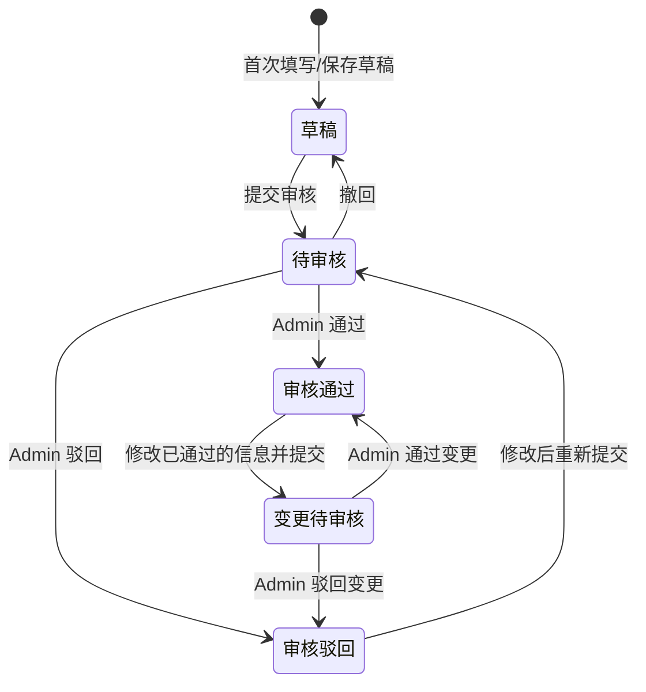

---

---

#### 4.3.3 实名认证页（/pages/certification/real-name）

**页面说明**：这是首次注册后的实名核验与人脸活体仿真流程。**对于 User（普通用户），仅需完成此高质感认证流程即算闭环通过**。整体交互**全面废弃传统的生硬滑块步骤**，采用跨时代的“大卡片全屏沉浸流”形式，伴随下划线吸附表单与动态仿真动画体验，对准移动互联网一线品质。

**沉浸式核验交互步骤**

| 步骤 | 内容说明 | 核心视觉与交互特效说明 |
| ------ | ------ | ------ |
| Step 1：身份预采集 | 输入真实姓名与身份证号 | 大字重标题渐变引出，输入框采用底边红线吸附对齐动效 |
| Step 2：拍摄人像面 | 身份证正面（人像面）验证 | 黄金比例证件虚线扫描框，四角挂载红色“扫描相机对焦指示角标”，中心辅以透明淡色人员剪影水印 |
| Step 3：拍摄国徽面 | 身份证背面（国徽面）验证 | 搭载半透明国徽防伪水印，点击后触发绿光盾牌打勾校验通过特效 |
| Step 4：人脸活体检测 | 生物识别高度仿真 | 卡片切入时全UI环境瞬时硬切暗黑模式，画面中央拉起大型绿色极光扫描雷达，内藏上下折返的平滑扫描光束。系统底层搭载分级交互时间锁（例如定时流转文案“请正对手机” ➔ “缓慢向左摇头” ➔ “检测通过”），极限拉高科技代入感 |
| Step 5：实名通关 | 状态结算与数据同步回流 | 雷达闭合后颁发绿底盾牌大勾通关文书！在页面下沉代码里安插了持久化缓存变更机制，使得后续返航认证大厅（前缀页面）时自动解锁所有高级权限版面并满屏幕飘绿 |

**Step 1 字段定义（身份预采集）**

| 字段名称 | 字段标识 | 类型 | 必填 | 限制 | 说明 |
| --------- | --------- | ------ | ------ | ------ | ------ |
| 真实姓名 | real_name | string(20) | 是 | 2-20 个中文字符 | 底边红线吸附输入框 |
| 身份证号 | id_card | string(18) | 是 | 18 位，校验末位校验码 | 自动格式化展示 |

| 按钮 | 操作 | 说明 |
| ------ | ------ | ------ |
| 下一步 | 校验姓名+身份证号后进入 Step 2 | 校验不通过时震动提示 |

**Step 2 字段定义（拍摄人像面）**

| 字段名称 | 字段标识 | 类型 | 必填 | 限制 | 说明 |
| --------- | --------- | ------ | ------ | ------ | ------ |
| 身份证正面照 | id_card_front | file | 是 | JPG/PNG，≤ 5MB | 调用相机拍摄，OCR 自动识别 |
| OCR 识别姓名 | ocr_name | string | 自动 | — | OCR 结果与 Step 1 输入比对 |
| OCR 识别证号 | ocr_id_card | string | 自动 | — | OCR 结果与 Step 1 输入比对 |

| 按钮 | 操作 | 说明 |
| ------ | ------ | ------ |
| 拍摄 | 调起相机拍摄身份证人像面 | 扫描框对焦引导 |
| 从相册选择 | 从手机相册选择已有照片 | 备选入口 |
| 重新拍摄 | 清除当前照片重新拍摄 | 拍摄后可见 |
| 下一步 | OCR 比对通过后进入 Step 3 | 比对失败提示重新拍摄 |

**Step 3 字段定义（拍摄国徽面）**

| 字段名称 | 字段标识 | 类型 | 必填 | 限制 | 说明 |
| --------- | --------- | ------ | ------ | ------ | ------ |
| 身份证反面照 | id_card_back | file | 是 | JPG/PNG，≤ 5MB | 调用相机拍摄 |
| OCR 有效期 | ocr_expiry | string | 自动 | — | 自动识别证件有效期，过期则阻断 |

| 按钮 | 操作 | 说明 |
| ------ | ------ | ------ |
| 拍摄 | 调起相机拍摄身份证国徽面 | 国徽防伪水印引导 |
| 从相册选择 | 从手机相册选择已有照片 | 备选入口 |
| 重新拍摄 | 清除当前照片重新拍摄 | 拍摄后可见 |
| 下一步 | 校验通过后进入 Step 4 | 触发绿光盾牌打勾特效 |

**Step 4 字段定义（人脸活体检测）**

| 字段名称 | 字段标识 | 类型 | 必填 | 限制 | 说明 |
| --------- | --------- | ------ | ------ | ------ | ------ |
| 活体检测结果 | liveness_result | enum | 自动 | 枚举：`pass`（通过）、`fail`（失败） | 系统判定 |
| 人脸比对分数 | face_score | decimal(5,2) | 自动 | 阈值 ≥ 80 分视为通过 | 与身份证照片比对 |
| 活体视频帧 | liveness_video | file | 自动 | — | 检测过程录制，后台留档 |

| 按钮 | 操作 | 说明 |
| ------ | ------ | ------ |
| 开始检测 | 启动相机进入活体检测模式 | 全屏暗黑模式+极光雷达 |
| 重新检测 | 检测失败后重试（最多 3 次） | 超过需人工审核 |

**活体检测交互时间锁序列**

| 阶段 | 文案提示 | 持续时间 | 检测动作 |
| ------ | --------- | --------- | --------- |
| 1 | "请正对手机" | 2 秒 | 正脸采集 |
| 2 | "缓慢向左摇头" | 3 秒 | 活体摇头检测 |
| 3 | "请眨眼" | 2 秒 | 活体眨眼检测 |
| 4 | "检测通过" | 1 秒 | 结果展示 |

**Step 5 状态结算字段**

| 字段名称 | 字段标识 | 类型 | 说明 |
| --------- | --------- | ------ | ------ |
| 实名认证状态 | realname_status | enum | `verified`（已验证）、`failed`（验证失败）、`manual_review`（人工审核中） |
| 认证通过时间 | verified_at | datetime | 自动记录 |
| 认证等级 | auth_level | enum | `basic`（基础实名，User 闭环）、`professional`（演艺认证，需配合信息填报） |

| 按钮 | 操作 | 说明 |
| ------ | ------ | ------ |
| 返回认证大厅 | 跳转至认证提报中心 | 自动刷新状态卡 |
| 继续完善信息 | 跳转至个人信息填报页 | 仅 Actor 可见 |

**实名认证状态流转**

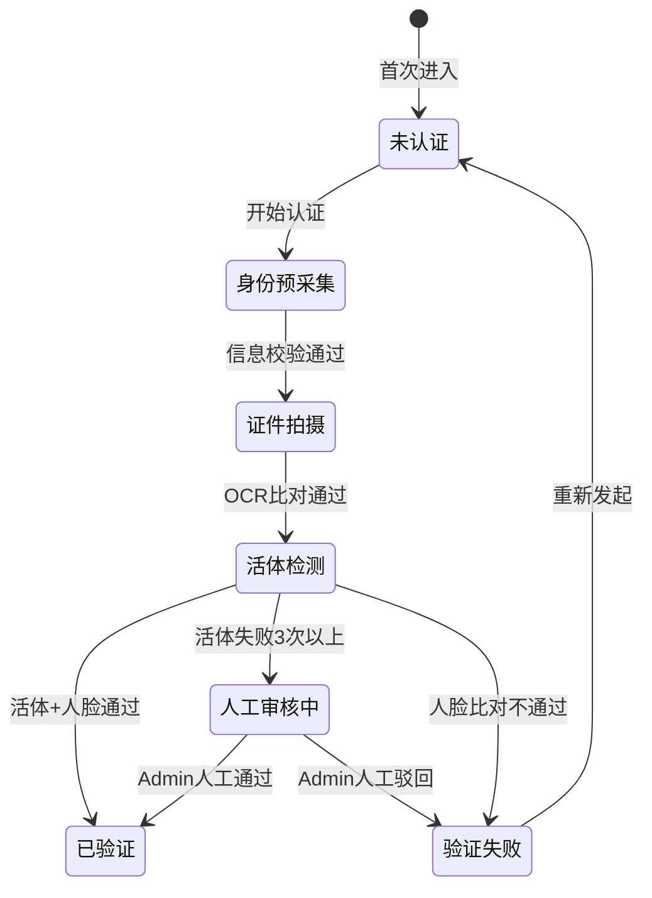

#### 4.3.4 认证进度查看页（/pages/certification/progress）

**页面布局**

| 区域 | 组件 | 说明 |
| ------ | ------ | ------ |
| 顶部状态概要 | 状态大图标+文字 | 当前状态（审核中/已通过/已驳回）醒目展示 |
| 进度时间线 | 垂直时间线 | 展示各阶段和当前状态 |
| 审核意见卡 | 信息卡 | 驳回时展示审核意见和驳回原因 |
| 底部操作区 | 固定按钮 | 根据状态展示可用操作 |

**时间线节点数据结构**

| 字段名称 | 字段标识 | 类型 | 说明 |
| --------- | --------- | ------ | ------ |
| 节点 ID | node_id | string(36) | UUID |
| 阶段名称 | stage_name | string(50) | 如"提交申请"、"材料审核"、"审核通过"等 |
| 阶段状态 | stage_status | enum | `completed`（已完成）、`current`（进行中）、`pending`（待处理） |
| 操作人 | operator | string(20) | 系统/管理员名称 |
| 操作时间 | operated_at | datetime | ISO 8601 |
| 备注/意见 | remark | string(500) | 审核意见、驳回原因等 |

**审核驳回信息字段**

| 字段名称 | 字段标识 | 类型 | 说明 |
| --------- | --------- | ------ | ------ |
| 驳回原因分类 | reject_type | enum | `material_incomplete`（材料不完整）、`material_invalid`（材料无效）、`info_mismatch`（信息不一致）、`other`（其他） |
| 驳回详细说明 | reject_detail | string(500) | 审核员填写的具体说明 |
| 驳回时间 | rejected_at | datetime | — |

**操作按钮**

| 按钮 | 操作 | 可见条件 |
| ------ | ------ | --------- |
| 修改并重新提交 | 跳转至信息填报页（编辑模式） | 状态 = 已驳回 |
| 撤回申请 | 撤回已提交的认证（二次确认弹窗） | 状态 = 审核中 |
| 查看认证详情 | 跳转至信息填报页（只读模式） | 状态 = 已通过 |

---

#### 4.3.5 认证审核台（/pages/admin/certification）【Admin】

**页面布局**

| 区域 | 组件 | 说明 |
| ------ | ------ | ------ |
| 统计卡片 | 3个数值卡 | 待审核数/本月已通过/本月已驳回 |
| Tab 分类 | 全部/待审核/手动审核/已驳回/已通过 | 默认选待审核 |
| 筛选条件 | 标签行 | 认证状态/提交时间范围 |
| 申请列表 | 纵向卡片列表 | 每张卡片一条申请 |

**申请卡片元素**

| 元素 | 说明 |
| ------ | ------ |
| 申请人头像 + 姓名 | — |
| 手机号（脱敏） | — |
| 提交时间 | — |
| 状态标签 | 待审核/审核中/已通过/已驳回 |
| 操作按钮 | 查看/快速通过/驳回 |

**快速驳回弹窗**

| 字段名称 | 字段标识 | 类型 | 必填 | 说明 |
| --------- | --------- | ------ | ------ | ------ |
| 驳回原因 | `reject_reason` | string(500) | 是 | 多行文本输入 |

**认证管理台字段定义**

**页面说明**：管理员用于处理用户认证申请的后台管理页面。支持查看认证队列、批量审批、查看统计数据。

##### 4.3.2.1 认证申请列表页（/certification/manage）

**页面布局**

| 区域 | 组件 | 说明 |
| ------ | ------ | ------ |
| 筛选区 | 多条件筛选表单 | 筛选认证申请 |
| 统计栏 | 4 个统计卡片 | 待审核数、今日已处理、本月通过率、平均处理时长 |
| 数据表格 | 分页表格 | 展示认证申请列表 |
| 批量操作栏 | 底部固定操作区 | 批量审批 |

**筛选条件**

| 字段名称 | 字段标识 | 类型 | 说明 |
| --------- | --------- | ------ | ------ |
| 审核状态 | status | enum | 枚举：`all`（全部）、`pending`（待审核）、`approved`（已通过）、`rejected`（已驳回） |
| 用户类型 | user_type | enum | 枚举：`all`（全部）、`actor`（演员） |
| 申请人姓名 | applicant_name | string | 模糊搜索 |
| 手机号 | phone | string | 精确搜索 |
| 身份证号 | id_card | string | 精确搜索（后 6 位模糊） |
| 申请时间范围 | apply_date_range | date[] | 起止日期 |

| 按钮 | 操作 |
| ------ | ------ |
| 搜索 | 按条件筛选 |
| 重置 | 清空筛选条件 |
| 导出 | 导出当前筛选结果为 Excel |

**数据表格列**

| 列名 | 字段标识 | 宽度 | 排序 | 说明 |
| ------ | --------- | ------ | ------ | ------ |
| 序号 | — | 60px | — | 自动编号 |
| 申请人姓名 | real_name | 100px | — | — |
| 用户类型 | user_type | 80px | — | 标签展示 |
| 手机号 | phone | 120px | — | 中间 4 位脱敏 |
| 身份证号 | id_card | 160px | — | 中间 8 位脱敏 |
| 申请时间 | apply_time | 160px | 支持 | — |
| 审核状态 | status | 100px | 支持 | 彩色标签 |
| 审核人 | reviewer_name | 100px | — | — |
| 审核时间 | review_time | 160px | 支持 | — |
| 操作 | — | 180px | — | 按钮组 |

**操作按钮（表格行级）**

| 按钮 | 操作 | 可见条件 | 权限 |
| ------ | ------ | --------- | ------ |
| 查看 | 打开申请详情弹窗/页面 | 始终可见 | Admin |
| 通过 | 审核通过该申请 | status = `pending` | Admin |
| 驳回 | 驳回该申请（需填写驳回原因） | status = `pending` | Admin |

**批量操作按钮（底部操作栏）**

| 按钮 | 操作 | 说明 |
| ------ | ------ | ------ |
| 全选/取消全选 | 勾选当前页所有记录 | — |
| 批量通过 | 将已勾选的待审核申请全部通过 | 二次确认弹窗 |
| 批量驳回 | 将已勾选的待审核申请全部驳回 | 需统一填写驳回原因 |

##### 4.3.2.2 认证申请详情页

**页面布局**

| 区域 | 组件 | 说明 |
| ------ | ------ | ------ |
| 申请人基本信息 | 只读展示 | 姓名、性别、身份证号（脱敏）、手机号、照片 |
| 实名认证材料 | 图片预览 | 身份证正反面、手持身份证照 |
| 从业信息 | 只读展示 | 从业年限、所属单位、专业方向等 |
| 教育背景 | 表格展示 | 学历列表 |
| 附件材料 | 文件列表 | 可预览/下载 |
| 审核操作区 | 表单 | 审核意见和操作按钮 |
| 审核历史 | 时间线 | 展示历次审核记录 |

**审核操作字段**

| 字段名称 | 字段标识 | 类型 | 必填 | 限制 | 说明 |
| --------- | --------- | ------ | ------ | ------ | ------ |
| 审核结论 | decision | enum | 是 | 枚举：`approved`（通过）、`rejected`（驳回） | — |
| 审核意见 | review_comment | string(500) | 驳回时必填 | 最多 500 字 | 通过时可选填 |
| 驳回原因分类 | reject_reason_type | enum | 驳回时必填 | 枚举：`material_incomplete`（材料不完整）、`material_invalid`（材料无效）、`info_mismatch`（信息不一致）、`other`（其他） | — |

| 按钮 | 操作 |
| ------ | ------ |
| 确认提交 | 提交审核结论 |
| 返回列表 | 返回认证管理列表页 |

---

---

#### 4.3.6 认证申请详情（/pages/admin/certification/:apply_id）【Admin】

**页面说明**：Admin 查看单个认证申请的完整详情。展示申请人全量信息、身份证材料、附件及审核历史。底部操作栏可直接完成审核操作。

**页面布局**

| 区域 | 组件 | 说明 |
| ------ | ------ | ------ |
| 顶部概要 | 申请人头像+姓名+状态标签 | — |
| 信息分区（可折叠） | 基本信息/联系方式/从业信息/教育背景 | 只读展示，字段同 §4.3.2 |
| 身份证材料 | 正反面图片预览（点击放大） | — |
| 附件清单 | 协议签名/其他材料列表 | 可下载 |
| 审核历史 | 垂直时间线 | 历次审核/驳回/重新提交记录 |
| 底部操作栏 | 2个按钮内联 | 通过/驳回 |

**底部操作按钮**

| 按钮 | 操作 | 可见条件 |
| ------ | ------ | --------- |
| 通过 | 弹窗确认后通过认证申请 | 状态 = `pending` / `reviewing` |
| 驳回 | 弹出驳回表单（原因分类+详细说明），确认后驳回 | 状态 = `pending` / `reviewing` |
| 返回列表 | 返回认证审核台列表 | 任意状态 |

**审核历史记录数据结构**

| 字段名称 | 字段标识 | 类型 | 说明 |
| --------- | --------- | ------ | ------ |
| 记录 ID | record_id | string(36) | UUID |
| 操作类型 | action_type | enum | `submit`（提交）、`approve`（通过）、`reject`（驳回）、`withdraw`（撤回）、`resubmit`（重新提交） |
| 操作人 | operator_name | string(20) | Admin 姓名 / 系统 |
| 操作时间 | action_time | datetime | ISO 8601 |
| 审核意见 | comment | string(500) | 通过时可选填，驳回时必填 |

**驳回弹窗字段**

| 字段名称 | 字段标识 | 类型 | 必填 | 限制 | 说明 |
| --------- | --------- | ------ | ------ | ------ | ------ |
| 驳回原因分类 | reject_reason_type | enum | 是 | 枚举：`material_incomplete`（材料不完整）、`material_invalid`（材料无效）、`info_mismatch`（信息不一致）、`other`（其他） | 下拉选择 |
| 驳回详细说明 | reject_detail | string(500) | 是 | 最多 500 字 | 多行文本输入 |

---

### 4.4 证书服务

#### 4.4.1 证书服务首页（/pages/certificate）

**页面说明**：证书模块主入口，根据角色动态展示不同视图。

**页面布局**

| 区域 | 组件 | 说明 |
| ------ | ------ | ------ |
| 角色状态卡 | 顶部卡片 | Actor: 我的证书状态概览（Admin相关管理通过后台管理大厅进入） |
| 功能入口网格 | 宫格按钮 | 角色差异化展示 |
| 快捷操作 | 操作卡片 | 最近待处理事项 |

**角色差异化入口**

| 入口名称 | 跳转目标 | Actor | Admin | User |
| --------- | --------- | ------ | ------ | ------ |
| 证书申领 | `/pages/certificate/apply` | ✅ | ❌ | ❌ |
| 申请进度 | `/pages/certificate/progress` | ✅ | ❌ | ❌ |
| 我的证书 | `/pages/certificate/detail` | ✅ | ❌ | ❌ |
| 证书验证 | `/pages/certificate/verify` | ✅ | ✅ | ✅ |
| 缴费中心 | `/pages/certificate/payment` | ✅ | ❌ | ❌ |
| 年审申请 | `/pages/certificate/renewal` | ✅ | ❌ | ❌ |

**Actor 状态卡字段**

| 字段名称 | 字段标识 | 类型 | 说明 |
| --------- | --------- | ------ | ------ |
| 持有证书数 | cert_count | int | — |
| 待年审证书数 | pending_renewal | int | 红色角标 |
| 申请中 | applying_count | int | — |

#### 4.4.2 证书申领页（/pages/certificate/apply）

**页面说明**：采用分步引导式流程（PC 端与移动端流程一致，此处为权威定义）。

**Step 1：选择证书类型**

| 操作 | 说明 |
| ------ | ------ |
| 演员资格证卡片 | 点击选择 |
| 专业技术资格证书卡片 | 点击选择（校验前置条件） |

**Step 2：确认个人信息**  
展示已通过审核的个人信息（只读），确认无误后下一步。

**Step 3：选择认定方式 + 上传材料**  
支持相机拍摄和相册选择上传材料。

**Step 4：费用确认与支付**

| 操作 | 说明 |
| ------ | ------ |
| 查看费用明细 | 展示各项费用 |
| 选择支付方式 | 微信支付（默认） |
| 确认支付 | 调用微信支付 SDK |

**Step 5：提交完成**  
展示申请编号，可查看进度。

**操作按钮（每步底部固定）**

| 按钮 | 操作 |
| ------ | ------ |
| 上一步 | 返回上一步 |
| 下一步 / 确认支付 / 提交申请 | 步骤推进 |

**证书申领字段定义与流程设计**

**页面说明**：演员用户在线申领演员资格证或专业技术资格证书的页面。采用分步向导式表单引导用户完成申领。

##### 4.4.2.1 证书类型选择页（/certificate/apply）

**页面布局**

| 区域 | 组件 | 说明 |
| ------ | ------ | ------ |
| 页面标题 | "证书申领" | — |
| 证书类型卡片 | 2 张选择卡片 | 演员资格证 / 专业技术资格证书 |
| 申领须知 | 折叠面板 | 各类型证书的申领条件说明 |

**演员资格证卡片信息**

| 元素 | 内容 |
| ------ | ------ |
| 标题 | 演员资格证 |
| 说明 | 对演员的"表演能力"和"艺术德行"两方面进行认证 |
| 费用 | 申领费 100 元（含培训费 1800 元、考试费 100 元需另缴） |
| 有效期 | 2 年，需定期审查 |
| 按钮 | 立即申领 → 跳转至申领表单，参数 `type=actor_cert` |

**专业技术资格证书卡片信息**

| 元素 | 内容 |
| ------ | ------ |
| 标题 | 专业技术资格证书 |
| 说明 | 凭有效演员证即可申领，申领后自动获得 |
| 前置条件 | 必须持有有效的演员资格证 |
| 按钮 | 立即申领 → 校验是否持有有效演员资格证，未持有则弹窗提示 |

##### 4.4.2.2 演员资格证申领表单（/certificate/apply/actor-cert）

**分步向导**：共 4 步

**Step 1：确认个人信息**

| 区域 | 组件 | 说明 |
| ------ | ------ | ------ |
| 信息展示区 | 只读表单 | 自动拉取认证中心已通过的个人信息 |
| 信息校验提示 | 提示条 | 若个人信息未通过审核，提示先完成认证 |

| 按钮 | 操作 |
| ------ | ------ |
| 信息无误，下一步 | 确认信息后进入 Step 2 |
| 修改个人信息 | 跳转至个人信息编辑页 |

**Step 2：选择表演能力认定方式**

| 字段名称 | 字段标识 | 类型 | 必填 | 限制 | 说明 |
| --------- | --------- | ------ | ------ | ------ | ------ |
| 认定方式 | ability_proof_type | enum | 是 | 枚举见下表 | 单选 |

| 认定方式 | 枚举值 | 条件 | 需上传材料 |
| --------- | -------- | ------ | ----------- |
| 艺术院校毕业 | `art_school` | 中等以上艺术学校（含综合性院校艺术专业）文艺表演类专业毕业 | 毕业证书扫描件 |
| 专业团体从业 | `professional_group` | 在专业艺术团体担任演员 3 年以上 | 单位书面证明（含参演作品）+ 盖章 |
| 协会技能考评 | `association_exam` | 不具备以上条件者，需通过表演协会组织的专业技能考评 | 无需上传，系统自动关联考评结果 |

**条件上传字段**

| 字段名称 | 字段标识 | 类型 | 必填 | 限制 | 可见条件 |
| --------- | --------- | ------ | ------ | ------ | --------- |
| 毕业证书 | diploma_file | file | 是 | JPG/PNG/PDF，≤ 10MB | ability_proof_type = `art_school` |
| 学位证书 | degree_file | file | 否 | JPG/PNG/PDF，≤ 10MB | ability_proof_type = `art_school` |
| 单位证明信 | org_proof_file | file | 是 | JPG/PNG/PDF，≤ 10MB，须有单位公章 | ability_proof_type = `professional_group` |
| 参演作品清单 | work_list_file | file | 是 | JPG/PNG/PDF，≤ 10MB | ability_proof_type = `professional_group` |
| 补充材料 | extra_files | file[] | 否 | 每个 ≤ 10MB，最多 3 个 | 始终可见 |

| 按钮 | 操作 |
| ------ | ------ |
| 上一步 | 返回 Step 1 |
| 下一步 | 校验材料上传完整性，进入 Step 3 |

**Step 3：费用确认与支付**

| 区域 | 组件 | 说明 |
| ------ | ------ | ------ |
| 费用明细 | 表格 | 展示各项费用 |
| 支付方式 | 单选按钮组 | 微信支付 / 支付宝 / 银行转账 |
| 发票信息 | 可选表单 | 填写开票信息 |

**费用明细**

| 费用项 | 字段标识 | 金额（元） | 说明 |
| -------- | --------- | ----------- | ------ |
| 艺德培训费 | training_fee | 1,800 | 在线培训课程 |
| 考试费 | exam_fee | 100 | 艺德考核 |
| 证书申领费 | cert_fee | 100 | 证书工本及验证费 |
| **合计** | **total_fee** | **2,000** | — |

**发票信息字段**

| 字段名称 | 字段标识 | 类型 | 必填 | 限制 | 说明 |
| --------- | --------- | ------ | ------ | ------ | ------ |
| 是否需要发票 | need_invoice | boolean | 是 | — | — |
| 发票类型 | invoice_type | enum | 条件必填 | 枚举：`personal`（个人）、`company`（企业） | need_invoice = true 时必填 |
| 发票抬头 | invoice_title | string(100) | 条件必填 | — | — |
| 纳税人识别号 | tax_no | string(20) | 条件必填 | invoice_type = `company` 时必填 | — |
| 接收邮箱 | invoice_email | string(100) | 条件必填 | 邮箱格式 | 电子发票接收邮箱 |

| 按钮 | 操作 |
| ------ | ------ |
| 上一步 | 返回 Step 2 |
| 确认支付 | 调用支付接口，跳转至支付页面 |

**Step 4：提交确认**

| 区域 | 组件 | 说明 |
| ------ | ------ | ------ |
| 申请摘要 | 只读信息卡 | 展示申请人、认定方式、费用等关键信息 |
| 承诺勾选 | 复选框 | "我已阅读并同意《演员证管理办法》" |
| 申请编号 | 自动生成 | 支付成功后生成申请编号 |

| 按钮 | 操作 |
| ------ | ------ |
| 提交申请 | 创建证书申请记录，进入审核流程 |
| 查看我的申请 | 跳转至申请进度查看页 |

##### 4.4.2.3 专业技术资格证书申领表单（/certificate/apply/tech-cert）

**前置校验**：用户必须持有状态为"有效"的演员资格证，否则弹窗提示并阻止继续。专业技术资格证书**不分等级**，无需选择等级。

**Step 1：确认前置条件**

| 字段名称 | 字段标识 | 类型 | 必填 | 限制 | 说明 |
| --------- | --------- | ------ | ------ | ------ | ------ |
| 持有演员证编号 | actor_cert_no | string | 自动 | 系统自动读取已持有的有效演员证 | 只读展示，不可修改 |

| 按钮 | 操作 |
| ------ | ------ |
| 下一步 | 系统校验演员证状态为"有效"后进入 Step 2，未持有或已失效则弹窗提示 |

**Step 2~4**：与演员资格证申领流程类似（确认信息 → 费用支付 → 提交确认），费用标准相同。

#### 4.4.3 申请进度页（/pages/certificate/progress）

**页面说明**：展示 Actor 当前证书申请的完整流程进度，以垂直步骤条形式呈现。

**页面布局**

| 区域 | 组件 | 说明 |
| ------ | ------ | ------ |
| 证书信息条 | 顶部信息条 | 证书类型+等级、申请编号 |
| 流程步骤条 | 垂直步骤条 | 定稿→材料审核→缴费→培训→考核→审核盖章→发放 |
| 当前阶段详情 | 信息卡 | 当前阶段的状态说明和操作引导 |

**步骤条节点数据结构**

| 字段名称 | 字段标识 | 类型 | 说明 |
| --------- | --------- | ------ | ------ |
| 步骤编号 | step_no | int | 1-7 |
| 步骤名称 | step_name | string | 提交/材料审核/缴费/培训/考核/审核盖章/发放 |
| 步骤状态 | step_status | enum | `completed`（已完成）、`current`（进行中）、`pending`（待处理）、`failed`（未通过） |
| 完成时间 | completed_at | datetime | 已完成步骤的完成时间 |
| 操作引导文案 | guide_text | string | 如"请前往缴费中心完成缴费" |
| 关联跳转 | action_url | string | 如缴费中心、培训首页的跳转链接 |

**操作按钮**

| 按钮 | 操作 | 可见条件 |
| ------ | ------ | --------- |
| 去缴费 | 跳转缴费中心 | 当前步骤 = 缴费 |
| 去培训 | 跳转学习首页 | 当前步骤 = 培训 |
| 去考试 | 跳转考核列表 | 当前步骤 = 考核 |
| 查看证书 | 跳转证书详情 | 步骤 = 已发放 |
| 撤回申请 | 撤回当前申请（二次确认） | 材料审核阶段 |

#### 4.4.4 证书详情页（/pages/certificate/detail/:cert_id）

**页面说明**：展示演员的电子证书详情，包含防伪信息和验证二维码。

**页面布局**

| 区域 | 组件 | 说明 |
| ------ | ------ | ------ |
| 电子证书卡 | 证书图片 | 带防伪水印的电子证书预览 |
| 证书基本信息 | 信息列表 | 证书编号、类型、等级等 |
| 验证二维码 | 底部二维码 | 他人可扫码验真 |
| 操作区 | 底部按钮 | 保存/分享 |

**证书详情字段**

| 字段名称 | 字段标识 | 类型 | 说明 |
| --------- | --------- | ------ | ------ |
| 证书编号 | cert_no | string(30) | 全局唯一 |
| 证书类型 | cert_type | enum | `actor_cert`（演员证）、`tech_cert`（专业技术资格证书） |
| 证书等级 | cert_level | enum | 一级/二级/三级/四级（演员证）；专业技术资格证书不分级 |
| 持证人姓名 | holder_name | string | — |
| 身份证号 | holder_id_card | string | 脱敏展示 |
| 发证日期 | issue_date | date | — |
| 有效期至 | expiry_date | date | 到期前 180 天黄色预警 |
| 证书状态 | cert_status | enum | `valid`（有效）、`expired`（已过期）、`suspended`（已暂停）、`revoked`（已吊销） |
| 发证机构 | issuing_org | string | 中国广播电视社会组织联合会演员委员会 |
| 防伪编码 | security_code | string | 证书防伪验证码 |

**操作按钮**

| 按钮 | 操作 | 说明 |
| ------ | ------ | ------ |
| 保存到相册 | 将电子证书图片保存至手机相册 | — |
| 分享 | 生成带二维码的证书分享卡片 | 微信/朋友圈 |
| 申请年审 | 跳转至年审申请页 | 到期前 180 天可见 |

#### 4.4.5 证书验证页（/pages/certificate/verify）

**页面说明**：面向所有用户的公开证书真伪查询页面，支持扫码和手动输入两种方式。

**页面布局**

| 区域 | 组件 | 说明 |
| ------ | ------ | ------ |
| 查询方式切换 | Tab | 扫码验证 / 手动查询 |
| 扫码区域 | 相机扫码框 | 扫描证书上的二维码 |
| 手动查询表单 | 输入框 | 输入证书编号查询 |
| 查询结果区 | 结果卡片 | 展示验证结果 |

**手动查询字段**

| 字段名称 | 字段标识 | 类型 | 必填 | 限制 | 说明 |
| --------- | --------- | ------ | ------ | ------ | ------ |
| 证书编号 | cert_no | string(30) | 是 | 字母+数字组合 | 印刷在证书上的唯一编号 |

**查询结果展示字段**

| 字段名称 | 字段标识 | 类型 | 说明 |
| --------- | --------- | ------ | ------ |
| 验证状态 | verify_status | enum | `valid`（有效）、`expired`（已过期）、`revoked`（已吊销）、`not_found`（未找到） |
| 持证人姓名 | holder_name | string | 脱敏展示（如"张*三"） |
| 证书类型 | cert_type | string | 如"演员证（二级）" |
| 发证日期 | issue_date | date | — |
| 有效期至 | expiry_date | date | 过期红色标注 |
| 发证机构 | issuing_org | string | — |

**操作按钮**

| 按钮 | 操作 | 说明 |
| ------ | ------ | ------ |
| 查询 | 提交证书编号进行验证 | 手动查询模式 |
| 重新扫码 | 清除结果，重新进入扫码模式 | 扫码模式 |
| 重新查询 | 清除查询结果 | 查询后可见 |

#### 4.4.6 缴费中心（/pages/certificate/payment）

**页面说明**：演员用户统一处理各类待缴费项目的入口，支持查看待缴费订单、缴费记录和发票申请。

**页面布局**

| 区域 | 组件 | 说明 |
| ------ | ------ | ------ |
| Tab 分类 | 待缴费 / 缴费记录 | — |
| 待缴费列表 | 纵向卡片列表 | 展示所有待支付订单 |
| 缴费记录列表 | 纵向列表 | 展示历史缴费记录 |

**待缴费卡片**

| 元素 | 说明 |
| ------ | ------ |
| 费用名称 | 如"演员资格证申领费"、"艺德培训费"、"考试费"、"年审费" |
| 费用类型标签 | 证书费/培训费/考试费/年审费 |
| 金额 | 醒目数字展示，单位：元 |
| 创建时间 | — |
| 关联业务 | 如"证书申请: AC-2026-000001" |
| 超时提示 | 距订单自动取消的剩余时间（如"23:59:59 后失效"） |

**待缴费卡片操作**

| 按钮 | 操作 | 说明 |
| ------ | ------ | ------ |
| 立即支付 | 调用微信支付 SDK | 默认微信支付 |
| 查看详情 | 展示费用明细弹窗 | — |
| 取消订单 | 取消该待缴费项（二次确认） | 关联业务同步取消 |

**缴费记录列表**

| 元素 | 说明 |
| ------ | ------ |
| 费用名称 | — |
| 金额 | — |
| 支付方式 | 微信支付 |
| 支付状态 | 已支付 / 已退款 |
| 支付时间 | — |
| 操作 | 查看详情 / 申请发票 / 申请退款 |

**缴费详情弹窗**

| 字段 | 说明 |
| ------ | ------ |
| 订单编号 | — |
| 费用类型 | — |
| 费用明细 | 各子项金额列表 |
| 合计金额 | — |
| 支付方式 | — |
| 支付流水号 | 已支付时展示 |
| 支付时间 | 已支付时展示 |

**发票申请（底部弹出表单）**

| 字段名称 | 字段标识 | 类型 | 必填 | 限制 | 说明 |
| --------- | --------- | ------ | ------ | ------ | ------ |
| 发票类型 | invoice_type | enum | 是 | `personal`(个人)/`company`(单位) | — |
| 抬头名称 | invoice_title | string(100) | 是 | — | 个人填姓名，单位填公司名 |
| 纳税人识别号 | tax_no | string(20) | 单位必填 | — | 单位发票必填 |
| 接收邮箱 | email | string(100) | 是 | 邮箱格式 | 电子发票发送至此邮箱 |

| 按钮 | 操作 |
| ------ | ------ |
| 提交申请 | 提交发票申请 |
| 取消 | 关闭弹窗 |

**订单超时规则**

| 规则 | 说明 |
| ------ | ------ |
| 超时时间 | 订单创建后 24 小时内未支付自动取消 |
| 超时提醒 | 距超时 2 小时和 30 分钟各推送一次提醒 |
| 超时处理 | 自动取消订单，关联的证书申请/培训报名同步取消 |

---

#### 4.4.7 年审申请页（/pages/certificate/renewal）【Actor】

**页面说明**：Actor 发起自己证书的年度审验。证书到期前 180 天开放此入口。

**操作流程**

1. **选择证书**：从到期的已有证书中选择要年审的证书。
2. **上传材料**：上传继续教育学时证明、近期从业记录等。
3. **缴纳年审费**：拉起微信支付，金额读取基础配置项（如 100 元）。
4. **提交等待审核**：提交后在「我的证书-年审进度」中查看。

**年审申请字段**

| 字段名称 | 字段标识 | 类型 | 必填 | 限制 | 说明 |
| --------- | --------- | ------ | ------ | ------ | ------ |
| 年审证书 | cert_id | string(36) | 是 | 从可年审证书列表选择 | — |
| 继续教育学时证明 | edu_cert_file | file | 是 | JPG/PNG/PDF，≤ 10MB | 最多上传 5 个文件 |
| 近期从业记录 | work_record_file | file | 否 | JPG/PNG/PDF，≤ 10MB | 如合同、演出记录等 |
| 个人声明 | declaration | boolean | 是 | 需勾选同意 | "本人承诺所提交材料真实有效" |

**费用信息**

| 字段名称 | 字段标识 | 类型 | 说明 |
| --------- | --------- | ------ | ------ |
| 年审费金额 | renewal_fee | decimal(10,2) | 读取系统配置（如 100 元） |
| 支付方式 | payment_method | enum | `wechat`（微信支付）为默认 |
| 支付状态 | payment_status | enum | `unpaid`（未支付）、`paid`（已支付）、`refunded`（已退款） |

**操作按钮（底部固定）**

| 按钮 | 操作 | 说明 |
| ------ | ------ | ------ |
| 保存草稿 | 保存当前进度 | 不提交不缴费 |
| 缴费并提交 | 拉起微信支付，支付成功后自动提交年审申请 | 二次确认弹窗 |

---

#### 4.4.8 证书管理台（/pages/admin/certificate）【Admin】

**访问入口**：Admin 角色通过「后台管理大厅」进入证书服务模块，本模块前台不提供单独的管理台入口。

**页面布局**

| 区域 | 组件 | 说明 |
| ------ | ------ | ------ |
| 统计卡片 | 4个卡片 | 待审核/审核中/本月已签发/即将到期 |
| Tab 分类 | 待审核/审核中/已通过/已驳回/已吊销 | 默认选待审核 |
| 筛选条件 | 标签行 | 证书类型/申请等级/日期范围 |
| 申请列表 | 纵向卡片列表 | — |

**筛选字段**

| 字段名称 | 字段标识 | 类型 | 说明 |
| --------- | --------- | ------ | ------ |
| 证书类型 | cert_type | enum | 全部/actor_cert/tech_cert |
| 申请等级 | cert_level | enum | 全部/level_1~level_4（仅 actor_cert 时生效） |
| 关键词 | keyword | string | 模糊搜索姓名/申请编号 |
| 申请日期范围 | apply_date_range | date[] | — |

**申请卡片元素**

| 元素 | 说明 |
| ------ | ------ |
| 证书类型标签 | actor_cert/tech_cert |
| 申请人姓名 | — |
| 申请等级 | 演员证时展示 |
| 申请编号 | AP-{}格式 |
| 当前阶段 | 待缴费/培训/考核/审核盖章等 |
| 操作 | 查看详情/展开快速操作 |

**证书管理台字段定义**

**页面说明**：管理员管理证书申请的后台页面。

**数据表格列**

| 列名 | 字段标识 | 宽度 | 排序 | 说明 |
| ------ | --------- | ------ | ------ | ------ |
| 序号 | — | 60px | — | — |
| 申请编号 | apply_no | 150px | — | 点击跳转详情 |
| 申请人姓名 | applicant_name | 100px | — | — |
| 证书类型 | cert_type | 120px | — | 标签展示 |
| 证书等级 | cert_level | 80px | — | 仅 tech_cert 显示 |
| 认定方式 | ability_proof_type | 120px | — | — |
| 申请时间 | apply_time | 160px | 支持 | — |
| 当前阶段 | current_stage | 120px | — | 标签（材料审核/培训中/考核中/待签发） |
| 审核状态 | status | 100px | 支持 | 彩色标签 |
| 操作 | — | 200px | — | 按钮组 |

**行级操作按钮**

| 按钮 | 操作 | 可见条件 | 权限 |
| ------ | ------ | --------- | ------ |
| 查看 | 打开申请详情 | 始终 | Admin |
| 审核 | 进入审核操作页 | status = `pending` | Admin |
| 签发 | 确认签发证书（盖章） | current_stage = `待签发` | Admin |
| 催办 | 发送提醒通知给申请人 | current_stage = `培训中` 或 `考核中` | Admin |

**证书申请详情页**

| 区域 | 组件 | 说明 |
| ------ | ------ | ------ |
| 申请概要 | 信息卡 | 申请编号、类型、等级、申请时间、当前阶段 |
| 申请人信息 | 只读展示 | 姓名、身份证号（脱敏）、联系方式 |
| 认定材料 | 文件列表 | 可预览/下载上传的证明材料 |
| 培训进度 | 进度卡 | 培训课程完成情况 |
| 考核成绩 | 成绩卡 | 考核分数和通过状态 |
| 缴费记录 | 表格 | 各项费用缴纳情况 |
| 审核记录 | 时间线 | 历次审核操作记录 |
| 操作区 | 按钮组 | 审核/签发操作 |

**审核操作字段**

| 字段名称 | 字段标识 | 类型 | 必填 | 限制 | 说明 |
| --------- | --------- | ------ | ------ | ------ | ------ |
| 审核结论 | decision | enum | 是 | 枚举：`approved`（通过）、`rejected`（驳回）、`need_supplement`（需补充材料） | — |
| 审核意见 | review_comment | string(500) | 驳回/补充时必填 | 最多 500 字 | — |
| 需补充项说明 | supplement_items | string(500) | 需补充时必填 | — | 详细说明需要补充的材料 |

| 按钮 | 操作 |
| ------ | ------ |
| 确认提交审核 | 提交审核结论，通知申请人 |
| 确认签发 | 生成证书编号，更新证书状态为"有效"，通知申请人（二次确认弹窗） |
| 返回列表 | 返回证书管理列表 |

**证书申请数据结构**

| 字段名称 | 字段标识 | 类型 | 必填 | 限制 | 说明 |
| --------- | --------- | ------ | ------ | ------ | ------ |
| 申请 ID | apply_id | string(36) | 自动 | UUID | — |
| 申请编号 | apply_no | string(20) | 自动 | 规则：`AP-{年份}{月份}-{5位序号}` | 唯一 |
| 申请人 ID | applicant_id | string(36) | 是 | 关联用户 ID | — |
| 证书类型 | cert_type | enum | 是 | `actor_cert` / `tech_cert` | — |
| 申请等级 | cert_level | enum | 条件必填 | `level_1` ~ `level_4` | 仅 `actor_cert`（演员证）时必填，专业技术资格证书不分级 |
| 认定方式 | ability_proof_type | enum | 是 | `art_school` / `professional_group` / `association_exam` | — |
| 申请状态 | status | enum | 是 | `draft`（草稿）、`pending`（待审核）、`reviewing`（审核中）、`approved`（已通过）、`rejected`（已驳回）、`supplement`（需补充材料） | — |
| 当前阶段 | current_stage | enum | 是 | `material_review`（材料审核）、`payment`（缴费）、`training`（培训）、`exam`（考核）、`org_review`（机构审核）、`issuing`（签发中）、`completed`（已完成） | — |
| 培训完成状态 | training_completed | boolean | 否 | — | 默认 false |
| 考核通过状态 | exam_passed | boolean | 否 | — | 默认 false |
| 考核分数 | exam_score | decimal(5,2) | 否 | 0-100 | — |
| 支付状态 | payment_status | enum | 是 | `unpaid`（未支付）、`paid`（已支付）、`refunded`（已退款） | — |
| 支付金额 | payment_amount | decimal(10,2) | 否 | — | 单位：元 |
| 支付时间 | payment_time | datetime | 否 | — | — |
| 支付流水号 | payment_transaction_no | string(50) | 否 | — | 第三方支付流水号 |
| 审核人 ID | reviewer_id | string(36) | 否 | — | — |
| 审核时间 | review_time | datetime | 否 | — | — |
| 审核意见 | review_comment | string(500) | 否 | — | — |
| 签发管理员 ID | issuing_admin_id | string(36) | 否 | — | — |
| 签发时间 | issue_time | datetime | 否 | — | — |
| 关联证书 ID | cert_id | string(36) | 否 | 签发后关联 | — |
| 创建时间 | created_at | datetime | 自动 | — | — |
| 更新时间 | updated_at | datetime | 自动 | — | — |

---

---

#### 4.4.9 证书申请审核详情（/pages/admin/certificate/:apply_id）【Admin】

**页面布局**

| 区域 | 组件 | 说明 |
| ------ | ------ | ------ |
| 申请基本信息 | 证书类型/等级/申请人/提交时间/缴费状态 | 只读 |
| 申请人导航 | 头像+姓名+认证标签 | 点击跳转全景档案 |
| 材料清单 | 附件列表 | 点击预览/下载 |
| 培训考核进度 | 步骤条关联 | 当前阶段高亮显示 |
| 审核意见输入 | 多行文本框 | — |
| 底部操作栏 | 3个按钮 | — |

**底部操作按钮**

| 按钮 | 操作 | 可见条件 |
| ------ | ------ | --------- |
| 审核通过 | 当前阶段推进（如：材料审核通过 → 进入缴费） | 当前阶段需审核时 |
| 驳回 | 弹出原因输入，确认后驳回并通知申请人 | 当前阶段需审核时 |
| 证书签发 | 确认并生成电子证书文件 | 阶段 = `issuing` |

#### 4.4.10 证书数据总览（/pages/admin/certificate/stats）【Admin】

**页面布局**

| 区域 | 组件 | 说明 |
| ------ | ------ | ------ |
| 统计卡片 | 4个卡片 | 有效演员证总数/有效专业技术资格证书总数/即将到期证书数/待年审数 |
| 证书类型分布 | 饼图 | 演员证 vs 专业技术资格证书 |
| 演员证等级分布 | 柱状图 | 一/二/三/四级占比 |
| 月度发证数量 | 折线图 | 近 12 个月 |
| 即将到期预警列表 | 纵向列表 | 证书到期前 90/60/30 天，方便对接年审 |

**统计卡片字段**

| 字段名称 | 字段标识 | 类型 | 说明 |
| --------- | --------- | ------ | ------ |
| 有效演员证总数 | valid_actor_cert_count | int | 当前有效的演员证总数 |
| 有效专技证书总数 | valid_tech_cert_count | int | 当前有效的专业技术资格证书总数 |
| 即将到期证书数 | expiring_cert_count | int | 90 天内到期的证书数量 |
| 待年审证书数 | pending_renewal_count | int | 已到期未年审的证书数量 |

**预警列表卡片字段**

| 字段名称 | 字段标识 | 类型 | 说明 |
| --------- | --------- | ------ | ------ |
| 持证人姓名 | holder_name | string | — |
| 证书类型+等级 | cert_type_level | string | 如"演员证（二级）" |
| 到期日期 | expiry_date | date | 红色/橙色/黄色标注 |
| 剩余天数 | remaining_days | int | ≤30 红色、≤60 橙色、≤90 黄色 |

**操作按钮**

| 按钮 | 操作 | 说明 |
| ------ | ------ | ------ |
| 发送年审提醒 | 向持证人推送年审提醒通知 | 预警列表中可操作 |
| 导出数据 | 跳转至 PC 端导出（移动端仅提示） | 数据量大时引导至 PC |

#### 4.4.11 年审管理（/pages/admin/certificate/renewal）【Admin】

**页面布局**

| 区域 | 组件 | 说明 |
| ------ | ------ | ------ |
| Tab 分类 | 待审核/审核中/已通过/逾期未年审 | — |
| 筛选 | 标签行 | 证书类型/日期范围 |
| 年审列表 | 纵向卡片列表 | — |

**年审卡片元素**

| 元素 | 说明 |
| ------ | ------ |
| 证书类型 + 等级 | — |
| 持证人姓名 | — |
| 证书到期日期 | 逾期红色高亮 |
| 当前年审状态 | 待交材料/待缴费/待审核/已完成 |
| 操作 | 审核年审申请/发送提醒 |

**操作按钮**

| 按钮 | 操作 | 可见条件 |
| ------ | ------ | --------- |
| 审核 | 跳转年审审核详情页 | 状态 = 待审核 |
| 发送提醒 | 向持证人推送年审提醒通知 | 逾期未年审 |
| 批量通过 | 批量通过已勾选的年审申请 | 底部固定，勾选后可见 |
| 批量驳回 | 批量驳回（需填统一驳回原因） | 底部固定，勾选后可见 |

### 4.5 培训与考核

#### 4.5.1 学习首页（/pages/training）

**页面说明**：职业能力评价的主入口，根据当前登录角色 (`yanyuan_role`) 动态渲染不同的视图。

**1. 管理员 (Admin) 视图**

- **定位**：培训考核移动端管理看板。
- **页面布局**：
  - **顶部统计**：展示"进行中课程"、"今日活跃学习人数"、"待批阅试卷"的数量卡片。
  - **管理入口网格**：课程下发、考务管理、题库管理、试卷批阅。
  - **待办列表**：例如"发现 15 份试卷等待批阅"之类的消息提醒。

**2. 演员 (Actor) 视图**

- **定位**：演员的专属学习中心。
- **页面布局**：
  - **学习进度卡**：顶部展示"已完成课时/总课时"环形进度条及艺德得分。
  - **Tab 分类**：我的课程 / 推荐课程。
  - **课程卡片列表**：每张卡片含封面、标题、进度条及"继续学习/去考试"按钮。

**3. 普通用户 (User) 视图**

- **定位**：公开学习大厅与游客试看区。
- **页面布局**：
  - **顶部引导**：展示提示栏"完成演员认证即可解锁全部专属专业培训，点击去认证"。
  - **公开课列表**：仅展示设置为"面向社会公开"的普法/艺德宣传类视频课（不可参与考核）。

**课程卡片通用元素**

| 元素 | 说明 |
| ------ | ------ |
| 封面图 | 左侧缩略图 |
| 课程名称 / 标签 | 必修 / 选修 / 公开 |
| 学习进度 | 仅 Actor 报名后可见进度条 |

#### 4.5.2 课程学习页（/pages/training/lesson/:lesson_id）

**页面布局**

| 区域 | 组件 | 说明 |
| ------ | ------ | ------ |
| 视频播放区 | 视频播放器 | 支持全屏、倍速、断点续播 |
| 课时信息 | 标题 + 章节 | — |
| 课程大纲 | 底部弹出列表 | 点击切换课时 |
| 课后习题 | 底部弹出答题面板 | 课时结束后弹出 |

**视频播放规则**：观看 80% 标记完成、防快进、断点续播、30 秒上报进度。

**操作按钮**

| 按钮 | 操作 |
| ------ | ------ |
| 课程大纲 | 弹出课程目录 |
| 下一课时 | 跳转下一课时 |
| 提交答案 | 提交习题答案 |

**培训课程字段定义与数据结构**

**页面说明**：面向演员用户的在线培训学习平台。支持课程报名、在线缴费、视频学习、进度跟踪、课后习题。系统自动关联证书申领所需的必修课程。

##### 4.5.1.1 培训课程列表页（/evaluation/training）

**页面布局**

| 区域 | 组件 | 说明 |
| ------ | ------ | ------ |
| Tab 分类 | 全部课程 / 必修课程 / 选修课程 / 我的课程 | 按类型切换 |
| 筛选区 | 课程分类筛选 + 关键词搜索 | — |
| 课程卡片列表 | 网格排列（3-4 列） | 每张卡片展示一个课程 |
| 分页 | 底部分页组件 | 每页 12 个 |

**筛选条件**

| 字段名称 | 字段标识 | 类型 | 说明 |
| --------- | --------- | ------ | ------ |
| 课程分类 | course_category | enum | 枚举：`all`（全部）、`ethics`（艺德修养）、`performance`（演技培训）、`law`（法律法规）、`psychology`（心理健康） |
| 课程状态 | course_status | enum | 枚举：`all`、`not_started`（未开始）、`in_progress`（学习中）、`completed`（已完成） |
| 关键词 | keyword | string(50) | 搜索课程名称和简介 |

| 按钮 | 操作 |
| ------ | ------ |
| 搜索 | 执行筛选 |
| 重置 | 清空条件 |

**课程卡片组件**

| 元素 | 说明 |
| ------ | ------ |
| 封面图 | 课程封面（16:9） |
| 课程名称 | — |
| 课程分类标签 | 彩色标签 |
| 是否必修 | 必修课程显示"必修"标识 |
| 总课时 | 如"共 12 课时" |
| 学习进度条 | 已报名课程显示进度百分比 |
| 价格 | 含在培训费中时显示"已包含" |

**卡片操作按钮**

| 按钮 | 操作 | 可见条件 |
| ------ | ------ | --------- |
| 查看详情 | 跳转至课程详情页 | 始终 |
| 立即报名 | 报名并缴费 | 未报名时 |
| 继续学习 | 跳转至上次学习的课时 | 学习中时 |
| 查看证书 | 课程完成后查看培训证书 | 已完成时 |

##### 4.5.1.2 课程详情页（/evaluation/training/:course_id）

**页面布局**

| 区域 | 组件 | 说明 |
| ------ | ------ | ------ |
| 课程头部 | 课程名称 + 简介 + 讲师 + 总课时 + 价格 | — |
| 课程大纲 | 可折叠列表 | 按章节展示课时列表，已学课时打勾 |
| 学习进度 | 环形进度 + 文字 | 已完成 X/Y 课时 |
| 课程评价 | 评分 + 评论区 | 已完成用户可评价 |
| 操作区 | 按钮 | — |

**课程大纲课时项**

| 元素 | 说明 |
| ------ | ------ |
| 课时序号 | — |
| 课时标题 | — |
| 课时类型图标 | 视频 📹 / 文档 📄 / 习题 📝 |
| 时长 | 视频课时显示时长 |
| 完成状态 | ✅ 已完成 / ⏸ 进行中 / 🔒 未解锁 |
| 播放按钮 | 点击进入课时学习页 |

**操作按钮**

| 按钮 | 操作 | 可见条件 |
| ------ | ------ | --------- |
| 立即报名 | 弹出支付确认 → 完成缴费 | 未报名 |
| 开始学习 | 进入第一个课时 | 已报名未开始 |
| 继续学习 | 进入上次位置的课时 | 学习中 |
| 申请考核 | 跳转至考核中心 | 所有必修课时完成 |

##### 4.5.1.3 课时学习页（/evaluation/training/:course_id/lesson/:lesson_id）

**页面布局**

| 区域 | 组件 | 说明 |
| ------ | ------ | ------ |
| 视频播放区 | 视频播放器 | 支持倍速（0.5x/1x/1.5x/2x）、全屏、拖拽进度 |
| 课时信息 | 课时标题 + 所属章节 + 时长 | — |
| 课件下载 | 附件列表 | 可下载课件 PDF |
| 课后习题区 | 习题表单 | 课时结束后弹出（如有） |
| 侧边栏 | 课程大纲（可折叠） | 快速切换课时 |

**视频播放规则**

| 规则 | 说明 |
| ------ | ------ |
| 观看时长记录 | 每 30 秒自动上报观看进度 |
| 完成条件 | 观看时长达到视频总时长的 80% 标记为已完成 |
| 防快进 | 首次观看不允许拖拽进度条超过已观看进度 |
| 断点续播 | 记录上次播放位置，重新进入自动续播 |

**课后习题字段**

| 字段名称 | 字段标识 | 类型 | 说明 |
| --------- | --------- | ------ | ------ |
| 题目 | question_text | string(500) | — |
| 题目类型 | question_type | enum | 枚举：`single`（单选）、`multiple`（多选）、`true_false`（判断） |
| 选项 | options | object[] | 每个选项含 `label`(string) 和 `value`(string) |
| 正确答案 | correct_answer | string[] | 正确选项的 value 数组 |
| 用户答案 | user_answer | string[] | 用户提交的答案 |
| 解析 | explanation | string(500) | 提交后展示 |

| 按钮 | 操作 |
| ------ | ------ |
| 提交答案 | 校验答案，展示对错和解析 |
| 下一课时 | 跳转至下一课时 |
| 返回课程 | 返回课程详情页 |

##### 4.5.1.4 培训数据与进度查看页（/evaluation/training/my-progress）

**页面布局**

| 区域 | 组件 | 说明 |
| ------ | ------ | ------ |
| 总体进度卡 | 环形图 | 已完成课程数/总课程数 |
| 必修完成状态 | 清单列表 | 每门必修课的完成状态与分数 |
| 学习时长统计 | 折线图 | 按周/月展示累计学习时长 |
| 课程列表 | 表格 | 已报名课程的详细进度 |

**课程进度表格列**

| 列名 | 字段标识 | 说明 |
| ------ | --------- | ------ |
| 课程名称 | course_name | — |
| 课程分类 | category | 标签 |
| 是否必修 | is_required | 是/否 |
| 总课时 | total_lessons | — |
| 已完成课时 | completed_lessons | — |
| 进度 | progress_percent | 进度条 |
| 习题正确率 | quiz_accuracy | 百分比 |
| 最后学习时间 | last_study_time | — |
| 操作 | — | "继续学习"按钮 |

**培训课程数据结构**

| 字段名称 | 字段标识 | 类型 | 必填 | 限制 | 说明 |
| --------- | --------- | ------ | ------ | ------ | ------ |
| 课程 ID | course_id | string(36) | 自动 | UUID | — |
| 课程名称 | course_name | string(100) | 是 | — | — |
| 课程分类 | category | enum | 是 | `ethics`/`performance`/`law`/`psychology` | — |
| 是否必修 | is_required | boolean | 是 | — | 关联证书类型 |
| 关联证书类型 | related_cert_type | enum[] | 否 | `actor_cert`/`tech_cert` | 该课程是哪类证书的必修 |
| 课程简介 | description | string(500) | 是 | — | — |
| 封面图 | cover_url | string(500) | 否 | — | — |
| 讲师姓名 | instructor_name | string(20) | 是 | — | — |
| 讲师简介 | instructor_bio | string(200) | 否 | — | — |
| 总课时数 | total_lessons | int | 是 | 1-100 | — |
| 总时长（分钟） | total_duration | int | 是 | — | — |
| 课程费用 | fee | decimal(10,2) | 是 | — | 0 表示免费 |
| 状态 | status | enum | 是 | `draft`/`published`/`offline` | — |
| 排序权重 | sort_order | int | 是 | 默认 0 | — |
| 创建时间 | created_at | datetime | 自动 | — | — |
| 更新时间 | updated_at | datetime | 自动 | — | — |

**课时数据结构**

| 字段名称 | 字段标识 | 类型 | 必填 | 限制 | 说明 |
| --------- | --------- | ------ | ------ | ------ | ------ |
| 课时 ID | lesson_id | string(36) | 自动 | UUID | — |
| 所属课程 ID | course_id | string(36) | 是 | — | — |
| 章节名称 | chapter_name | string(50) | 是 | — | — |
| 课时标题 | title | string(100) | 是 | — | — |
| 课时序号 | sequence | int | 是 | 1-100 | 同一课程内唯一 |
| 课时类型 | type | enum | 是 | `video`/`document`/`quiz` | — |
| 视频地址 | video_url | string(500) | 条件必填 | type = `video` 时必填 | — |
| 视频时长（秒） | video_duration | int | 条件必填 | — | — |
| 文档内容 | doc_content | text | 条件必填 | type = `document` 时必填 | 富文本 |
| 课件附件 | attachment_url | string(500) | 否 | PDF/PPT | — |
| 是否包含习题 | has_quiz | boolean | 是 | — | — |
| 习题数量 | quiz_count | int | 否 | — | — |

**学习记录数据结构**

| 字段名称 | 字段标识 | 类型 | 必填 | 限制 | 说明 |
| --------- | --------- | ------ | ------ | ------ | ------ |
| 记录 ID | record_id | string(36) | 自动 | UUID | — |
| 用户 ID | user_id | string(36) | 是 | — | — |
| 课程 ID | course_id | string(36) | 是 | — | — |
| 课时 ID | lesson_id | string(36) | 是 | — | — |
| 学习状态 | status | enum | 是 | `not_started`/`in_progress`/`completed` | — |
| 观看进度（秒） | watch_progress | int | 否 | — | 视频课时 |
| 完成时间 | completed_at | datetime | 否 | — | — |
| 习题得分 | quiz_score | decimal(5,2) | 否 | 0-100 | — |
| 总学习时长（秒） | study_duration | int | 是 | — | 累计学习时长 |
| 最后学习时间 | last_study_at | datetime | 是 | — | — |

---

---

#### 4.5.3 考核列表页（/pages/training/exam）

**页面说明**：展示可参加的考核任务列表和考核历史记录。

**页面布局**

| 区域 | 组件 | 说明 |
| ------ | ------ | ------ |
| Tab 分类 | 可参加 / 我的记录 | 默认"可参加" |
| 考核卡片列表 | 纵向卡片 | 每张卡片一个考核任务 |

**考核卡片字段**

| 字段名称 | 字段标识 | 类型 | 说明 |
| --------- | --------- | ------ | ------ |
| 考核名称 | exam_name | string | — |
| 考核类型标签 | exam_type | enum | 艺德考核/表演能力/心理测评 |
| 考核方式 | exam_mode | enum | 线上/线下 |
| 报名时间窗口 | register_period | string | "2026-04-01 ~ 2026-04-15" |
| 考试时间 | exam_time | string | "2026-04-20 14:00" |
| 考试时长 | duration | string | 如"90 分钟" |
| 报名费 | fee | decimal | 如"100 元" |
| 报名状态 | register_status | enum | `not_registered`（未报名）、`registered`（已报名）、`completed`（已完成） |
| 成绩 | score | decimal | 已完成时展示（"我的记录"Tab） |
| 是否通过 | is_passed | boolean | 已完成时展示 |

**操作按钮**

| 按钮 | 操作 | 可见条件 |
| ------ | ------ | --------- |
| 报名 | 弹窗确认报名并缴费 | 报名窗口内、未报名 |
| 开始考试 | 进入在线考试页 | 已报名、考试时间内 |
| 查看成绩 | 跳转成绩查看页 | 已完成 |
| 重新报名 | 报名下次同类考核 | 未通过且可重考 |

#### 4.5.4 在线考试页（/pages/training/exam/:exam_id/take）

**页面布局**

| 区域 | 组件 | 说明 |
| ------ | ------ | ------ |
| 顶部 | 考试名称 + 倒计时 | 固定悬浮 |
| 题目区 | 题干 + 选项 | 上下滑动切题 |
| 底部 | 上一题/下一题/答题卡/交卷 | 固定底栏 |

**考试规则**：防切屏由小程序 `onHide` 事件监控、倒计时、断线续考、自动保存。

**考试页面字段**

| 字段名称 | 字段标识 | 类型 | 说明 |
| --------- | --------- | ------ | ------ |
| 考试名称 | exam_name | string | 顶部固定显示 |
| 剩余时间 | remaining_time | int | 秒，实时倒计时，≤5分钟变红 |
| 当前题号 | current_no | int | 如"第 3/50 题" |
| 题目类型 | question_type | enum | `single`（单选）、`multiple`（多选）、`judge`（判断）、`essay`（简答） |
| 题干内容 | question_text | string | 支持图文混排 |
| 选项列表 | options | object[] | 每项含 `label` 和 `value` |
| 已选答案 | selected_answer | string[] | 用户选择状态 |
| 是否已答 | is_answered | boolean | 答题卡标记用 |
| 切屏次数 | tab_switch_count | int | ≥3 次弹窗警告，≥5 次强制交卷 |

**答题卡弹窗字段**

| 字段名称 | 字段标识 | 类型 | 说明 |
| --------- | --------- | ------ | ------ |
| 题号网格 | question_grid | object[] | 含题号、是否已答标记 |
| 已答题数 | answered_count | int | 如"已答 35/50" |
| 未答题数 | unanswered_count | int | 红色高亮 |

**操作按钮**

| 按钮 | 操作 |
| ------ | ------ |
| 上一题 | — |
| 下一题 | — |
| 答题卡 | 弹出所有题号网格，标记已答/未答 |
| 交卷 | 二次确认 → 提交 |

#### 4.5.5 成绩查看页（/pages/training/exam/:exam_id/result）

**页面说明**：展示考试最终成绩和各维度分析。

**页面布局**

| 区域 | 组件 | 说明 |
| ------ | ------ | ------ |
| 成绩大卡片 | 总分+通过/未通过 | 通过=绿色，未通过=红色 |
| 各维度得分 | 横向柱状图 | 按知识领域展示分项得分 |
| 答题统计 | 3组数字 | 正确/错误/未答题数 |
| 操作区 | 底部按钮 | — |

**成绩详情字段**

| 字段名称 | 字段标识 | 类型 | 说明 |
| --------- | --------- | ------ | ------ |
| 总得分 | total_score | decimal(5,2) | — |
| 满分 | full_score | decimal(5,2) | — |
| 合格分数线 | pass_score | decimal(5,2) | — |
| 是否通过 | is_passed | boolean | — |
| 正确题数 | correct_count | int | — |
| 错误题数 | wrong_count | int | — |
| 未答题数 | unanswered_count | int | — |
| 客观题得分 | objective_score | decimal(5,2) | 自动评分部分 |
| 主观题得分 | subjective_score | decimal(5,2) | 人工评分部分 |
| 考试耗时 | duration_used | int | 分钟 |
| 各维度得分 | dimension_scores | object[] | `{name, score, full_score}` |

| 按钮 | 操作 |
| ------ | ------ |
| 查看解析 | 查看各题详细解析 |
| 重新报名 | 报名下次考核（未通过 + 次数 < 2） |
| 返回 | 返回考核列表 |

---

**考核中心字段定义与数据结构**

**页面说明**：面向演员用户的考核评估页面。提供多元化考评体系（艺德考核、表演能力考核、心理测评等），支持线上考试和线下考核预约。

##### 4.5.2.1 考核列表页（/evaluation/exam）

**页面布局**

| 区域 | 组件 | 说明 |
| ------ | ------ | ------ |
| Tab 分类 | 全部 / 可参加的考核 / 我的考核记录 | — |
| 通知横幅 | 最近一次考核安排通知 | — |
| 考核卡片列表 | 列表排列 | 展示可参加和已参加的考核 |

**考核卡片组件**

| 元素 | 说明 |
| ------ | ------ |
| 考核名称 | — |
| 考核类型标签 | 艺德考核 / 表演能力考核 / 心理测评 |
| 考核方式 | 线上（在线答题）/ 线下（现场考核） |
| 考核时间 | 开始~结束时间窗口 |
| 时长限制 | 如"90 分钟" |
| 合格标准 | 如"≥ 60 分" |
| 费用 | — |
| 我的状态 | 未报名 / 已报名 / 已完成 / 已过期 |

**卡片操作按钮**

| 按钮 | 操作 | 可见条件 |
| ------ | ------ | --------- |
| 报名 | 报名参加考核（线上即刻报名，线下需预约时间） | 未报名且在报名时间窗口内 |
| 开始考试 | 进入在线答题页面 | 已报名 + 线上考核 + 在考试时间窗口内 |
| 查看成绩 | 展示考核分数和明细 | 已完成 |
| 查看详情 | 查看考核信息和安排 | 始终 |
| 预约时间 | 选择线下考核的时间段 | 线下考核 + 已报名未预约 |

##### 4.5.2.2 线上考试页面（/evaluation/exam/:exam_id/take）

**页面布局**

| 区域 | 组件 | 说明 |
| ------ | ------ | ------ |
| 顶部信息栏 | 考试名称 + 倒计时 + 题目进度 | 固定在顶部 |
| 答题区 | 题目展示 + 选项选择 | 单题展示模式或整卷展示模式 |
| 答题卡侧边栏 | 题号网格 | 已答/未答/标记状态，点击快速跳转 |
| 底部操作栏 | 上一题/下一题/标记/交卷 | — |

**考试规则**

| 规则 | 说明 |
| ------ | ------ |
| 防切屏 | 切换浏览器 Tab 超过 3 次强制交卷 |
| 倒计时 | 到时自动交卷 |
| 断线续考 | 网络断开后 5 分钟内可重新进入继续答题 |
| 答题保存 | 每次切题自动保存当前答案 |
| 成绩有效期 | 考核成绩半年内有效 |
| 考试次数限制 | 每年仅允许参加 2 次同类考试 |

**操作按钮**

| 按钮 | 操作 |
| ------ | ------ |
| 上一题 | 切换到上一题 |
| 下一题 | 切换到下一题 |
| 标记本题 | 标记为待检查 |
| 交卷 | 二次确认弹窗 → 提交答卷 → 显示得分（自动评分）或"等待批阅"（主观题） |

##### 4.5.2.3 考核成绩查看页（/evaluation/exam/:exam_id/result）

**页面布局**

| 区域 | 组件 | 说明 |
| ------ | ------ | ------ |
| 成绩概要卡 | 总分 + 通过/未通过标签 + 排名百分位 | — |
| 各维度得分 | 雷达图或柱状图 | 按考核维度细分展示 |
| 题目回顾 | 折叠列表 | 每题的答题情况和正确答案（自动评分题目） |
| 操作区 | 按钮 | — |

| 按钮 | 操作 | 可见条件 |
| ------ | ------ | --------- |
| 重新报名 | 报名下一次考核 | 未通过 + 当年考试次数 < 2 |
| 下载成绩单 | 下载 PDF 成绩单 | 已通过 |
| 返回考核列表 | 返回列表页 | 始终 |

---

---

#### 4.5.6 培训考务控制台（/pages/admin/training）【Admin】

**页面说明**：Admin 在移动端管理培训和考核任务的控制台。

**页面布局**

| 区域 | 组件 | 说明 |
| ------ | ------ | ------ |
| 统计卡片 | 3组 | 进行中课程/今日学习人数/待批阅试卷 |
| Tab 分类 | 课程管理/考务管理 | — |
| 课程/考核列表 | 纵向卡片 | — |
| 底部浮动按钮 | + 号 | 提示在PC端创建新课程/考核 |

**课程管理列表卡片字段**

| 字段名称 | 字段标识 | 类型 | 说明 |
| --------- | --------- | ------ | ------ |
| 课程名称 | course_name | string | — |
| 课程分类标签 | category | enum | 艺德/演技/法律/心理 |
| 课程状态 | status | enum | 草稿/已发布/已下架 |
| 报名人数 | enrolled_count | int | — |
| 完成率 | completion_rate | decimal | 百分比 |

| 按钮 | 操作 | 说明 |
| ------ | ------ | ------ |
| 发布/下架 | 切换课程上下架状态 | 滑动操作 |
| 查看学员进度 | 跳转学员进度管理页 | — |
| 查看详情 | 跳转课程详情 | — |

#### 4.5.8 题库管理（/pages/admin/question-bank）【Admin】

**页面布局**

| 区域 | 组件 | 说明 |
| ------ | ------ | ------ |
| 统计卡片 | 3个卡片 | 题库总题数/单选题数/多选题数 |
| 筛选器 | 分类/题目类型/难度 | — |
| 题目列表 | 纵向卡片列表 | — |
| 右下角浮动按钮 | ＋ | 新建题目 |

**筛选字段**

| 字段名称 | 字段标识 | 类型 | 说明 |
| --------- | --------- | ------ | ------ |
| 题目分类 | question_category | string | — |
| 题目类型 | question_type | enum | `single`(单选)/`multiple`(多选)/`judge`(判断) |
| 难度 | difficulty | enum | `easy`/`medium`/`hard` |
| 关键词 | keyword | string | 模糊搜索题干 |

**题目卡片元素**

| 元素 | 说明 |
| ------ | ------ |
| 题目类型标签 | — |
| 难度标签 | — |
| 题干（截断至 2 行） | — |
| 引用次数 | 被多少份试卷使用 |
| 操作 | 编辑/删除/预览 |

**新建/编辑题目表单**

| 字段名称 | 字段标识 | 类型 | 必填 | 说明 |
| --------- | --------- | ------ | ------ | ------ |
| 题目分类 | question_category | string(50) | 是 | — |
| 题目类型 | question_type | enum | 是 | 单选/多选/判断 |
| 难度 | difficulty | enum | 是 | — |
| 题干 | stem | text | 是 | — |
| 选项列表 | options | object[] | 是 | 每项含 `label`(A/B/C/D) + `content` |
| 正确答案 | correct_answer | string[] | 是 | 选项标签数组，如 `["A","C"]` |
| 解析 | analysis | text | 否 | 答题后展示 |
| 分值 | score | int | 是 | — |

#### 4.5.9 试卷批阅（/pages/admin/exam/:exam_id/review）【Admin】

**页面布局**

| 区域 | 组件 | 说明 |
| ------ | ------ | ------ |
| 考核概要 | 考核名称/时间/已批阅人数 | — |
| Tab 分类 | 待批阅/已批阅 | — |
| 考生列表 | 纵向卡片列表 | — |

**考生卡片元素**

| 元素 | 说明 |
| ------ | ------ |
| 考生姓名 | — |
| 考试时长 | — |
| 客观题得分 | 自动批改 |
| 主观题状态 | 待批阅/已批阅 |
| 点击 | 进入答卷详情批阅 |

**答卷批阅页（/pages/admin/exam/:exam_id/review/:submission_id）**

| 区域 | 组件 | 说明 |
| ------ | ------ | ------ |
| 答卷题目列表 | 逐题展开 | 题干+选项+考生作答+标准答案+评分输入 |
| 综合评语 | 多行文本 | — |
| 底部操作 | 提交批阅 | 提交后该考生成绩生效 |

**批阅单题字段**

| 字段名称 | 字段标识 | 类型 | 说明 |
| --------- | --------- | ------ | ------ |
| 题目得分 | item_score | decimal | 主观题需手动填写，不可超过满分 |
| 批阅评语 | item_comment | string(200) | 可选 |

#### 4.5.10 学员进度管理（/pages/admin/training/:course_id/students）【Admin】

**页面布局**

| 区域 | 组件 | 说明 |
| ------ | ------ | ------ |
| 课程概要 | 课程名称/已报名人数/完课率 | — |
| Tab 分类 | 全部/已完课/学习中/未开始 | — |
| 学员列表 | 纵向卡片列表 | — |

**学员卡片元素**

| 元素 | 说明 |
| ------ | ------ |
| 学员姓名 + 头像 | — |
| 学习进度 | 已完成课时数 / 总课时数 |
| 累计学习时长 | — |
| 最近学习时间 | — |
| 阶段成绩 | 课后习题均分 |
| 操作 | 发送学习提醒（推送消息） |

**考核管理台字段定义**

**页面说明**：管理员创建、配置和管理考核任务的后台页面。支持题库管理、试卷生成、自动/手动阅卷、成绩统计。

##### 4.5.4.1 考核任务管理列表页（/evaluation/exam-manage）

**页面布局**

| 区域 | 组件 | 说明 |
| ------ | ------ | ------ |
| 统计卡片 | 4 个卡片 | 进行中考核、本月考核人次、平均通过率、待批阅试卷数 |
| 筛选区 | 多条件筛选 | — |
| 数据表格 | 分页表格 | 考核任务列表 |

**筛选条件**

| 字段名称 | 字段标识 | 类型 | 说明 |
| --------- | --------- | ------ | ------ |
| 考核类型 | exam_type | enum | 全部 / 艺德考核 / 表演能力考核 / 心理测评 |
| 考核方式 | exam_mode | enum | 全部 / 线上 / 线下 |
| 状态 | status | enum | 全部 / 草稿 / 报名中 / 进行中 / 已结束 |
| 关键词 | keyword | string | 搜索考核名称 |
| 时间范围 | date_range | date[] | 起止日期 |

| 按钮 | 操作 | 权限 |
| ------ | ------ | ------ |
| 搜索 | 执行筛选 | Admin |
| 重置 | 清空条件 | Admin |
| 新建考核 | 创建新的考核任务 | Admin |

**数据表格列**

| 列名 | 字段标识 | 宽度 | 排序 | 说明 |
| ------ | --------- | ------ | ------ | ------ |
| 序号 | — | 60px | — | — |
| 考核名称 | exam_name | 200px | — | 点击跳转详情 |
| 考核类型 | exam_type | 120px | — | 标签 |
| 考核方式 | exam_mode | 80px | — | — |
| 报名时间窗口 | register_period | 200px | — | 起止时间 |
| 考核时间窗口 | exam_period | 200px | 支持 | 起止时间 |
| 报名人数 | register_count | 80px | 支持 | — |
| 通过率 | pass_rate | 80px | 支持 | 百分比 |
| 状态 | status | 100px | 支持 | 彩色标签 |
| 操作 | — | 200px | — | 按钮组 |

**行级操作按钮**

| 按钮 | 操作 | 可见条件 | 权限 |
| ------ | ------ | --------- | ------ |
| 编辑 | 编辑考核配置 | status = `draft` | Admin |
| 发布 | 发布考核（开放报名） | status = `draft` | Admin |
| 查看成绩 | 查看所有考生成绩 | status = `已结束` | Admin |
| 批阅 | 进入批阅页面 | 有待批阅试卷 | Admin |
| 数据分析 | 查看考核分析看板 | status = `已结束` | Admin |
| 结束 | 手动结束考核 | status = `进行中` | Admin |
| 删除 | 删除考核（二次确认） | status = `draft` 且报名人数=0 | Admin |

##### 4.5.4.2 考核任务编辑页（/evaluation/exam-manage/edit/:exam_id）

**基本信息字段**

| 字段名称 | 字段标识 | 类型 | 必填 | 限制 | 说明 |
| --------- | --------- | ------ | ------ | ------ | ------ |
| 考核名称 | exam_name | string(100) | 是 | — | — |
| 考核类型 | exam_type | enum | 是 | `ethics`(艺德)/`performance`(表演能力)/`psychology`(心理测评) | — |
| 考核方式 | exam_mode | enum | 是 | `online`(线上)/`offline`(线下) | — |
| 关联证书类型 | related_cert_type | enum | 否 | `actor_cert`/`tech_cert` | 该考核与哪类证书关联 |
| 报名开始时间 | register_start | datetime | 是 | — | — |
| 报名截止时间 | register_end | datetime | 是 | 须晚于报名开始 | — |
| 考核开始时间 | exam_start | datetime | 是 | 须晚于报名截止 | — |
| 考核结束时间 | exam_end | datetime | 是 | 须晚于考核开始 | — |
| 考试时长（分钟） | duration_minutes | int | 是 | 30-300 | 线上考核的答题时长 |
| 合格分数线 | pass_score | decimal(5,2) | 是 | 0-100，默认 60 | — |
| 总分 | total_score | decimal(5,2) | 是 | 默认 100 | — |
| 报名费 | register_fee | decimal(10,2) | 是 | — | 0 表示免费 |
| 最大报名人数 | max_registrations | int | 否 | — | 0 表示不限 |
| 考核说明 | description | text | 否 | 富文本 | — |
| 考核须知 | notice | text | 否 | — | 展示给考生的注意事项 |

**试卷配置区**

| 字段名称 | 字段标识 | 类型 | 必填 | 说明 |
| --------- | --------- | ------ | ------ | ------ |
| 组卷方式 | paper_mode | enum | 是 | `manual`（手动选题）/ `random`（随机抽题） |
| 手动选题 | selected_questions | string[] | 条件必填 | 从题库中选择具体题目 |
| 随机抽题规则 | random_rules | object[] | 条件必填 | 按分类/难度配置抽题数量 |

**随机抽题规则字段**

| 字段名称 | 字段标识 | 类型 | 说明 |
| --------- | --------- | ------ | ------ |
| 题目分类 | question_category | enum | 题库中的分类 |
| 题目类型 | question_type | enum | 单选/多选/判断/简答 |
| 难度 | difficulty | enum | `easy`/`medium`/`hard` |
| 抽取数量 | count | int | — |
| 每题分值 | score_per_question | decimal | — |

| 按钮 | 操作 |
| ------ | ------ |
| 保存草稿 | 保存考核配置 |
| 预览试卷 | 以考生视角预览 |
| 发布 | 发布考核并开放报名 |

##### 4.5.4.3 题库管理页（/evaluation/exam-manage/question-bank）

**页面布局**

| 区域 | 组件 | 说明 |
| ------ | ------ | ------ |
| 筛选区 | 分类/类型/难度/关键词筛选 | — |
| 数据表格 | 分页表格 | 题目列表 |

**筛选条件**

| 字段名称 | 字段标识 | 类型 | 说明 |
| --------- | --------- | ------ | ------ |
| 题目分类 | category | enum | 艺德知识/法律法规/表演理论/心理健康/其他 |
| 题目类型 | type | enum | 全部/单选/多选/判断/简答 |
| 难度 | difficulty | enum | 全部/简单/中等/困难 |
| 关键词 | keyword | string | 搜索题干内容 |

| 按钮 | 操作 | 权限 |
| ------ | ------ | ------ |
| 搜索 | 执行筛选 | Admin |
| 重置 | 清空 | Admin |
| 新建题目 | 打开题目编辑弹窗 | Admin |
| 批量导入 | 上传 Excel 批量导入题目 | Admin |
| 导出 | 导出题库为 Excel | Admin |

**题目数据结构**

| 字段名称 | 字段标识 | 类型 | 必填 | 限制 | 说明 |
| --------- | --------- | ------ | ------ | ------ | ------ |
| 题目 ID | question_id | string(36) | 自动 | UUID | — |
| 题干 | content | text | 是 | 支持富文本（含图片） | — |
| 题目分类 | category | enum | 是 | `ethics_knowledge`/`law`/`performance_theory`/`psychology`/`other` | — |
| 题目类型 | type | enum | 是 | `single`(单选)/`multiple`(多选)/`true_false`(判断)/`short_answer`(简答) | — |
| 难度 | difficulty | enum | 是 | `easy`/`medium`/`hard` | — |
| 选项 | options | json | 条件必填 | 选择题必填，数组格式 `[{label,value,is_correct}]` | — |
| 正确答案 | correct_answer | text | 是 | — | 选择题为正确选项值，简答题为参考答案 |
| 答案解析 | explanation | text | 否 | — | — |
| 建议分值 | suggested_score | decimal(5,2) | 是 | 默认 2 | — |
| 使用次数 | usage_count | int | 自动 | — | 被引用到试卷的次数 |
| 正确率 | accuracy_rate | decimal(5,2) | 自动 | — | 历史答题正确率 |
| 状态 | status | enum | 是 | `active`/`disabled` | — |
| 创建人 | created_by | string(36) | 自动 | — | — |
| 创建时间 | created_at | datetime | 自动 | — | — |
| 更新时间 | updated_at | datetime | 自动 | — | — |

**新建/编辑题目弹窗操作**

| 按钮 | 操作 |
| ------ | ------ |
| 添加选项 | 增加一个选项（最多 8 个） |
| 删除选项 | 删除指定选项 |
| 设为正确答案 | 标记选项为正确答案 |
| 保存 | 保存题目 |
| 取消 | 关闭弹窗 |

##### 4.5.4.4 批阅页面（/evaluation/exam-manage/:exam_id/review）

**页面布局**

| 区域 | 组件 | 说明 |
| ------ | ------ | ------ |
| 待批阅列表 | 左侧考生列表 | 展示待批阅考生，点击切换 |
| 答卷展示区 | 中部 | 展示考生每题的答案 |
| 评分区 | 右侧 | 每题打分和评语 |

**评分操作字段**

| 字段名称 | 字段标识 | 类型 | 必填 | 限制 | 说明 |
| --------- | --------- | ------ | ------ | ------ | ------ |
| 题目得分 | score | decimal(5,2) | 是 | 0 ~ 该题满分 | — |
| 评语 | comment | string(200) | 否 | — | 每题可选评语 |

| 按钮 | 操作 |
| ------ | ------ |
| 保存评分 | 保存当前考生的评分 |
| 提交并下一位 | 提交评分，切换到下一位考生 |
| 批量自动评分 | 对客观题（单选/多选/判断）自动评分 |

##### 4.5.4.5 考核数据分析看板（/evaluation/exam-manage/:exam_id/analytics）

**看板组件**

| 组件 | 数据 | 图表类型 |
| ------ | ------ | --------- |
| 考核概览 | 报名人数/实际参考/通过人数/通过率 | 指标卡片 |
| 分数分布 | 各分数段人数分布 | 柱状图 |
| 题目正确率 | 每题的正确率排名 | 水平柱状图 |
| 难度分析 | 各难度级别的平均得分 | 分组柱状图 |
| 成绩排行 | Top 10 和 Bottom 10 考生 | 表格 |

**考核任务数据结构**

| 字段名称 | 字段标识 | 类型 | 必填 | 限制 | 说明 |
| --------- | --------- | ------ | ------ | ------ | ------ |
| 考核 ID | exam_id | string(36) | 自动 | UUID | — |
| 考核名称 | exam_name | string(100) | 是 | — | — |
| 考核类型 | exam_type | enum | 是 | `ethics`/`performance`/`psychology` | — |
| 考核方式 | exam_mode | enum | 是 | `online`/`offline` | — |
| 关联证书类型 | related_cert_type | enum | 否 | — | — |
| 报名时间窗口 | register_start / register_end | datetime | 是 | — | — |
| 考核时间窗口 | exam_start / exam_end | datetime | 是 | — | — |
| 考试时长 | duration_minutes | int | 是 | — | — |
| 合格分数线 | pass_score | decimal(5,2) | 是 | — | — |
| 总分 | total_score | decimal(5,2) | 是 | — | — |
| 报名费 | register_fee | decimal(10,2) | 是 | — | — |
| 组卷方式 | paper_mode | enum | 是 | `manual`/`random` | — |
| 状态 | status | enum | 是 | `draft`/`registering`/`in_progress`/`ended` | — |
| 报名人数 | register_count | int | 自动 | — | — |
| 实际参考人数 | actual_count | int | 自动 | — | — |
| 通过人数 | pass_count | int | 自动 | — | — |
| 创建时间 | created_at | datetime | 自动 | — | — |

**考生答卷数据结构**

| 字段名称 | 字段标识 | 类型 | 必填 | 限制 | 说明 |
| --------- | --------- | ------ | ------ | ------ | ------ |
| 答卷 ID | answer_sheet_id | string(36) | 自动 | UUID | — |
| 考核 ID | exam_id | string(36) | 是 | — | — |
| 考生 ID | student_id | string(36) | 是 | — | — |
| 开始答题时间 | start_time | datetime | 自动 | — | — |
| 交卷时间 | submit_time | datetime | 否 | — | — |
| 答题状态 | status | enum | 是 | `in_progress`/`submitted`/`reviewing`/`scored` | — |
| 总得分 | total_score | decimal(5,2) | 否 | — | 批阅完成后 |
| 是否通过 | is_passed | boolean | 否 | — | — |
| 客观题得分 | objective_score | decimal(5,2) | 否 | — | 自动评分 |
| 主观题得分 | subjective_score | decimal(5,2) | 否 | — | 手动评分 |
| 切屏次数 | tab_switch_count | int | 自动 | — | 防作弊记录 |
| 批阅人 ID | reviewer_id | string(36) | 否 | — | — |
| 批阅时间 | review_time | datetime | 否 | — | — |

---

**培训管理台字段定义**

**页面说明**：管理员配置和管理培训课程、题库、学习进度的后台页面。

##### 4.5.3.1 课程管理列表页（/evaluation/training-manage）

**页面布局**

| 区域 | 组件 | 说明 |
| ------ | ------ | ------ |
| 统计卡片 | 3 个卡片 | 已发布课程数、本月活跃学员数、平均完成率 |
| 筛选区 | 多条件筛选 | — |
| 数据表格 | 分页表格 | 课程列表 |

**筛选条件**

| 字段名称 | 字段标识 | 类型 | 说明 |
| --------- | --------- | ------ | ------ |
| 课程分类 | category | enum | 全部 / 艺德修养 / 演技培训 / 法律法规 / 心理健康 |
| 课程状态 | status | enum | 全部 / 草稿 / 已发布 / 已下架 |
| 是否必修 | is_required | enum | 全部 / 必修 / 选修 |
| 关键词 | keyword | string | 搜索课程名称 |

| 按钮 | 操作 | 权限 |
| ------ | ------ | ------ |
| 搜索 | 执行筛选 | Admin |
| 重置 | 清空条件 | Admin |
| 新建课程 | 跳转至课程编辑页 | Admin |

**数据表格列**

| 列名 | 字段标识 | 宽度 | 排序 | 说明 |
| ------ | --------- | ------ | ------ | ------ |
| 序号 | — | 60px | — | — |
| 课程名称 | course_name | 200px | — | 点击跳转编辑 |
| 分类 | category | 100px | — | 标签 |
| 是否必修 | is_required | 80px | — | — |
| 总课时 | total_lessons | 80px | 支持 | — |
| 已报名人数 | enrolled_count | 100px | 支持 | — |
| 完成率 | completion_rate | 100px | 支持 | 百分比 |
| 状态 | status | 80px | 支持 | 彩色标签 |
| 创建时间 | created_at | 160px | 支持 | — |
| 操作 | — | 200px | — | 按钮组 |

**行级操作按钮**

| 按钮 | 操作 | 可见条件 | 权限 |
| ------ | ------ | --------- | ------ |
| 编辑 | 进入课程编辑页 | 始终 | Admin |
| 发布 | 发布课程 | status = `draft` | Admin |
| 下架 | 下架课程 | status = `published` | Admin |
| 查看学员 | 查看报名学员列表和进度 | 始终 | Admin |
| 删除 | 删除课程（二次确认） | 已报名人数=0 | Admin |

##### 4.5.3.2 课程编辑页（/evaluation/training-manage/edit/:course_id）

**页面布局**

| 区域 | 组件 | 说明 |
| ------ | ------ | ------ |
| 基本信息表单 | 表单 | 课程名、分类、讲师、价格等 |
| 课程大纲编辑 | 可拖拽排序列表 | 章节和课时管理 |
| 课时编辑区 | 内联编辑 | 上传视频/文档、配置习题 |

**基本信息字段**：参见培训课程数据结构（4.5.1.4）

**课时编辑操作**

| 按钮 | 操作 |
| ------ | ------ |
| 添加章节 | 新增一个章节分组 |
| 添加课时 | 在选中章节下添加课时 |
| 上传视频 | 上传课时视频，支持 MP4/MOV，≤ 2GB |
| 上传文档 | 上传课时文档 |
| 配置习题 | 弹窗编辑课后习题 |
| 拖拽排序 | 拖拽调整课时和章节顺序 |
| 删除课时 | 删除课时（二次确认） |
| 保存 | 保存全部修改 |
| 预览 | 以学员视角预览课程 |

##### 4.5.3.3 学员进度管理页（/evaluation/training-manage/:course_id/students）

**数据表格列**

| 列名 | 字段标识 | 宽度 | 说明 |
| ------ | --------- | ------ | ------ |
| 序号 | — | 60px | — |
| 学员姓名 | student_name | 100px | — |
| 手机号 | phone | 120px | 脱敏 |
| 报名时间 | enroll_time | 160px | — |
| 已完成课时 | completed_lessons | 100px | — |
| 学习进度 | progress | 120px | 进度条 |
| 总学习时长 | total_study_time | 100px | 格式化为 X 小时 X 分 |
| 习题平均分 | avg_quiz_score | 100px | — |
| 最后学习时间 | last_study_at | 160px | — |
| 操作 | — | 120px | — |

| 按钮 | 操作 |
| ------ | ------ |
| 发送提醒 | 向该学员发送学习提醒通知 |
| 查看详情 | 查看该学员每课时的学习记录 |
| 导出 | 导出全部学员进度为 Excel |

##### 4.5.3.4 培训数据分析看板（/evaluation/training-manage/analytics）

**看板组件**

| 组件 | 数据 | 图表类型 |
| ------ | ------ | --------- |
| 课程完成率趋势 | 按月统计各课程完成率 | 折线图 |
| 学员活跃度 | 按日/周/月统计活跃学员数 | 柱状图 |
| 课程热度排行 | 按报名人数排序的 Top 10 课程 | 水平柱状图 |
| 习题正确率分布 | 各课程习题平均正确率 | 雷达图 |
| 总体完成指标 | 已报名/进行中/已完成人数 | 环形图 |

---

---

#### 4.5.11 线下培训预约页（/pages/training/offline）【Actor】

**页面说明**：Actor 报名参加线下实地组织的培训场次。

**字段说明**

| 字段名称 | 字段标识 | 类型 | 说明 |
| --------- | --------- | ------ | ------ |
| 培训标题 | title | string | — |
| 培训时间 | train_time | datetime | 开始与结束时间 |
| 培训地点 | location | string | 展示具体地址，提供一键导航 |
| **培训费用** | **price** | **decimal(10,2)** | **以"¥XX.XX/人"格式醒目显示（朱红色）；免费培训显示"免费"** |
| 剩余名额 / 总名额 | quota | string | 满额显示"报名已满"，按钮置灰 |
| 导航按钮 | nav_action | button | 调用地图导航至培训地点 |
| 报名按钮 | action | button | 点击弹出缴费确认弹窗（见下） |

**报名缴费弹窗（Bottom Sheet）**

点击「立即报名」后，从底部弹出缴费确认弹窗：

| 区域 | 组件 | 说明 |
| ------ | ------ | ------ |
| 弹窗标题 | "确认报名" + 关闭按钮 | — |
| 培训信息摘要 | 培训标题 + 时间 + 地点 | 灰色背景区 |
| 费用明细 | 培训费用 / 报名人数(1人) / 应付金额 | 应付金额以朱红色大字展示 |
| 支付方式选择 | 微信支付（默认选中）/ 支付宝 | 带单选圆点的卡片 |
| 安全提示 | 🛡 "支付环境安全，资金由平台担保" | 灰色小字居中 |
| 确认按钮 | "确认支付 ¥XX.XX" | 朱红色全宽按钮；免费培训显示"确认报名（免费）" |

**支付成功状态**

| 元素 | 说明 |
| ------ | ------ |
| 绿色对勾动画 | ✓ 弹入效果 |
| "报名成功" 标题 | — |
| 提示文字 | "您已成功报名'XXX'，请按时参加培训。" |
| 完成按钮 | 绿色按钮，点击关闭弹窗；卡片按钮变为"已报名"（绿色） |

---

### 4.6 个人中心

#### 4.6.1 个人中心首页（/pages/profile）

**页面说明**：用户个人信息和功能入口汇总页面。

**页面布局**

| 区域 | 组件 | 说明 |
| ------ | ------ | ------ |
| 用户信息卡 | 头像+姓名+认证标识 | 点击跳转个人信息编辑 |
| 统计面板 | 3组数字 | 我的证书/我的荣誉/学习课程 |
| 功能列表 | 纵向列表入口 | 各功能模块入口 |

**用户信息卡字段**

| 字段名称 | 字段标识 | 类型 | 说明 |
| --------- | --------- | ------ | ------ |
| 头像 | avatar_url | string | — |
| 姓名 | real_name | string | — |
| 角色标签 | role_label | string | "演员"/"普通用户" |
| 认证标识 | cert_badge | enum | `uncertified`/`certified` |
| 艺名 | stage_name | string | 仅 Actor 展示 |

**功能列表入口**

| 入口名称 | 跳转目标 | 角标 | 可见角色 |
| --------- | --------- | ------ | --------- |
| 证书资产库 | `/pages/profile/certificates` | 证书数 | Actor |
| 荣誉管理 | `/pages/profile/honors` | 荣誉数 | Actor |
| 消息中心 | `/pages/profile/messages` | 未读数 | All |
| 账号安全 | `/pages/profile/account` | — | All |
| 心理健康测评 | `/pages/profile/psychology` | — | Actor |
| 购买记录 | `/pages/profile/purchases` | — | All |
| 关于平台 | 平台信息页 | — | All |

#### 4.6.2 证书资产库页（/pages/profile/certificates）

**页面说明**：展示用户所有已获得的证书（平台发放+自行上传的外部证书）。

**页面布局**

| 区域 | 组件 | 说明 |
| ------ | ------ | ------ |
| Tab 分类 | 平台证书 / 外部证书 | — |
| 证书卡片列表 | 纵向卡片 | 每张卡片一个证书 |
| 底部浮动按钮 | + 号 | 添加外部证书 |

**证书卡片字段**

| 字段名称 | 字段标识 | 类型 | 说明 |
| --------- | --------- | ------ | ------ |
| 证书名称 | cert_name | string | — |
| 证书类型 | cert_type | enum | 演员证/专业技术资格证书/外部证书 |
| 证书等级 | cert_level | string | 如"二级" |
| 发证日期 | issue_date | date | — |
| 有效期至 | expiry_date | date | 到期前变色预警 |
| 证书状态 | cert_status | enum | 有效/已过期/待年审 |
| 证书缩略图 | cert_thumb | string | 证书图片缩略图 |

**操作按钮**

| 按钮 | 操作 | 说明 |
| ------ | ------ | ------ |
| 查看详情 | 跳转证书详情页 | 平台证书 |
| 添加外部证书 | 弹出上传表单 | 底部浮动按钮 |
| 编辑 | 修改外部证书信息 | 仅外部证书 |
| 删除 | 删除外部证书（二次确认） | 仅外部证书 |

**添加外部证书字段**

| 字段名称 | 字段标识 | 类型 | 必填 | 限制 | 说明 |
| --------- | --------- | ------ | ------ | ------ | ------ |
| 证书名称 | ext_cert_name | string(100) | 是 | — | — |
| 发证机构 | ext_issuing_org | string(100) | 是 | — | — |
| 发证日期 | ext_issue_date | date | 是 | — | — |
| 有效期至 | ext_expiry_date | date | 否 | — | 永久有效可不填 |
| 证书照片 | ext_cert_photo | file | 是 | JPG/PNG，≤ 5MB | 最多上传 3 张 |

#### 4.6.3 荣誉管理页（/pages/profile/honors）

**页面说明**：展示用户获得的行业荣誉记录。移动端采用时间线展示，底部浮动按钮"添加荣誉"。

**页面布局**

| 区域 | 组件 | 说明 |
| ------ | ------ | ------ |
| 荣誉时间线 | 垂直时间线 | 按获奖时间倒序排列 |
| 底部浮动按钮 | + 号 | 添加荣誉记录 |

**荣誉记录字段**

| 字段名称 | 字段标识 | 类型 | 必填 | 限制 | 说明 |
| --------- | --------- | ------ | ------ | ------ | ------ |
| 荣誉名称 | honor_name | string(100) | 是 | — | 如"第36届金鸡奖最佳男主角提名" |
| 颁发机构 | issuing_org | string(100) | 是 | — | — |
| 获奖时间 | award_date | date | 是 | — | — |
| 荣誉等级 | honor_level | enum | 否 | `national`（国家级）、`provincial`（省级）、`industry`（行业级）、`other`（其他） | — |
| 荣誉证明 | honor_cert_file | file | 否 | JPG/PNG/PDF，≤ 5MB | 获奖证书或文件 |
| 备注 | remark | string(200) | 否 | — | — |

**操作按钮**

| 按钮 | 操作 | 说明 |
| ------ | ------ | ------ |
| 添加荣誉 | 弹出添加表单 | 底部浮动按钮 |
| 编辑 | 修改荣誉记录 | 时间线节点操作 |
| 删除 | 删除荣誉记录（二次确认） | 时间线节点操作 |

#### 4.6.4 消息中心页（/pages/profile/messages）

**页面说明**：汇总展示系统推送给用户的所有消息通知。

**页面布局**

| 区域 | 组件 | 说明 |
| ------ | ------ | ------ |
| Tab 分类 | 全部 / 未读 | 默认"全部" |
| 消息列表 | 纵向卡片 | 左滑可删除 |
| 顶部操作 | 文字按钮 | "全部已读" |

**消息卡片字段**

| 字段名称 | 字段标识 | 类型 | 说明 |
| --------- | --------- | ------ | ------ |
| 消息 ID | msg_id | string(36) | UUID |
| 消息类型 | msg_type | enum | `system`（系统）、`cert`（证书）、`training`（培训）、`exam`（考核）、`finance`（财务） |
| 消息标题 | msg_title | string(100) | — |
| 消息摘要 | msg_summary | string(200) | 截断展示 |
| 发送时间 | sent_at | datetime | 相对时间展示（如"3小时前"） |
| 是否已读 | is_read | boolean | 未读显示蓝色圆点 |
| 跳转链接 | action_url | string | 点击消息跳转的目标页 |

**操作按钮**

| 按钮 | 操作 | 说明 |
| ------ | ------ | ------ |
| 全部已读 | 将所有未读消息标记为已读 | 顶部右侧 |
| 删除 | 左滑后出现删除按钮 | 单条操作 |
| 点击消息 | 标记已读 + 跳转 action_url | — |

#### 4.6.5 账号安全页（/pages/profile/account）

**页面说明**：用户可在此更换绑定手机号或修改登录密码。

**页面布局**

| 区域 | 组件 | 说明 |
| ------ | ------ | ------ |
| 当前手机号 | 信息展示 | 脱敏展示（如 138****8888） |
| 更换手机号 | 入口项 | 点击弹出更换流程 |
| 修改密码 | 入口项 | 点击弹出修改流程 |
| 注销账号 | 入口项（红色） | 账号注销入口 |

**更换手机号字段**

| 字段名称 | 字段标识 | 类型 | 必填 | 限制 | 说明 |
| --------- | --------- | ------ | ------ | ------ | ------ |
| 原手机验证码 | old_sms_code | string(6) | 是 | 6 位数字，5 分钟有效 | 向原手机号发送 |
| 新手机号 | new_phone | string(11) | 是 | 11 位大陆手机号，不可与已注册号重复 | — |
| 新手机验证码 | new_sms_code | string(6) | 是 | 6 位数字，5 分钟有效 | 向新手机号发送 |

**修改密码字段**

| 字段名称 | 字段标识 | 类型 | 必填 | 限制 | 说明 |
| --------- | --------- | ------ | ------ | ------ | ------ |
| 原密码 | old_password | string | 是 | — | — |
| 新密码 | new_password | string | 是 | 8-20 位，须包含大小写字母和数字 | — |
| 确认新密码 | confirm_password | string | 是 | 与新密码一致 | — |

**操作按钮**

| 按钮 | 操作 | 说明 |
| ------ | ------ | ------ |
| 获取验证码 | 向对应手机号发送验证码 | 60 秒倒计时 |
| 确认更换 | 提交新手机号绑定 | 校验通过后生效 |
| 确认修改 | 提交密码修改 | 校验通过后需重新登录 |
| 取消 | 关闭弹窗 | — |

#### 4.6.6 心理健康测评答题页（/pages/profile/psychology/:assessment_id）

**页面说明**：演员用户参与心理健康测评答题的页面。从消息通知或个人中心入口进入。

**页面布局**

| 区域 | 组件 | 说明 |
| ------ | ------ | ------ |
| 顶部 | 测评名称 + 进度条（如"5/30"） | 固定悬浮 |
| 题目区 | 题干 + 选项列表 | 上下滑动切题 |
| 底部 | 上一题/下一题/提交 | 固定底栏 |

**操作按钮**

| 按钮 | 操作 |
| ------ | ------ |
| 上一题 | — |
| 下一题 | — |
| 提交测评 | 二次确认 → 提交答题 → 展示结果摘要（综合评分+等级） |

**测评结果页**

| 区域 | 组件 | 说明 |
| ------ | ------ | ------ |
| 综合评分 | 大字数值 + 等级标签 | 优秀/良好/一般/需关注 |
| 各维度雷达图 | 雷达图 | 情绪/压力/人际等维度 |
| 建议文本 | 文字卡片 | 根据评分自动生成 |
| 操作 | 按钮 | — |

| 按钮 | 操作 |
| ------ | ------ |
| 完成 | 返回个人中心 |
| 保存报告 | 保存测评结果图片至相册 |

#### 4.6.7 购买记录页（/pages/profile/purchases）

**页面说明**：展示用户在平台上产生的所有付费记录，包括培训费、考试费、证书费等。

**页面布局**

| 区域 | 组件 | 说明 |
| ------ | ------ | ------ |
| 筛选区 | 时间范围+类型 | 底部弹出筛选面板 |
| 购买记录列表 | 纵向卡片 | 按时间倒序 |

**购买记录字段**

| 字段名称 | 字段标识 | 类型 | 说明 |
| --------- | --------- | ------ | ------ |
| 订单编号 | order_no | string | — |
| 商品名称 | product_name | string | 如"演员证申领费"、"艺德培训课程" |
| 商品类型 | product_type | enum | `training`（培训）、`exam`（考核）、`cert`（证书）、`renewal`（年审）、`archive`（档案查看） |
| 金额 | amount | decimal(10,2) | 元 |
| 支付方式 | payment_method | string | 微信支付 |
| 支付状态 | payment_status | enum | `paid`（已支付）、`refunded`（已退款）、`pending`（待支付） |
| 支付时间 | paid_at | datetime | — |
| 发票状态 | invoice_status | enum | `none`（未申请）、`applied`（已申请）、`issued`（已开具） |

**操作按钮**

| 按钮 | 操作 | 说明 |
| ------ | ------ | ------ |
| 申请退款 | 提交退款申请 | 支付后 7 天内可申请 |
| 申请发票 | 弹出发票信息填写表单 | 已支付且未开票 |
| 查看发票 | 查看已开具的电子发票 | 已开票 |

#### 4.8.1 个人信息

**页面说明**：演员用户查看和管理个人综合信息的页面。

##### 4.8.1.1 个人信息主页（/profile/info）

**页面布局**

| 区域 | 组件 | 说明 |
| ------ | ------ | ------ |
| 个人概要卡 | 头像 + 姓名 + 认证标识 + 会员等级 | — |
| 统计面板 | 4 个小卡片 | 持有证书数、在学课程数、荣誉数量、待办事项 |
| 基本信息区 | 只读展示 | 与 4.3.1 相同字段 |
| 联系信息区 | 只读展示 | — |
| 从业信息区 | 只读展示 | — |
| 教育背景区 | 表格展示 | — |

**操作按钮**

| 按钮 | 操作 | 权限 |
| ------ | ------ | ------ |
| 编辑信息 | 跳转至 /certification/personal-info 编辑模式 | Actor |
| 修改头像 | 弹窗上传新头像（裁切） | Actor |

---

#### 4.8.2 证书资产库

**页面说明**：演员用户管理所有证书资源的统一入口，不限平台获得的证书。支持上传外部证书、审查资料更新、快捷验证。

##### 4.8.2.1 证书资产库页面（/profile/certificates）

**页面布局**

| 区域 | 组件 | 说明 |
| ------ | ------ | ------ |
| Tab 分类 | 平台证书 / 外部证书 / 全部 | — |
| 证书卡片列表 | 网格排列 | 每张卡片展示一个证书 |
| 添加入口 | 浮动按钮 | 添加外部证书 |

**平台证书卡片**：参见 4.3.3.1 证书卡片组件

**外部证书卡片**

| 元素 | 说明 |
| ------ | ------ |
| 证书名称 | — |
| 发证机构 | — |
| 发证日期 | — |
| 证书图片 | 缩略图 |
| 来源标识 | "外部导入" 标签 |
| 审核状态 | 待审核/已通过/已驳回 |

**操作按钮**

| 按钮 | 操作 | 可见条件 |
| ------ | ------ | --------- |
| 添加外部证书 | 弹窗表单上传外部证书 | 始终 |
| 查看详情 | 查看证书详情 | 始终 |
| 下载 | 下载电子证书 | 平台证书 + status = valid |
| 编辑 | 修改外部证书信息 | 外部证书 |
| 删除 | 删除外部证书（二次确认） | 外部证书 |
| 快捷验证 | 展示证书验证二维码 | 平台证书 + status = valid |

**添加外部证书表单**

| 字段名称 | 字段标识 | 类型 | 必填 | 限制 | 说明 |
| --------- | --------- | ------ | ------ | ------ | ------ |
| 证书名称 | cert_name | string(100) | 是 | — | — |
| 发证机构 | issuing_org | string(100) | 是 | — | — |
| 证书类别 | cert_category | string(50) | 是 | — | 如"普通话等级证书"、"职业资格证"等 |
| 发证日期 | issue_date | date | 是 | 不晚于当前日期 | — |
| 有效期至 | expiry_date | date | 否 | — | 无有效期可留空 |
| 证书编号 | cert_no | string(50) | 否 | — | — |
| 证书扫描件 | cert_image | file | 是 | JPG/PNG/PDF，≤ 10MB | — |
| 补充说明 | remark | string(200) | 否 | — | — |

| 按钮 | 操作 |
| ------ | ------ |
| 提交 | 提交外部证书，进入审核队列 |
| 取消 | 关闭弹窗 |

---

#### 4.8.3 荣誉管理

**页面说明**：演员用户维护个人头衔、称号、奖项等荣誉记录的页面。

##### 4.8.3.1 荣誉列表页（/profile/honors）

**页面布局**

| 区域 | 组件 | 说明 |
| ------ | ------ | ------ |
| 荣誉统计 | 总荣誉数 + 各类型数量 | — |
| 荣誉卡片列表 | 时间线排列 | 按获得时间倒序 |
| 添加入口 | 按钮 | 添加新荣誉 |

**荣誉数据结构**

| 字段名称 | 字段标识 | 类型 | 必填 | 限制 | 说明 |
| --------- | --------- | ------ | ------ | ------ | ------ |
| 荣誉 ID | honor_id | string(36) | 自动 | UUID | — |
| 用户 ID | user_id | string(36) | 是 | — | — |
| 荣誉名称 | honor_name | string(100) | 是 | — | — |
| 荣誉类型 | honor_type | enum | 是 | `title`(头衔)/`award`(奖项)/`certificate`(称号)/`charity`(公益) | — |
| 颁发机构 | issuing_org | string(100) | 是 | — | — |
| 获得时间 | award_date | date | 是 | 不晚于当前日期 | — |
| 描述 | description | string(500) | 否 | — | — |
| 证明材料 | proof_files | file[] | 否 | 每个 ≤ 10MB，最多 5 个 | — |
| 审核状态 | status | enum | 是 | `pending`/`approved`/`rejected` | — |
| 审核意见 | review_comment | string(200) | 否 | — | — |
| 是否公开 | is_public | boolean | 是 | 默认 true | 是否在档案中公开展示 |
| 创建时间 | created_at | datetime | 自动 | — | — |

**操作按钮**

| 按钮 | 操作 | 可见条件 | 权限 |
| ------ | ------ | --------- | ------ |
| 添加荣誉 | 弹窗表单新增荣誉 | 始终 | Actor |
| 编辑 | 修改荣誉信息 | status ≠ `approved` | Actor |
| 删除 | 删除荣誉（二次确认） | 始终 | Actor |
| 查看审核意见 | 展示驳回原因 | status = `rejected` | Actor |

---

#### 4.8.4 账号/密码管理

**页面说明**：用户管理登录账号信息和安全设置的页面。

##### 4.8.4.1 账号管理页面（/profile/account）

**页面布局**

| 区域 | 组件 | 说明 |
| ------ | ------ | ------ |
| 手机号管理 | 当前手机号（脱敏）+ 更换按钮 | — |
| 密码管理 | 密码状态 + 修改密码按钮 | — |
| 登录记录 | 最近 10 次登录记录 | 时间 + 设备 + IP 地址 |

**更换手机号流程**

| 步骤 | 字段/操作 |
| ------ | --------- |
| 1. 验证原手机号 | 发送验证码至原手机号 → 输入验证码确认身份 |
| 2. 绑定新手机号 | 输入新手机号 → 发送验证码 → 输入验证码确认 |

**更换手机号字段**

| 字段名称 | 字段标识 | 类型 | 必填 | 限制 | 说明 |
| --------- | --------- | ------ | ------ | ------ | ------ |
| 原手机验证码 | old_phone_code | string(6) | 是 | 6 位数字 | — |
| 新手机号 | new_phone | string(11) | 是 | 手机号格式，不可与已注册号码重复 | — |
| 新手机验证码 | new_phone_code | string(6) | 是 | 6 位数字 | — |

**修改密码字段**

| 字段名称 | 字段标识 | 类型 | 必填 | 限制 | 说明 |
| --------- | --------- | ------ | ------ | ------ | ------ |
| 当前密码 | old_password | string | 是 | — | — |
| 新密码 | new_password | string | 是 | 8-20 位，须包含大小写字母和数字 | — |
| 确认新密码 | confirm_password | string | 是 | 与新密码一致 | — |

| 按钮 | 操作 |
| ------ | ------ |
| 更换手机号 | 打开更换手机号弹窗 |
| 修改密码 | 打开修改密码弹窗 |
| 确认修改 | 提交修改（各弹窗内） |
| 取消 | 关闭弹窗 |

---

---

### 4.8 人才数字档案（Admin）

> **设计原则**：档案模块面向 Admin，提供移动端快速查看全量演员档案的能力，支持分维度浏览。查看、审核、标注操作均在移动端完成（PC 端同步一致）。

#### 4.8.1 档案搜索页（/pages/archive/search）

**页面说明**：全角色均可访问的档案公开搜索入口。

**页面布局**

| 区域 | 组件 | 说明 |
| ------ | ------ | ------ |
| 顶部搜索栏 | 搜索框 + 筛选图标 | 搜索演员姓名/证书编号 |
| 筛选条件栏 | 标签行（可折叠） | 认证状态/证书等级/从业方向 |
| 搜索结果列表 | 卡片列表 | 演员基础信息卡 |
| 空状态 | 插图 + 提示文字 | 无结果时展示 |

**搜索筛选字段**

| 字段名称 | 字段标识 | 类型 | 说明 |
| --------- | --------- | ------ | ------ |
| 关键词 | keyword | string | 模糊匹配姓名/证书编号 |
| 认证状态 | cert_status | enum | `all`/`certified`(已认证)/`uncertified`(未认证) |
| 证书类型 | cert_type | enum | `all`/`actor_cert`/`tech_cert` |
| 证书等级 | cert_level | enum | `all`/`level_1`~`level_4`（仅 actor_cert 时生效） |
| 从业方向 | specialty | enum | 影视/舞台/综艺/主持等 |

**演员卡片元素**

| 元素 | 说明 |
| ------ | ------ |
| 头像 | 圆形头像，默认占位图 |
| 姓名 | 实名认证后的真实姓名 |
| 认证标签 | 已认证 ✅ / 未认证 |
| 从业方向标签 | — |
| 证书等级 | 如"演员证·三级" |
| 点击 | 跳转档案摘要页 |

#### 4.8.2 档案摘要页（/pages/archive/preview/:uid）

**页面说明**：免费展示的演员档案概要信息，引导付费解锁完整档案。

**页面布局**

| 区域 | 组件 | 说明 |
| ------ | ------ | ------ |
| 基本信息卡 | 头像+姓名+艺名+认证标识 | 免费可见 |
| 从业概要 | 信息列表 | 专业方向、从业年限（免费可见） |
| 模糊信息区 | 毛玻璃遮罩 | 联系方式、详细经历（付费后解锁） |
| 底部操作栏 | 按钮 | 付费解锁 |

**免费展示字段**

| 字段名称 | 字段标识 | 说明 |
| --------- | --------- | ------ |
| 头像 | avatar_url | — |
| 姓名 | real_name | — |
| 艺名 | stage_name | — |
| 性别 | gender | — |
| 认证状态 | cert_status | 已认证/未认证 |
| 专业方向 | speciality | 标签展示 |
| 从业年限 | career_years | — |

**付费解锁字段**（付费后可见）

| 字段名称 | 字段标识 | 说明 |
| --------- | --------- | ------ |
| 联系电话 | phone | 脱敏展示 |
| 经纪人 | agent_name | — |
| 经纪公司 | agency | — |
| 教育背景 | education | 详细学历列表 |
| 从业经历 | work_experience | 详细项目经历 |
| 荣誉记录 | honors | 完整获奖列表 |

| 按钮 | 操作 | 说明 |
| ------ | ------ | ------ |
| 付费解锁完整档案 | 拉起微信支付 | 底部固定，Admin 免费自动解锁 |
| 联系 TA | 解锁后直拨电话 | 付费后可见 |

#### 4.8.3 档案详情页（/pages/archive/detail/:uid）

**页面说明**：需付费解锁（Admin 免费）。使用 Tab 分区展示演员完整信息。

**页面布局**

| 区域 | 组件 | 说明 |
| ------ | ------ | ------ |
| 顶部个人卡 | 头像+姓名+艺名+认证标识 | — |
| Tab 分区 | 基本信息/从业信息/教育背景/荣誉/证书 | — |
| 各 Tab 内容 | 对应信息列表 | 字段同 §4.3.2 个人信息 |

**Tab 页数据映射**

| Tab 名称 | 数据来源 | 展示方式 |
| --------- | --------- | --------- |
| 基本信息 | 认证信息 §4.3.2 | 只读信息列表 |
| 从业信息 | 从业信息字段 §4.3.2 | 标签+文本 |
| 教育背景 | 教育背景字段 §4.3.2 | 时间线 |
| 荣誉 | 荣誉数据 §4.6.3 | 时间线 |
| 证书 | 证书资产库 §4.6.2 | 卡片列表 |

| 按钮 | 操作 | 说明 |
| ------ | ------ | ------ |
| 联系 TA | 拨打电话 | — |
| 收藏档案 | 加入收藏夹 | 点击切换状态 |
| 分享 | 生成分享卡片 | — |

#### 4.8.4 我的档案页（/pages/archive/my）

**页面说明**：Actor 自己查看个人完整档案，无需付费，与 §4.8.3 详情页布局相同，但增加编辑入口。

**额外操作按钮**

| 按钮 | 操作 |
| ------ | ------ |
| 编辑个人信息 | 跳转至个人信息填报页（/pages/certification/info） |
| 分享档案 | 生成档案分享卡片（脱敏展示） |

#### 4.8.5 全量人员档案库（/pages/admin/archive）

**页面说明**：Admin 查看全平台所有注册人员档案列表。

**页面布局**

| 区域 | 组件 | 说明 |
| ------ | ------ | ------ |
| 搜索栏 | 搜索框 | 搜索姓名/手机号/证书编号 |
| 筛选器 | 多条件标签行 | 认证状态/证书类型/证书等级/从业方向 |
| 统计卡片 | 3个卡片 | 总人数/已认证人数/持证人数 |
| 人员列表 | 分页卡片列表 | — |

**筛选字段**

| 字段名称 | 字段标识 | 类型 | 说明 |
| --------- | --------- | ------ | ------ |
| 关键词 | keyword | string | 模糊搜索姓名/手机/证书编号 |
| 认证状态 | auth_status | enum | `all`/`certified`/`pending`/`uncertified` |
| 证书类型 | cert_type | enum | `all`/`actor_cert`/`tech_cert`/`none`(无证) |
| 从业方向 | specialty | string | — |

**人员卡片元素**

| 元素 | 说明 |
| ------ | ------ |
| 头像 + 姓名 | — |
| 认证状态标签 | — |
| 证书摘要 | 如"演员证·二级（有效）" |
| 注册时间 | — |
| 点击 | 跳转全景档案详情 |

#### 4.8.6 档案工作台（/pages/admin/archive/workbench）

**页面说明**：Admin 查看档案模块的整体统计和待处理事项。

**页面布局**

| 区域 | 组件 | 说明 |
| ------ | ------ | ------ |
| 统计卡片 | 3组 | 总档案数/本月新增/待完善档案数 |
| 待处理事项 | 列表 | 信息变更审核、档案补全提醒等 |
| 快捷入口 | 网格按钮 | 跳转各管理页面 |

**统计卡片字段**

| 字段名称 | 字段标识 | 类型 | 说明 |
| --------- | --------- | ------ | ------ |
| 总档案数 | total_archives | int | — |
| 本月新增 | monthly_new | int | — |
| 待完善档案数 | incomplete_count | int | 信息完整度 < 60% 的档案数 |

**待处理事项字段**

| 字段名称 | 字段标识 | 类型 | 说明 |
| --------- | --------- | ------ | ------ |
| 事项标题 | title | string | — |
| 事项类型 | type | enum | `info_change`（信息变更）、`incomplete`（资料不完整）、`expired_cert`（证书过期） |
| 关联用户 | user_name | string | — |
| 创建时间 | created_at | datetime | — |

| 按钮 | 操作 | 说明 |
| ------ | ------ | ------ |
| 处理 | 跳转至对应的处理页面 | 待处理事项 |
| 查看全部档案 | 跳转档案搜索页 | 快捷入口 |
| 导出报表 | 引导至 PC 端 | 移动端仅提示 |

#### 4.6.1 基础信息管理

**页面说明**：管理员查看和管理平台所有注册人员基本信息的后台页面。

##### 4.6.1.1 人员信息列表页（/talent-archive/basic）

**页面布局**

| 区域 | 组件 | 说明 |
| ------ | ------ | ------ |
| 统计卡片 | 3 个卡片 | 总注册人数、本月新增、已认证人数 |
| 筛选区 | 多条件筛选 | — |
| 数据表格 | 分页表格 | 人员基本信息列表 |

**筛选条件**

| 字段名称 | 字段标识 | 类型 | 说明 |
| --------- | --------- | ------ | ------ |
| 姓名 | name | string | 模糊搜索 |
| 手机号 | phone | string | 精确搜索 |
| 身份证号 | id_card | string | 后 6 位模糊搜索 |
| 认证状态 | auth_status | enum | 全部/待审核/已认证/已驳回/已冻结 |
| 用户类型 | user_type | enum | 全部/演员 |
| 注册时间范围 | register_date_range | date[] | 起止日期 |
| 专业方向 | speciality | enum | 电影/电视剧/舞台剧/综艺/配音/其他 |

| 按钮 | 操作 | 权限 |
| ------ | ------ | ------ |
| 搜索 | 执行筛选 | Admin |
| 重置 | 清空条件 | Admin |
| 导出 | 导出查询结果为 Excel | Admin |

**数据表格列**

| 列名 | 字段标识 | 宽度 | 排序 | 说明 |
| ------ | --------- | ------ | ------ | ------ |
| 序号 | — | 60px | — | — |
| 头像 | photo_url | 60px | — | 缩略图 |
| 姓名 | real_name | 100px | — | 点击跳转档案详情 |
| 性别 | gender | 60px | — | — |
| 手机号 | phone | 120px | — | 中间 4 位脱敏 |
| 身份证号 | id_card | 160px | — | 中间 8 位脱敏 |
| 用户类型 | user_type | 80px | — | 标签 |
| 认证状态 | auth_status | 100px | 支持 | 彩色标签 |
| 持有证书 | cert_count | 80px | 支持 | 数字 |
| 注册时间 | register_time | 160px | 支持 | — |
| 操作 | — | 180px | — | 按钮组 |

**行级操作按钮**

| 按钮 | 操作 | 可见条件 | 权限 |
| ------ | ------ | --------- | ------ |
| 查看档案 | 跳转至全景数字档案页 | 始终 | Admin |
| 编辑 | 编辑人员基本信息 | 始终 | Admin |
| 冻结 | 冻结该账号 | auth_status = `已认证` | Admin |
| 解冻 | 解冻该账号 | auth_status = `已冻结` | Admin |

---

#### 4.6.2 资格证书管理

**页面说明**：管理员查看所有注册人员证书持有情况的汇总页面。

##### 4.6.2.1 证书汇总列表页（/talent-archive/certificates）

**页面布局**

| 区域 | 组件 | 说明 |
| ------ | ------ | ------ |
| 统计卡片 | 4 个卡片 | 有效演员证数量、有效专业资格证数量、即将到期数量、已过期数量 |
| 筛选区 | 多条件筛选 | — |
| 数据表格 | 分页表格 | 证书列表 |

**筛选条件**

| 字段名称 | 字段标识 | 类型 | 说明 |
| --------- | --------- | ------ | ------ |
| 持证人姓名 | holder_name | string | 模糊搜索 |
| 证书类型 | cert_type | enum | 全部/演员资格证/专业技术资格证书 |
| 证书等级 | cert_level | enum | 全部/一级/二级/三级/四级 |
| 证书状态 | status | enum | 全部/有效/即将到期/已过期/年审中/暂停/吊销 |
| 发证日期范围 | issue_date_range | date[] | — |
| 到期日期范围 | expiry_date_range | date[] | — |

| 按钮 | 操作 | 权限 |
| ------ | ------ | ------ |
| 搜索 | 执行筛选 | Admin |
| 重置 | 清空条件 | Admin |
| 导出 | 导出证书数据为 Excel | Admin |

**数据表格列**

| 列名 | 字段标识 | 宽度 | 排序 | 说明 |
| ------ | --------- | ------ | ------ | ------ |
| 序号 | — | 60px | — | — |
| 证书编号 | cert_no | 150px | — | — |
| 持证人 | holder_name | 100px | — | 点击跳转档案 |
| 证书类型 | cert_type | 120px | — | 标签 |
| 证书等级 | cert_level | 80px | — | — |
| 发证日期 | issue_date | 120px | 支持 | — |
| 有效期至 | expiry_date | 120px | 支持 | — |
| 剩余天数 | remaining_days | 80px | 支持 | ≤90 天标红 |
| 状态 | status | 100px | 支持 | 彩色标签 |
| 操作 | — | 150px | — | 按钮组 |

**行级操作按钮**

| 按钮 | 操作 | 权限 |
| ------ | ------ | ------ |
| 查看详情 | 查看证书详情 | Admin |
| 暂停 | 暂停证书有效性 | Admin |
| 恢复 | 恢复已暂停的证书 | Admin |
| 吊销 | 吊销证书（需填写原因，二次确认） | Admin |

---

#### 4.6.3 全景数字档案

**页面说明**：整合单个人才的全维度信息，形成包含基本信息、证书、培训、考核、荣誉、红黑榜、心理健康等数据的360度全景画像。

##### 4.6.3.1 人才全景档案页（/talent-archive/panorama/:user_id）

**页面布局**

| 区域 | 组件 | 说明 |
| ------ | ------ | ------ |
| 顶部概要 | 头像 + 姓名 + 认证标识 + 档案健康度评分 | — |
| Tab 导航 | 基本信息 / 证书记录 / 培训记录 / 考核记录 / 荣誉记录 / 红黑榜 / 心理健康 | 切换不同维度 |
| 档案健康度 | 雷达图 | 多维度评分可视化 |
| 优化建议 | 提示卡片 | 根据档案完整度给出优化建议 |

**档案健康度评分维度**

| 维度 | 字段标识 | 计算规则 | 满分 |
| ------ | --------- | --------- | ------ |
| 信息完整度 | info_score | 已填字段/总字段 × 100 | 100 |
| 证书状态 | cert_score | 持有有效证书数量 × 权重 | 100 |
| 培训完成度 | training_score | 必修课完成率 × 100 | 100 |
| 考核成绩 | exam_score | 最近一次考核标准化得分 | 100 |
| 荣誉积累 | honor_score | 荣誉数量 × 权重 | 100 |
| 合规状态 | compliance_score | 无黑榜记录=100，有黑榜=0 | 100 |

**Tab 1：基本信息**  
展示与 4.3.1 个人信息填报页相同的字段，此处为只读模式。

**Tab 2：证书记录**  
表格展示该人才持有的所有证书，字段参见 4.3.3.2 证书数据结构。

**Tab 3：培训记录**

| 列名 | 说明 |
| ------ | ------ |
| 课程名称 | — |
| 课程分类 | 标签 |
| 报名时间 | — |
| 完成状态 | 进行中/已完成/未开始 |
| 学习进度 | 进度条 |
| 完成时间 | — |
| 习题平均分 | — |

**Tab 4：考核记录**

| 列名 | 说明 |
| ------ | ------ |
| 考核名称 | — |
| 考核类型 | 标签 |
| 考核时间 | — |
| 得分 | — |
| 是否通过 | ✅ / ❌ |
| 成绩有效期至 | — |

**Tab 5：荣誉记录**

| 列名 | 说明 |
| ------ | ------ |
| 荣誉名称 | — |
| 荣誉类型 | 头衔/称号/奖项/公益 |
| 颁发机构 | — |
| 获得时间 | — |
| 证明材料 | 可预览/下载 |
| 审核状态 | 待审核/已通过/已驳回 |

**Tab 6：红黑榜记录**

| 列名 | 说明 |
| ------ | ------ |
| 榜单类型 | 红榜/黑榜 |
| 事由 | — |
| 记录时间 | — |
| 有效期至 | 黑榜记录有有效期 |
| 影响 | 对证书/培训/考核的影响说明 |
| 操作人 | — |

**Tab 7：心理健康记录**

| 列名 | 说明 |
| ------ | ------ |
| 测评名称 | — |
| 测评时间 | — |
| 综合评分 | 数值 |
| 评估等级 | 优秀/良好/一般/需关注 |
| 建议 | 简要建议文本 |
| 详细报告 | 可下载 PDF |

**操作按钮**

| 按钮 | 操作 | 权限 |
| ------ | ------ | ------ |
| 导出档案 | 导出完整档案为 PDF | Admin |
| 打印档案 | 打印档案页面 | Admin |
| 编辑信息 | 进入编辑模式修改信息 | Admin |
| 添加荣誉 | 为该人才添加荣誉记录 | Admin |
| 添加红/黑榜记录 | 新增红黑榜记录 | Admin |

---

#### 4.6.4 工作台

**页面说明**：管理员处理各类上报和审核事项的工作台页面。

##### 4.6.4.1 审核工作台页面（/talent-archive/workbench）

**页面布局**

| 区域 | 组件 | 说明 |
| ------ | ------ | ------ |
| Tab 分类 | 待审核 / 已处理 / 全部 | — |
| 事项类型筛选 | 下拉框 | 证书验证/荣誉审核/申诉处理/信息变更 |
| 事项列表 | 分页表格 | — |

**事项类型枚举**

| 事项类型 | 枚举值 | 说明 |
| --------- | -------- | ------ |
| 证书验证 | `cert_verify` | 验证外部提交的证书真伪 |
| 荣誉审核 | `honor_review` | 审核用户上报的荣誉记录 |
| 申诉处理 | `appeal` | 处理用户提交的申诉 |
| 信息变更 | `info_change` | 审核用户的信息变更请求 |

**数据表格列**

| 列名 | 字段标识 | 宽度 | 说明 |
| ------ | --------- | ------ | ------ |
| 序号 | — | 60px | — |
| 事项类型 | item_type | 100px | 标签 |
| 标题 | title | 200px | — |
| 提交人 | submitter_name | 100px | — |
| 提交时间 | submit_time | 160px | — |
| 优先级 | priority | 80px | 高/中/低 |
| 状态 | status | 100px | 待审核/处理中/已完成/已驳回 |
| 操作 | — | 150px | — |

**行级操作按钮**

| 按钮 | 操作 | 可见条件 | 权限 |
| ------ | ------ | --------- | ------ |
| 处理 | 进入审核处理页面 | status = `待审核` | Admin |
| 查看 | 查看事项详情 | 始终 | Admin |

**审核处理字段**

| 字段名称 | 字段标识 | 类型 | 必填 | 限制 | 说明 |
| --------- | --------- | ------ | ------ | ------ | ------ |
| 处理结论 | decision | enum | 是 | `approved`/`rejected`/`pending` | — |
| 处理意见 | comment | string(500) | 驳回时必填 | — | — |
| 附件 | attachment | file[] | 否 | 每个 ≤ 10MB，最多 3 个 | 支撑材料 |

| 按钮 | 操作 |
| ------ | ------ |
| 提交 | 提交处理结论 |
| 返回 | 返回工作台列表 |

---

---

### 4.9 财务管理（Admin）

> **设计原则**：小程序财务模块面向 Admin，提供收支数据的快速查看与基础操作（退款/费用配置）。数据导出/完整对账报表仅在 PC 端提供。

#### 4.9.1 收支概览页（/pages/admin/finance）

**页面说明**：Admin 查看平台整体收支数据的看板页面。

**页面布局**

| 区域 | 组件 | 说明 |
| ------ | ------ | ------ |
| 周期选择 | 顶部下拉 | 今日/本周/本月/本季度/自定义 |
| 统计卡片 | 3组卡片 | 总收入/总订单数/平均客单价 |
| 收入趋势图 | 折线图 | 按天/周展示收入趋势 |
| 收入构成 | 饼图 | 培训费/考试费/证书费/年审费/档案查看费占比 |

**统计卡片字段**

| 字段名称 | 字段标识 | 类型 | 说明 |
| --------- | --------- | ------ | ------ |
| 周期总收入 | total_income | decimal(12,2) | 含同比/环比 |
| 周期总订单数 | total_orders | int | — |
| 平均客单价 | avg_order_amount | decimal(10,2) | — |
| 退款金额 | refund_amount | decimal(12,2) | — |
| 净收入 | net_income | decimal(12,2) | 总收入 - 退款 |

**收入构成字段**

| 字段名称 | 字段标识 | 类型 | 说明 |
| --------- | --------- | ------ | ------ |
| 分类名称 | category_name | string | 培训费/考试费/证书费/年审费/档案查看费 |
| 分类金额 | category_amount | decimal(12,2) | — |
| 占比 | percentage | decimal(5,2) | 百分比 |

**操作按钮**

| 按钮 | 操作 | 说明 |
| ------ | ------ | ------ |
| 切换周期 | 切换统计时间范围 | 顶部下拉 |
| 查看流水 | 跳转交易流水查询页 | 底部入口 |
| 导出报表 | 引导至 PC 端导出 | 移动端仅提示 |

#### 4.9.2 交易流水查询页（/pages/admin/finance/transactions）

**页面布局**

| 区域 | 组件 | 说明 |
| ------ | ------ | ------ |
| 筛选器 | 标签行 + 日期选择 | 多条件筛选 |
| 流水列表 | 纵向卡片列表 | — |

**筛选字段**

| 字段名称 | 字段标识 | 类型 | 说明 |
| --------- | --------- | ------ | ------ |
| 费用类型 | fee_type | enum | 全部/培训费/考试费/办证费/年审费/档案查询费/舆情查看费 |
| 支付状态 | pay_status | enum | 全部/已支付/待支付/已退款/已取消 |
| 日期范围 | date_range | date[] | — |
| 用户姓名 | user_name | string | 模糊搜索 |

**流水卡片元素**

| 元素 | 说明 |
| ------ | ------ |
| 订单编号 | `ORD-{年月}-{6位序号}` |
| 费用类型标签 | — |
| 用户姓名 | — |
| 金额 | 红色（支出/退款）/ 绿色（收入） |
| 支付状态 | — |
| 支付时间 | — |
| 点击 | 展示流水详情弹窗（含退款按钮） |

**退款操作（弹窗）**

| 字段名称 | 字段标识 | 类型 | 说明 |
| --------- | --------- | ------ | ------ |
| 退款原因 | refund_reason | string(200) | 必填 |
| 退款金额 | refund_amount | decimal | 自动填充，允许部分退款 |

| 按钮 | 操作 |
| ------ | ------ |
| 确认退款 | 提交退款申请并记录日志 |
| 取消 | 关闭弹窗 |

#### 4.9.3 费用标准配置页（/pages/admin/finance/fee-config）

**页面说明**：Admin 配置各类费用金额，修改后立即生效（新申请使用新价格，已提交订单不影响）。

**费用项列表**

| 费用项 | 字段标识 | 默认金额 | 说明 |
| -------- | --------- | --------- | ------ |
| 艺德培训费 | fee_training | 1800元 | 演员证申领必须 |
| 考试费 | fee_exam | 100元 | 每次考试缴纳 |
| 办证费（演员证） | fee_actor_cert | 100元 | 演员证申领 |
| 年审费（演员证） | fee_renewal | 100元 | 年度审查 |
| 办证费（专业技术资格证书） | fee_tech_cert | 100元 | — |
| 档案查询费 | fee_archive_query | — | 付费查看他人完整档案 |
| 舆情详情查看费 | fee_opinion_detail | — | 付费查看舆情详情 |
| 红黑榜详情查看费 | fee_board_detail | — | 付费查看详情 |

| 按钮 | 操作 |
| ------ | ------ |
| 保存配置 | 提交修改（二次确认），系统记录变更历史 |
| 重置 | 恢复当前生效版本 |

---

**财务管理字段定义与数据结构**

#### 4.7.1 收支概览

**页面说明**：管理员查看和管理平台全部资金流水的后台页面，包括证书费、培训费、考试费等各类收入。

##### 4.7.1.1 财务概览仪表盘（/finance/overview）

**页面布局**

| 区域 | 组件 | 说明 |
| ------ | ------ | ------ |
| 周期选择器 | 日/周/月/季度/年度切换 | 默认月度 |
| 收入指标卡片 | 4 个卡片 | 本期总收入、环比增长率、订单总数、退款金额 |
| 收入趋势图 | 折线图 | 按日/周/月展示收入趋势 |
| 收入构成 | 饼图 | 按费用类型展示收入占比 |
| 最近交易列表 | 表格 | 最近 10 笔交易 |

**收入指标卡片**

| 卡片 | 字段标识 | 说明 |
| ------ | --------- | ------ |
| 本期总收入 | period_income | 选定周期内的收入合计 |
| 环比增长 | income_growth_rate | 与上一周期对比的增长率百分比 |
| 订单总数 | order_count | 选定周期内的支付订单数 |
| 退款金额 | refund_amount | 选定周期内的退款合计 |

##### 4.7.1.2 交易流水列表页（/finance/transactions）

**筛选条件**

| 字段名称 | 字段标识 | 类型 | 说明 |
| --------- | --------- | ------ | ------ |
| 费用类型 | fee_type | enum | 全部/培训费/考试费/证书申领费/验证费/年审费 |
| 支付状态 | payment_status | enum | 全部/已支付/已退款/支付中/支付失败 |
| 支付方式 | payment_method | enum | 全部/微信支付/支付宝/银行转账 |
| 用户姓名 | user_name | string | 模糊搜索 |
| 订单编号 | order_no | string | 精确搜索 |
| 交易时间范围 | transaction_date_range | date[] | 起止日期 |
| 金额范围 | amount_range | decimal[] | 最小/最大金额 |

| 按钮 | 操作 | 权限 |
| ------ | ------ | ------ |
| 搜索 | 执行筛选 | Admin |
| 重置 | 清空条件 | Admin |
| 导出 | 导出流水为 Excel | Admin |
| 导出对账单 | 按月导出对账报表 | Admin |

**数据表格列**

| 列名 | 字段标识 | 宽度 | 排序 | 说明 |
| ------ | --------- | ------ | ------ | ------ |
| 序号 | — | 60px | — | — |
| 订单编号 | order_no | 180px | — | — |
| 用户姓名 | user_name | 100px | — | — |
| 费用类型 | fee_type | 100px | — | 标签 |
| 金额（元） | amount | 100px | 支持 | — |
| 支付方式 | payment_method | 100px | — | — |
| 支付状态 | payment_status | 100px | 支持 | 彩色标签 |
| 支付时间 | payment_time | 160px | 支持 | — |
| 流水号 | transaction_no | 200px | — | 第三方支付流水号 |
| 操作 | — | 120px | — | — |

**行级操作按钮**

| 按钮 | 操作 | 可见条件 | 权限 |
| ------ | ------ | --------- | ------ |
| 查看 | 查看交易详情 | 始终 | Admin |
| 退款 | 发起退款操作 | payment_status = `已支付` | Admin |

**交易数据结构**

| 字段名称 | 字段标识 | 类型 | 必填 | 限制 | 说明 |
| --------- | --------- | ------ | ------ | ------ | ------ |
| 订单 ID | order_id | string(36) | 自动 | UUID | — |
| 订单编号 | order_no | string(30) | 自动 | 规则：`ORD-{年月日}-{6位序号}` | 唯一 |
| 用户 ID | user_id | string(36) | 是 | — | — |
| 用户姓名 | user_name | string(20) | 是 | — | 冗余存储 |
| 费用类型 | fee_type | enum | 是 | `training_fee`(培训费)/`exam_fee`(考试费)/`cert_fee`(证书申领费)/`verify_fee`(验证费)/`renewal_fee`(年审费) | — |
| 关联业务 ID | related_biz_id | string(36) | 否 | — | 关联的申请ID/课程ID/考核ID |
| 关联业务类型 | related_biz_type | enum | 否 | `cert_apply`/`course`/`exam`/`renewal` | — |
| 金额 | amount | decimal(10,2) | 是 | > 0 | 单位：元 |
| 支付方式 | payment_method | enum | 是 | `wechat`/`alipay`/`bank_transfer` | — |
| 支付状态 | payment_status | enum | 是 | `pending`/`paid`/`refunded`/`failed` | — |
| 第三方流水号 | transaction_no | string(64) | 否 | — | 支付平台返回 |
| 支付时间 | payment_time | datetime | 否 | — | — |
| 退款金额 | refund_amount | decimal(10,2) | 否 | — | — |
| 退款时间 | refund_time | datetime | 否 | — | — |
| 退款原因 | refund_reason | string(200) | 否 | — | — |
| 发票状态 | invoice_status | enum | 是 | `none`(无需)/`pending`(待开)/`issued`(已开) | — |
| 发票 ID | invoice_id | string(36) | 否 | — | 关联发票 |
| 备注 | remark | string(200) | 否 | — | — |
| 创建时间 | created_at | datetime | 自动 | — | — |
| 更新时间 | updated_at | datetime | 自动 | — | — |

##### 4.7.1.3 退款操作弹窗

| 字段名称 | 字段标识 | 类型 | 必填 | 限制 | 说明 |
| --------- | --------- | ------ | ------ | ------ | ------ |
| 退款金额 | refund_amount | decimal(10,2) | 是 | 不超过原订单金额 | 支持部分退款 |
| 退款原因 | refund_reason | string(200) | 是 | — | — |
| 退款方式 | refund_method | enum | 是 | `original`(原路退回)/`manual`(线下退款) | 默认原路退回 |

| 按钮 | 操作 |
| ------ | ------ |
| 确认退款 | 提交退款申请（二次确认弹窗） |
| 取消 | 关闭弹窗 |

---

---

### 4.10 舆情监测（Admin）

> **设计原则**：移动端舆情监测面向 Admin，核心功能是快速查看风险预警、查看演员舆情档案、标记处理状态。数据源对接配置和来源规则管理在 PC 端完成。

#### 4.10.1 舆情监测总览页（/pages/admin/public-opinion）

**页面布局**

| 区域 | 组件 | 说明 |
| ------ | ------ | ------ |
| 风险分布卡片 | 3个指标卡 | 正常/关注/异常人数 |
| 近期预警 | 横向滚动卡片（最多5条） | 最新进入"异常"状态的演员 |
| Tab 分类 | 全部/异常/关注 | — |
| 演员风险列表 | 纵向卡片列表 | 按风险评分降序 |

**预警卡片元素**

| 元素 | 说明 |
| ------ | ------ |
| 演员头像 + 姓名 | — |
| 风险等级标签 | 🔴异常 / 🟡关注 / 🟢正常 |
| 最新舆情摘要 | 截断至 2 行 |
| 进入预警时间 | — |
| 点击 | 跳转该演员舆情档案 |

**操作**

| 按钮 | 操作 |
| ------ | ------ |
| 批量标记 | 勾选多名演员，批量标记风险等级 |
| 查看全部预警 | 跳转至预警管理页 |

#### 4.10.2 演员舆情档案页（/pages/admin/public-opinion/actor/:uid）

**页面布局**

| 区域 | 组件 | 说明 |
| ------ | ------ | ------ |
| 演员概要 | 头像+姓名+风险评分+等级标签 | — |
| 风险评分走势 | 折线图 | 近30天评分变化 |
| 舆情来源 Tab | 媒体报道/社交媒体/投诉记录/法律纠纷 | — |
| 事件时间线 | 垂直时间线 | 该Tab下的事件列表 |

**舆情事件卡片**

| 字段名称 | 字段标识 | 类型 | 说明 |
| --------- | --------- | ------ | ------ |
| 事件ID | event_id | string(36) | UUID |
| 演员ID | actor_id | string(36) | 关联用户 |
| 来源类型 | source_type | enum | `media`/`social`/`complaint`/`legal` |
| 来源平台 | source_platform | string(100) | 如"微博"、"微信举报" |
| 事件标题 | event_title | string(200) | — |
| 事件描述 | event_desc | text | — |
| 风险影响分 | risk_score | int | 正数（负面）/负数（正面加分） |
| 事件时间 | event_time | datetime | — |
| 处理状态 | handle_status | enum | `pending`(待处理)/`confirmed`(已确认)/`false_alarm`(误报)/`resolved`(已处置) |

**操作按钮**

| 按钮 | 操作 |
| ------ | ------ |
| 标记风险等级 | 手动设置该演员风险等级 |
| 加入黑榜 | 一键跳转新增红黑榜记录页并预填演员信息 |
| 标记误报 | 将当前事件标记为误报，风险评分回退 |

#### 4.10.3 舆情预警管理页（/pages/admin/public-opinion/alerts）

**页面布局**

| 区域 | 组件 | 说明 |
| ------ | ------ | ------ |
| Tab 分类 | 全部/待处理/已处置/误报 | — |
| 预警列表 | 纵向卡片列表 | — |

**预警记录字段**

| 字段名称 | 字段标识 | 类型 | 说明 |
| --------- | --------- | ------ | ------ |
| 预警ID | alert_id | string(36) | UUID |
| 演员ID | actor_id | string(36) | — |
| 预警级别 | alert_level | enum | `high`(高)/`medium`(中)/`low`(低) |
| 预警原因 | alert_reason | string(500) | 系统生成 |
| 触发时间 | triggered_at | datetime | — |
| 处理状态 | handle_status | enum | `pending`/`confirmed`/`false_alarm`/`resolved` |
| 处理人 | handled_by | string(20) | Admin 姓名 |
| 处理时间 | handled_at | datetime | — |
| 处理备注 | handle_note | string(200) | — |

**行级操作按钮**

| 按钮 | 操作 | 可见条件 |
| ------ | ------ | --------- |
| 确认预警 | 标记为"已确认" | handle_status = `pending` |
| 标记误报 | 标记为"误报"，风险评分回退 | handle_status ∈ {`pending`,`confirmed`} |
| 标记已处置 | 标记处置完成 + 填写备注 | handle_status = `confirmed` |
| 查看演员档案 | 跳转演员舆情档案页 | 始终 |

#### 4.10.4 舆情详情页（/pages/public-opinion/detail/:uid）

**页面说明**：展示单个演员的舆情事件详细信息（付费内容，Admin 免费）。

**展示字段**

| 字段名称 | 字段标识 | 类型 | 说明 |
| --------- | --------- | ------ | ------ |
| 事件标题 | event_title | string | — |
| 风险等级 | risk_level | enum | `high`（高风险-红）、`medium`（中风险-橙）、`low`（低风险-黄）、`normal`（正常-绿） |
| 事件来源 | source | string | 如"微博"、"抖音" |
| 事件摘要 | summary | string(500) | — |
| 原文链接 | source_url | string | 点击外部浏览器打开 |
| 发布时间 | published_at | datetime | — |
| 情感倾向 | sentiment | enum | `positive`（正面）、`negative`（负面）、`neutral`（中性） |

| 按钮 | 操作 | 说明 |
| ------ | ------ | ------ |
| 查看原文 | 打开外部链接 | — |
| 标记为已处理 | 更新事件处理状态 | Admin 可见 |

#### 4.10.5 短视频入口页（/pages/video）【All】

**页面说明**：平台短视频内容浏览入口（仅移动端），展示平台官方和演员发布的短视频内容。

**页面布局**

| 区域 | 组件 | 说明 |
| ------ | ------ | ------ |
| 视频流 | 全屏竖屏滑动 | 上下滑动切换视频 |
| 互动区 | 右侧浮动按钮 | 点赞/评论/分享 |
| 底部信息 | 文字叠加 | 标题/作者/描述 |

**视频内容字段**

| 字段名称 | 字段标识 | 类型 | 说明 |
| --------- | --------- | ------ | ------ |
| 视频 ID | video_id | string(36) | UUID |
| 视频标题 | title | string(100) | — |
| 视频 URL | video_url | string | — |
| 封面图 | cover_url | string | — |
| 作者 | author_name | string | — |
| 描述 | description | string(200) | — |
| 点赞数 | like_count | int | — |
| 评论数 | comment_count | int | — |

| 按钮 | 操作 | 说明 |
| ------ | ------ | ------ |
| 点赞 | 切换点赞状态 | 心形图标 |
| 评论 | 弹出评论面板 | — |
| 分享 | 微信分享 | — |

### 4.11 红黑榜

> 红黑榜分公开浏览（全角色）和 Admin 管理两部分。公开浏览摘要免费，完整详情付费（Admin 免费）。

#### 4.11.1 红黑榜列表页（/pages/board）

**页面说明**：面向所有用户展示演艺行业红榜（正面典型）和黑榜（违规记录）。

**页面布局**

| 区域 | 组件 | 说明 |
| ------ | ------ | ------ |
| Tab 分类 | 红榜 / 黑榜 | 默认红榜 |
| 记录列表 | 纵向卡片 | 按发布时间倒序 |

**榜单卡片字段**

| 字段名称 | 字段标识 | 类型 | 说明 |
| --------- | --------- | ------ | ------ |
| 榜单类型 | board_type | enum | `red`（红榜）、`black`（黑榜） |
| 当事人姓名 | person_name | string | — |
| 事由摘要 | reason_summary | string(200) | 截断展示 |
| 发布时间 | published_at | date | — |
| 处罚/表彰措施 | measure | string | 如"行业通报表扬"/"行业禁入" |

| 按钮 | 操作 | 说明 |
| ------ | ------ | ------ |
| 查看详情 | 跳转红黑榜详情页 | — |

#### 4.11.2 红黑榜详情页（/pages/board/detail/:record_id）

**页面说明**：付费查看完整详情（Admin 免费）。

**付费内容字段**

| 字段名称 | 字段标识 | 类型 | 说明 |
| --------- | --------- | ------ | ------ |
| 事由详情 | reason_detail | text | 完整事由描述 |
| 证据材料 | evidence_files | file[] | 图片/文档列表，可预览 |
| 影响措施 | impact_measures | string(500) | 证书暂停/禁止考核等 |
| 关联证书操作 | cert_action | enum | `none`/`suspend`/`revoke` |
| 有效期至 | expiry_date | date | 黑榜有效期 |
| 撤销原因 | revoke_reason | string(200) | 已撤销时展示 |
| 操作人姓名 | operator_name | string(20) | — |

#### 4.11.3 红黑榜管理页（/pages/admin/board）【Admin】

**页面布局**

| 区域 | 组件 | 说明 |
| ------ | ------ | ------ |
| Tab | 红榜 / 黑榜 / 全部 | — |
| 统计卡片 | 2个卡片 | 红榜总数/黑榜总数 |
| 筛选器 | 多条件 | — |
| 记录列表 | 同上，含操作按钮 | — |
| 右下角浮动按钮 | ＋ | 新增记录 |

**筛选条件**

| 字段名称 | 字段标识 | 类型 | 说明 |
| --------- | --------- | ------ | ------ |
| 榜单类型 | board_type | enum | 全部/红榜/黑榜 |
| 人员姓名 | person_name | string | 模糊搜索 |
| 事由分类 | reason_category | enum | 参见 §4.9.6 事由枚举 |
| 记录状态 | status | enum | 全部/有效/已过期/已撤销 |
| 记录时间范围 | record_date_range | date[] | — |

**行级操作按钮**

| 按钮 | 操作 | 可见条件 |
| ------ | ------ | --------- |
| 查看 | 跳转详情 | 始终 |
| 编辑 | 弹出编辑表单 | status = `active` |
| 撤销 | 填写撤销原因后撤销 | status = `active` |

#### 4.11.4 新增红黑榜记录页（/pages/admin/board/new）【Admin】

**页面说明**：Admin 新建红黑榜记录。

**表单字段**

| 字段名称 | 字段标识 | 类型 | 必填 | 限制 | 说明 |
| --------- | --------- | ------ | ------ | ------ | ------ |
| 关联演员 | actor_id | string(36) | 是 | 搜索选择 | 搜索框选择演员 |
| 榜单类型 | board_type | enum | 是 | `red`/`black` | 单选 |
| 事由分类 | reason_category | enum | 是 | 参见枚举 | — |
| 事由详情 | reason_detail | text | 是 | — | 多行文本 |
| 证据材料 | evidence_files | file[] | 否 | 每个≤10MB，最多10个 | 相机/相册选择 |
| 记录时间 | record_date | date | 是 | ≤当前日期 | 日期选择器 |
| 有效期至 | expiry_date | date | 条件必填 | 黑榜必填 | — |
| 影响措施 | impact_measures | string(500) | 条件必填 | 黑榜必填 | — |
| 关联证书操作 | cert_action | enum | 否 | `none`/`suspend`/`revoke` | 黑榜时可选 |

**操作按钮（底部固定）**

| 按钮 | 操作 |
| ------ | ------ |
| 提交 | 校验必填项后提交，若关联证书操作≠`none`则弹出二次确认 |
| 取消 | 返回列表 |

#### 4.11.5 红黑榜记录编辑页（/pages/admin/board/:record_id）【Admin】

**页面说明**：与新增页表单结构相同，预填当前记录值。仅 status = `active` 的记录可编辑。增加「撤销记录」入口。

**额外操作**

| 按钮 | 操作 |
| ------ | ------ |
| 保存修改 | 提交编辑 |
| 撤销记录 | 弹出撤销原因输入框，确认后撤销（不可恢复） |
| 返回 | 返回红黑榜管理列表 |

---

### 4.12 后台管理（Admin）

#### 4.12.1 通知公告管理页（/pages/admin/notices）

**页面布局**

| 区域 | 组件 | 说明 |
| ------ | ------ | ------ |
| 筛选器 | 分类/状态/关键词 | — |
| 公告列表 | 卡片列表 | — |
| 右下角浮动按钮 | ＋ | 新建公告 |

**筛选字段**

| 字段名称 | 字段标识 | 类型 | 说明 |
| --------- | --------- | ------ | ------ |
| 分类 | category | enum | 全部/考试安排/证书发放/政策公示/系统通知 |
| 状态 | status | enum | 全部/草稿/已发布/已下架 |
| 关键词 | keyword | string | 搜索标题 |

**公告卡片元素**

| 元素 | 说明 |
| ------ | ------ |
| 标题 | — |
| 分类标签 | — |
| 状态标签 | 草稿/已发布/已下架 |
| 是否置顶 | 📌 图标 |
| 发布时间 | — |
| 操作按钮 | 编辑/发布/下架/置顶/删除（按状态显示） |

**新建/编辑公告页（/pages/admin/notices/edit/:notice_id）**

| 字段名称 | 字段标识 | 类型 | 必填 | 说明 |
| --------- | --------- | ------ | ------ | ------ |
| 标题 | title | string(200) | 是 | — |
| 分类 | category | enum | 是 | — |
| 正文 | content | text | 是 | 富文本编辑器（支持图文） |
| 附件 | attachments | file[] | 否 | — |
| 是否置顶 | is_top | boolean | 是 | 默认 false |
| 发布时间 | published_at | datetime | 否 | 空则立即发布 |

| 按钮 | 操作 |
| ------ | ------ |
| 保存草稿 | 保存不发布 |
| 发布 | 立即发布或定时发布 |
| 预览 | 小程序预览效果 |
| 取消 | 放弃编辑返回列表 |

#### 4.12.2 权限角色管理页（/pages/admin/roles）

**页面说明**：Admin 管理系统角色及其权限配置。

**页面布局**

| 区域 | 组件 | 说明 |
| ------ | ------ | ------ |
| 角色列表 | 纵向卡片 | 展示所有角色及其描述 |
| 底部浮动按钮 | + 号 | 新增角色 |

**角色卡片字段**

| 字段名称 | 字段标识 | 类型 | 说明 |
| --------- | --------- | ------ | ------ |
| 角色名称 | role_name | string(50) | 如"管理员"、"演员"、"普通用户" |
| 角色标识 | role_key | string(30) | 如 `admin`、`actor`、`user` |
| 角色说明 | role_desc | string(200) | — |
| 用户数量 | user_count | int | 拥有该角色的用户数 |
| 权限数量 | perm_count | int | 已分配的功能权限数 |

| 按钮 | 操作 | 说明 |
| ------ | ------ | ------ |
| 编辑权限 | 弹出权限树形选择面板 | — |
| 新增角色 | 弹出角色创建表单 | 底部浮动按钮 |
| 删除角色 | 二次确认后删除（内置角色不可删） | 左滑操作 |

#### 4.12.3 用户角色分配页（/pages/admin/user-roles）

**页面说明**：Admin 为用户分配或调整角色。

**页面布局**

| 区域 | 组件 | 说明 |
| ------ | ------ | ------ |
| 搜索区 | 搜索框 | 按姓名/手机号/身份证号查找用户 |
| 用户列表 | 纵向列表 | 展示搜索结果 |

**用户列表字段**

| 字段名称 | 字段标识 | 类型 | 说明 |
| --------- | --------- | ------ | ------ |
| 头像 | avatar_url | string | — |
| 用户姓名 | real_name | string | — |
| 手机号 | phone | string | 脱敏展示 |
| 当前角色 | current_roles | string[] | 标签展示 |
| 认证状态 | cert_status | enum | — |

| 按钮 | 操作 | 说明 |
| ------ | ------ | ------ |
| 搜索 | 执行用户搜索 | — |
| 分配角色 | 弹出角色多选面板，确认更新 | 列表行操作 |

#### 4.12.4 消息模板管理页（/pages/admin/message-templates）

**页面说明**：Admin 配置系统消息推送模板。

**页面布局**

| 区域 | 组件 | 说明 |
| ------ | ------ | ------ |
| 模板列表 | 纵向卡片 | — |
| 底部浮动按钮 | + 号 | 新增模板 |

**模板字段**

| 字段名称 | 字段标识 | 类型 | 必填 | 限制 | 说明 |
| --------- | --------- | ------ | ------ | ------ | ------ |
| 模板名称 | tpl_name | string(50) | 是 | — | 如"认证通过通知" |
| 模板类型 | tpl_type | enum | 是 | `system`/`cert`/`training`/`exam`/`finance` | — |
| 消息标题 | msg_title | string(100) | 是 | 支持变量占位符 `{{name}}` | — |
| 消息内容 | msg_content | string(500) | 是 | 支持变量占位符 | — |
| 推送渠道 | channels | enum[] | 是 | `app`（站内）、`sms`（短信）、`wechat`（微信） | 多选 |
| 是否启用 | is_active | boolean | 是 | — | — |

| 按钮 | 操作 | 说明 |
| ------ | ------ | ------ |
| 新增模板 | 弹出模板编辑表单 | 底部浮动按钮 |
| 编辑 | 修改模板内容 | 卡片操作 |
| 启用/停用 | 切换模板启停状态 | 卡片操作 |
| 删除 | 删除模板（二次确认） | 卡片操作 |

#### 4.12.5 心理健康测评管理页（/pages/admin/psychology）

**页面说明**：Admin 管理心理健康测评量表和查看测评结果。移动端差异：量表类型选择使用底部选择器；目标人群为单选+多选组合。

**页面布局**

| 区域 | 组件 | 说明 |
| ------ | ------ | ------ |
| Tab 分类 | 量表管理 / 测评结果 | — |
| 量表列表 | 纵向卡片 | 展示已配置的量表 |
| 底部浮动按钮 | + 号 | 新增量表（引导至PC端） |

**量表卡片字段**

| 字段名称 | 字段标识 | 类型 | 说明 |
| --------- | --------- | ------ | ------ |
| 量表名称 | scale_name | string | — |
| 量表类型 | scale_type | enum | `scl90`/`phq9`/`gad7`/`custom` |
| 题目数量 | question_count | int | — |
| 目标人群 | target_group | enum[] | `actor`/`all` |
| 是否启用 | is_active | boolean | — |
| 已完成测评人数 | completed_count | int | — |

**测评结果列表字段**

| 字段名称 | 字段标识 | 类型 | 说明 |
| --------- | --------- | ------ | ------ |
| 测评人姓名 | user_name | string | — |
| 量表名称 | scale_name | string | — |
| 总得分 | total_score | decimal | — |
| 评估等级 | level | enum | 优秀/良好/一般/需关注 |
| 测评时间 | submitted_at | datetime | — |

| 按钮 | 操作 | 说明 |
| ------ | ------ | ------ |
| 查看详情 | 查看测评详细结果 | — |
| 启用/停用量表 | 切换量表状态 | 量表管理Tab |
| 新增量表 | 引导至 PC 端完成富文本编辑 | 底部浮动 |

#### 4.12.6 系统参数配置页（/pages/admin/settings）

**页面说明**：Admin 配置平台基础运营参数。

**页面布局**

| 区域 | 组件 | 说明 |
| ------ | ------ | ------ |
| 参数分组列表 | 可折叠分组 | 按业务模块分组展示 |

**参数字段**

| 字段名称 | 字段标识 | 类型 | 说明 |
| --------- | --------- | ------ | ------ |
| 参数名称 | param_name | string | 如"证书工本费" |
| 参数标识 | param_key | string | 如 `cert_fee` |
| 参数值 | param_value | string | — |
| 参数类型 | param_type | enum | `number`/`string`/`boolean`/`enum` |
| 所属分组 | group | string | 如"证书管理"、"财务管理" |
| 参数说明 | description | string | — |

| 按钮 | 操作 | 说明 |
| ------ | ------ | ------ |
| 保存 | 保存当前修改的参数值 | 底部固定 |
| 重置 | 恢复至上次保存的值 | 底部固定 |

#### 4.9.1 权限管理

**页面说明**：管理员统一配置系统用户角色、数据权限和操作权限的页面。

##### 4.9.1.1 角色管理页（/admin/roles）

**页面布局**

| 区域 | 组件 | 说明 |
| ------ | ------ | ------ |
| 角色列表 | 表格 | 展示系统所有角色 |
| 新建角色按钮 | 顶部按钮 | — |

**数据表格列**

| 列名 | 字段标识 | 宽度 | 说明 |
| ------ | --------- | ------ | ------ |
| 序号 | — | 60px | — |
| 角色名称 | role_name | 150px | — |
| 角色编码 | role_code | 120px | 唯一标识 |
| 描述 | description | 200px | — |
| 关联用户数 | user_count | 100px | — |
| 状态 | status | 80px | 启用/禁用 |
| 创建时间 | created_at | 160px | — |
| 操作 | — | 200px | — |

**角色数据结构**

| 字段名称 | 字段标识 | 类型 | 必填 | 限制 | 说明 |
| --------- | --------- | ------ | ------ | ------ | ------ |
| 角色 ID | role_id | string(36) | 自动 | UUID | — |
| 角色名称 | role_name | string(50) | 是 | 不可重复 | 如"超级管理员"、"证书审核员" |
| 角色编码 | role_code | string(30) | 是 | 英文+下划线，不可重复 | 如 `super_admin`、`cert_reviewer` |
| 描述 | description | string(200) | 否 | — | — |
| 权限列表 | permissions | string[] | 是 | — | 关联的权限标识数组 |
| 数据范围 | data_scope | enum | 是 | `all`(全部)/`dept`(本部门)/`self`(仅自己) | — |
| 状态 | status | enum | 是 | `active`/`disabled` | — |
| 是否系统角色 | is_system | boolean | 是 | — | 系统预设角色不可删除 |
| 创建时间 | created_at | datetime | 自动 | — | — |

**预设系统角色**

| 角色名称 | 角色编码 | 说明 |
| --------- | --------- | ------ |
| 超级管理员 | super_admin | 拥有全部权限，不可删除/修改 |
| 证书审核员 | cert_reviewer | 证书申请审核权限 |
| 培训管理员 | training_admin | 培训课程和学员管理权限 |
| 考核管理员 | exam_admin | 考核任务和批阅权限 |
| 财务管理员 | finance_admin | 财务数据查看和退款权限 |
| 内容管理员 | content_admin | 通知公告/党建专栏等内容管理权限 |

**行级操作按钮**

| 按钮 | 操作 | 可见条件 | 权限 |
| ------ | ------ | --------- | ------ |
| 编辑 | 编辑角色信息和权限 | is_system = false | Admin |
| 配置权限 | 弹窗勾选权限树 | 始终 | Admin |
| 禁用/启用 | 切换角色状态 | is_system = false | Admin |
| 删除 | 删除角色（二次确认） | is_system = false 且 user_count = 0 | Admin |
| 新建角色 | 创建新角色 | — | Admin |

**权限树结构（部分示例）**

```text
├── 认证中心
│   ├── 查看认证申请
│   ├── 审核认证申请
│   └── 导出认证数据
├── 证书管理
│   ├── 查看证书申请
│   ├── 审核证书申请
│   ├── 签发证书
│   └── 吊销证书
├── 培训管理
│   ├── 管理课程
│   ├── 查看学员进度
│   └── 发送学习提醒
├── 考核管理
│   ├── 管理考核任务
│   ├── 管理题库
│   ├── 批阅试卷
│   └── 查看考核数据
├── 人才档案
│   ├── 查看人员信息
│   ├── 编辑人员信息
│   ├── 查看全景档案
│   └── 冻结/解冻账号
├── 财务管理
│   ├── 查看交易流水
│   ├── 执行退款
│   └── 导出财务数据
├── 系统管理
│   ├── 角色管理
│   ├── 菜单管理
│   ├── 通知公告管理
│   ├── 数据安全审计
│   └── 消息中心配置
├── 红黑榜
│   ├── 查看红黑榜
│   ├── 新增红黑榜记录
│   └── 编辑/删除红黑榜
└── 心理健康
    ├── 管理测评任务
    ├── 查看测评报告
    └── 导出测评数据
```

##### 4.9.1.2 用户角色分配页（/admin/user-roles）

**筛选条件**

| 字段名称 | 字段标识 | 类型 | 说明 |
| --------- | --------- | ------ | ------ |
| 用户姓名 | name | string | 模糊搜索 |
| 角色 | role_id | enum | 下拉选择角色 |

**数据表格列**

| 列名 | 字段标识 | 宽度 | 说明 |
| ------ | --------- | ------ | ------ |
| 序号 | — | 60px | — |
| 用户姓名 | real_name | 100px | — |
| 手机号 | phone | 120px | 脱敏 |
| 当前角色 | roles | 200px | 多标签展示 |
| 操作 | — | 120px | — |

| 按钮 | 操作 |
| ------ | ------ |
| 分配角色 | 弹窗勾选角色（多选） |

---

#### 4.9.2 菜单管理

**页面说明**：管理员自定义前端导航菜单结构的页面。

##### 4.9.2.1 菜单管理页面（/admin/menus）

**页面布局**

| 区域 | 组件 | 说明 |
| ------ | ------ | ------ |
| 菜单树 | 树形结构（可拖拽） | 展示全部菜单层级 |
| 菜单编辑区 | 右侧表单 | 选中菜单项后编辑 |

**菜单数据结构**

| 字段名称 | 字段标识 | 类型 | 必填 | 限制 | 说明 |
| --------- | --------- | ------ | ------ | ------ | ------ |
| 菜单 ID | menu_id | string(36) | 自动 | UUID | — |
| 父级菜单 ID | parent_id | string(36) | 否 | — | 顶级菜单为空 |
| 菜单名称 | menu_name | string(50) | 是 | — | — |
| 路由路径 | path | string(200) | 是 | — | — |
| 图标 | icon | string(50) | 否 | — | 图标标识 |
| 排序 | sort_order | int | 是 | 0-999 | — |
| 是否可见 | is_visible | boolean | 是 | 默认 true | — |
| 关联权限 | permission_code | string(50) | 否 | — | 关联权限标识 |
| 状态 | status | enum | 是 | `active`/`disabled` | — |

| 按钮 | 操作 |
| ------ | ------ |
| 新增菜单 | 添加顶级或子级菜单 |
| 编辑 | 修改菜单信息 |
| 删除 | 删除菜单（无子级时可删） |
| 拖拽排序 | 拖拽调整顺序和层级 |
| 保存排序 | 保存拖拽排序结果 |

---

#### 4.9.3 通知公告管理

**页面说明**：管理员编辑、发布和管理通知公告的后台页面。

##### 4.9.3.1 通知公告管理列表页（/admin/notices）

**页面布局**

| 区域 | 组件 | 说明 |
| ------ | ------ | ------ |
| 筛选区 | 分类/状态/关键词筛选 | — |
| 数据表格 | 分页表格 | 公告列表 |

**筛选条件**

| 字段名称 | 字段标识 | 类型 | 说明 |
| --------- | --------- | ------ | ------ |
| 分类 | category | enum | 全部/考试安排/证书发放/政策公示/系统通知 |
| 状态 | status | enum | 全部/草稿/已发布/已下架 |
| 关键词 | keyword | string | 搜索标题 |

**数据表格列**

| 列名 | 字段标识 | 宽度 | 排序 | 说明 |
| ------ | --------- | ------ | ------ | ------ |
| 序号 | — | 60px | — | — |
| 标题 | title | 250px | — | — |
| 分类 | category | 100px | — | 标签 |
| 状态 | status | 80px | 支持 | — |
| 是否置顶 | is_top | 80px | — | — |
| 发布时间 | published_at | 160px | 支持 | — |
| 创建人 | created_by_name | 100px | — | — |
| 操作 | — | 250px | — | — |

**行级操作按钮**

| 按钮 | 操作 | 可见条件 |
| ------ | ------ | --------- |
| 编辑 | 进入编辑页面 | 始终 |
| 发布 | 发布公告 | status = `draft` |
| 下架 | 下架公告 | status = `published` |
| 置顶/取消置顶 | 切换置顶 | status = `published` |
| 删除 | 删除（二次确认） | status = `draft` |
| 新建公告 | 跳转至新建编辑页 | — |

**通知公告编辑页**

| 字段 | 说明 |
| ------ | ------ |
| 表单字段 | 参见 4.2.4 通知公告数据结构 |
| 富文本编辑器 | 正文编辑，支持图文混排、表格、视频嵌入 |
| 附件上传区 | 支持拖拽上传 |

| 按钮 | 操作 |
| ------ | ------ |
| 保存草稿 | 保存不发布 |
| 发布 | 保存并立即发布 |
| 预览 | 预览公告效果 |
| 取消 | 放弃编辑 |

---

#### 4.9.4 数据安全

**页面说明**：记录系统关键操作行为，提供审计日志查询功能。

##### 4.9.4.1 操作审计日志页（/admin/audit-log）

**页面布局**

| 区域 | 组件 | 说明 |
| ------ | ------ | ------ |
| 筛选区 | 多条件筛选 | — |
| 数据表格 | 分页表格 | 审计日志列表 |

**筛选条件**

| 字段名称 | 字段标识 | 类型 | 说明 |
| --------- | --------- | ------ | ------ |
| 操作人 | operator_name | string | 模糊搜索 |
| 操作类型 | action_type | enum | 全部/登录/数据导出/权限变更/账号操作/证书操作/财务操作 |
| 操作时间范围 | action_date_range | date[] | — |
| IP 地址 | ip_address | string | 精确搜索 |

| 按钮 | 操作 |
| ------ | ------ |
| 搜索 | 执行筛选 |
| 重置 | 清空条件 |
| 导出 | 导出审计日志 |

**数据表格列**

| 列名 | 字段标识 | 宽度 | 排序 | 说明 |
| ------ | --------- | ------ | ------ | ------ |
| 序号 | — | 60px | — | — |
| 操作人 | operator_name | 100px | — | — |
| 操作人角色 | operator_role | 100px | — | — |
| 操作类型 | action_type | 120px | — | 标签 |
| 操作描述 | action_desc | 300px | — | 详细描述 |
| 操作对象 | target | 150px | — | 如"证书 AC-2026-000001" |
| IP 地址 | ip_address | 120px | — | — |
| 设备信息 | device_info | 150px | — | 浏览器+操作系统 |
| 操作时间 | action_time | 160px | 支持 | — |
| 操作结果 | result | 80px | — | 成功/失败 |

**审计日志数据结构**

| 字段名称 | 字段标识 | 类型 | 必填 | 限制 | 说明 |
| --------- | --------- | ------ | ------ | ------ | ------ |
| 日志 ID | log_id | string(36) | 自动 | UUID | — |
| 操作人 ID | operator_id | string(36) | 是 | — | — |
| 操作人姓名 | operator_name | string(20) | 是 | — | — |
| 操作类型 | action_type | enum | 是 | `login`/`data_export`/`permission_change`/`account_action`/`cert_action`/`finance_action` | — |
| 操作描述 | action_desc | string(500) | 是 | — | — |
| 操作对象类型 | target_type | string(50) | 否 | — | 如 `user`/`certificate`/`role` |
| 操作对象 ID | target_id | string(36) | 否 | — | — |
| 请求参数 | request_params | json | 否 | — | 脱敏后的请求参数 |
| IP 地址 | ip_address | string(45) | 是 | — | 支持 IPv6 |
| 设备信息 | device_info | string(200) | 否 | — | User-Agent |
| 操作结果 | result | enum | 是 | `success`/`failure` | — |
| 失败原因 | failure_reason | string(200) | 否 | — | — |
| 操作时间 | action_time | datetime | 自动 | — | — |

**需审计的关键操作**

| 操作 | 说明 |
| ------ | ------ |
| 用户登录/登出 | 记录登录时间、设备、IP |
| 数据导出 | 任何导出 Excel/PDF 操作 |
| 权限变更 | 角色分配、权限修改 |
| 账号冻结/解冻/注销 | — |
| 证书签发/暂停/吊销 | — |
| 退款操作 | — |
| 红黑榜操作 | 新增/编辑/删除 |

---

#### 4.9.5 消息中心

**页面说明**：管理员配置和管理系统消息推送的页面。

##### 4.9.5.1 消息模板管理页（/admin/message-templates）

**页面布局**

| 区域 | 组件 | 说明 |
| ------ | ------ | ------ |
| 模板列表 | 分页表格 | 系统消息模板列表 |

**消息模板数据结构**

| 字段名称 | 字段标识 | 类型 | 必填 | 限制 | 说明 |
| --------- | --------- | ------ | ------ | ------ | ------ |
| 模板 ID | template_id | string(36) | 自动 | UUID | — |
| 模板名称 | template_name | string(100) | 是 | — | 如"证书审核通过通知" |
| 模板编码 | template_code | string(50) | 是 | 唯一 | 如 `cert_approved` |
| 消息类型 | msg_type | enum | 是 | `system`(系统)/`reminder`(提醒)/`alert`(警告) | — |
| 推送渠道 | channels | enum[] | 是 | `in_app`(站内)/`sms`(短信)/`email`(邮件)/`wechat`(微信) | 多选 |
| 标题模板 | title_template | string(200) | 是 | 支持变量占位符 `{{var}}` | — |
| 内容模板 | content_template | text | 是 | 支持变量占位符 | — |
| 变量说明 | variables | json | 否 | — | 记录可用变量及说明 |
| 状态 | status | enum | 是 | `active`/`disabled` | — |

**预设消息模板**

| 模板名称 | 编码 | 触发场景 |
| --------- | ------ | --------- |
| 认证审核通过 | auth_approved | 用户认证审核通过时 |
| 认证审核驳回 | auth_rejected | 用户认证审核驳回时 |
| 证书审核通过 | cert_approved | 证书申请审核通过时 |
| 证书签发通知 | cert_issued | 证书签发完成时 |
| 证书即将到期 | cert_expiring | 证书到期前 90/60/30 天 |
| 培训提醒 | training_reminder | 已报名课程未开始学习提醒 |
| 考核报名通知 | exam_register_open | 新考核开放报名时 |
| 考核成绩通知 | exam_result | 考核成绩出来时 |
| 缴费提醒 | payment_reminder | 待缴费提醒 |
| 年审提醒 | renewal_reminder | 年审到期提醒 |

**行级操作按钮**

| 按钮 | 操作 |
| ------ | ------ |
| 编辑 | 编辑模板内容 |
| 启用/禁用 | 切换模板状态 |
| 测试发送 | 向指定手机号/邮箱发送测试消息 |

##### 4.9.5.2 消息发送记录页（/admin/message-logs）

**数据表格列**

| 列名 | 字段标识 | 宽度 | 说明 |
| ------ | --------- | ------ | ------ |
| 序号 | — | 60px | — |
| 消息标题 | title | 200px | — |
| 接收人 | receiver_name | 100px | — |
| 推送渠道 | channel | 80px | 标签 |
| 发送状态 | send_status | 80px | 成功/失败/待发送 |
| 发送时间 | send_time | 160px | — |
| 是否已读 | is_read | 80px | 站内消息 |

---

#### 4.9.6 红黑榜管理

**页面说明**：管理员维护演员红黑榜记录的后台页面。红榜记录正面表现（公益演出、见义勇为等），黑榜记录负面行为（违规违纪等）。

##### 4.9.6.1 红黑榜列表页（/admin/honor-board）

**页面布局**

| 区域 | 组件 | 说明 |
| ------ | ------ | ------ |
| Tab 分类 | 红榜 / 黑榜 / 全部 | — |
| 统计卡片 | 2 个卡片 | 红榜总数、黑榜总数 |
| 筛选区 | 多条件筛选 | — |
| 数据表格 | 分页表格 | 红黑榜记录列表 |

**筛选条件**

| 字段名称 | 字段标识 | 类型 | 说明 |
| --------- | --------- | ------ | ------ |
| 榜单类型 | board_type | enum | 全部/红榜/黑榜 |
| 人员姓名 | person_name | string | 模糊搜索 |
| 事由分类 | reason_category | enum | 见下表 |
| 记录状态 | status | enum | 全部/有效/已过期/已撤销 |
| 记录时间范围 | record_date_range | date[] | — |

**事由分类枚举**

| 榜单 | 事由分类 | 枚举值 |
| ------ | --------- | -------- |
| 红榜 | 公益演出 | `charity_performance` |
| 红榜 | 捐赠行为 | `donation` |
| 红榜 | 见义勇为 | `bravery` |
| 红榜 | 行业贡献 | `industry_contribution` |
| 红榜 | 其他正面 | `other_positive` |
| 黑榜 | 违法行为 | `illegal` |
| 黑榜 | 违规违纪 | `violation` |
| 黑榜 | 失信行为 | `dishonesty` |
| 黑榜 | 不良记录 | `misconduct` |
| 黑榜 | 其他负面 | `other_negative` |

**数据表格列**

| 列名 | 字段标识 | 宽度 | 排序 | 说明 |
| ------ | --------- | ------ | ------ | ------ |
| 序号 | — | 60px | — | — |
| 榜单类型 | board_type | 80px | — | 红色/黑色标签 |
| 人员姓名 | person_name | 100px | — | 点击跳转档案 |
| 事由分类 | reason_category | 120px | — | — |
| 事由详情 | reason_detail | 250px | — | 截断展示 |
| 记录时间 | record_date | 120px | 支持 | — |
| 有效期至 | expiry_date | 120px | 支持 | — |
| 影响措施 | impact_measures | 150px | — | — |
| 状态 | status | 80px | — | 有效/已过期/已撤销 |
| 操作人 | operator_name | 100px | — | — |
| 操作 | — | 200px | — | — |

**行级操作按钮**

| 按钮 | 操作 | 可见条件 | 权限 |
| ------ | ------ | --------- | ------ |
| 查看 | 查看记录详情 | 始终 | Admin |
| 编辑 | 修改记录信息 | status = `有效` | Admin |
| 撤销 | 撤销记录（需填写原因） | status = `有效` | Admin |
| 删除 | 删除记录（二次确认） | status = `已撤销` | Admin |
| 新增记录 | 跳转至新增表单 | — | Admin |

**红黑榜数据结构**

| 字段名称 | 字段标识 | 类型 | 必填 | 限制 | 说明 |
| --------- | --------- | ------ | ------ | ------ | ------ |
| 记录 ID | record_id | string(36) | 自动 | UUID | — |
| 人员 ID | person_id | string(36) | 是 | 关联用户 ID | — |
| 人员姓名 | person_name | string(20) | 是 | — | 冗余存储 |
| 榜单类型 | board_type | enum | 是 | `red`(红榜)/`black`(黑榜) | — |
| 事由分类 | reason_category | enum | 是 | 参见事由分类枚举 | — |
| 事由详情 | reason_detail | text | 是 | — | 详细描述 |
| 证据材料 | evidence_files | file[] | 否 | 每个 ≤ 10MB，最多 10 个 | — |
| 记录时间 | record_date | date | 是 | — | — |
| 有效期至 | expiry_date | date | 条件必填 | 黑榜必填 | 黑榜记录有有效期 |
| 影响措施 | impact_measures | string(500) | 条件必填 | 黑榜必填 | 如"暂停证书"、"禁止参加考核" |
| 关联证书操作 | cert_action | enum | 否 | `none`(无)/`suspend`(暂停)/`revoke`(吊销) | 黑榜时是否联动处理证书 |
| 状态 | status | enum | 是 | `active`(有效)/`expired`(已过期)/`revoked`(已撤销) | — |
| 撤销原因 | revoke_reason | string(200) | 否 | — | — |
| 操作人 ID | operator_id | string(36) | 是 | — | — |
| 操作人姓名 | operator_name | string(20) | 是 | — | — |
| 创建时间 | created_at | datetime | 自动 | — | — |
| 更新时间 | updated_at | datetime | 自动 | — | — |

**黑榜影响规则**

| 影响 | 说明 |
| ------ | ------ |
| 证书暂停 | 黑榜期间证书自动暂停，黑榜过期后自动恢复 |
| 禁止考核 | 黑榜期间不允许报名参加考核 |
| 档案标注 | 全景档案中永久显示黑榜记录 |
| 年审影响 | 黑榜期间不可通过年审 |

---

#### 4.9.7 心理健康测评

**页面说明**：管理员创建和管理心理健康测评任务的后台页面。支持配置测评问卷、查看测评报告、导出数据。

##### 4.9.7.1 测评任务管理页（/admin/psychology）

**页面布局**

| 区域 | 组件 | 说明 |
| ------ | ------ | ------ |
| 统计卡片 | 3 个卡片 | 进行中测评数、本月参评人数、需关注人数 |
| 数据表格 | 分页表格 | 测评任务列表 |

**数据表格列**

| 列名 | 字段标识 | 宽度 | 排序 | 说明 |
| ------ | --------- | ------ | ------ | ------ |
| 序号 | — | 60px | — | — |
| 测评名称 | assessment_name | 200px | — | — |
| 量表类型 | scale_type | 120px | — | 标签 |
| 开放时间 | open_period | 200px | — | 起止时间 |
| 参评人数 | participant_count | 80px | 支持 | — |
| 需关注人数 | concern_count | 100px | 支持 | 需关注等级的人数 |
| 状态 | status | 80px | — | — |
| 操作 | — | 200px | — | — |

**行级操作按钮**

| 按钮 | 操作 | 可见条件 | 权限 |
| ------ | ------ | --------- | ------ |
| 编辑 | 编辑测评配置 | status = `draft` | Admin |
| 发布 | 发布测评 | status = `draft` | Admin |
| 查看报告 | 查看汇总报告和个人报告 | 有参评数据 | Admin |
| 导出数据 | 导出测评数据为 Excel | 有参评数据 | Admin |
| 结束 | 手动结束测评 | status = `进行中` | Admin |
| 新建测评 | 创建新测评任务 | — | Admin |

##### 4.9.7.2 测评任务编辑页

**测评任务字段**

| 字段名称 | 字段标识 | 类型 | 必填 | 限制 | 说明 |
| --------- | --------- | ------ | ------ | ------ | ------ |
| 测评名称 | assessment_name | string(100) | 是 | — | — |
| 量表类型 | scale_type | enum | 是 | `scl90`(SCL-90)/`sds`(SDS抑郁)/`sas`(SAS焦虑)/`custom`(自定义) | — |
| 测评说明 | description | text | 否 | — | — |
| 开放开始时间 | open_start | datetime | 是 | — | — |
| 开放结束时间 | open_end | datetime | 是 | — | — |
| 是否匿名 | is_anonymous | boolean | 是 | 默认 false | — |
| 目标人群 | target_group | enum | 是 | `all`(全部演员)/`cert_holder`(持证人员)/`specific`(指定人员) | — |
| 指定人员列表 | target_users | string[] | 条件必填 | target_group = `specific` 时必填 | 用户 ID 数组 |

**测评问卷题目字段**（自定义量表时）

| 字段名称 | 字段标识 | 类型 | 必填 | 说明 |
| --------- | --------- | ------ | ------ | ------ |
| 题目 | question | string(500) | 是 | — |
| 选项 | options | object[] | 是 | 每个含 `label`(string) 和 `score`(int) |
| 维度 | dimension | string(50) | 否 | 如"情绪"、"压力"、"人际" |

##### 4.9.7.3 测评报告页

**汇总报告**

| 组件 | 数据 | 图表类型 |
| ------ | ------ | --------- |
| 整体评估等级分布 | 优秀/良好/一般/需关注人数 | 饼图 |
| 各维度平均分 | 情绪/压力/人际/自信等维度 | 雷达图 |
| 需关注人员列表 | 评估等级="需关注"的人员 | 表格（姓名/评分/主要维度） |

**个人报告**

| 区域 | 内容 |
| ------ | ------ |
| 综合评分 | 数值 + 等级标签 |
| 各维度得分 | 雷达图 |
| 建议文本 | 根据评分自动生成 |
| 详细答题记录 | 每题的选择和得分 |

**测评数据结构**

| 字段名称 | 字段标识 | 类型 | 必填 | 限制 | 说明 |
| --------- | --------- | ------ | ------ | ------ | ------ |
| 测评 ID | assessment_id | string(36) | 自动 | UUID | — |
| 测评名称 | assessment_name | string(100) | 是 | — | — |
| 量表类型 | scale_type | enum | 是 | — | — |
| 状态 | status | enum | 是 | `draft`/`active`/`ended` | — |
| 创建时间 | created_at | datetime | 自动 | — | — |

**测评结果数据结构**

| 字段名称 | 字段标识 | 类型 | 必填 | 限制 | 说明 |
| --------- | --------- | ------ | ------ | ------ | ------ |
| 结果 ID | result_id | string(36) | 自动 | UUID | — |
| 测评 ID | assessment_id | string(36) | 是 | — | — |
| 用户 ID | user_id | string(36) | 是 | — | — |
| 总得分 | total_score | decimal(5,2) | 是 | — | — |
| 评估等级 | level | enum | 是 | `excellent`(优秀)/`good`(良好)/`normal`(一般)/`concern`(需关注) | — |
| 各维度得分 | dimension_scores | json | 否 | — | `{dimension: score}` |
| 答题记录 | answers | json | 是 | — | 每题的选择 |
| 建议 | suggestion | text | 是 | — | 自动/手动生成 |
| 提交时间 | submitted_at | datetime | 自动 | — | — |

---

---

### 4.10 消息中心（/pages/messages）

**页面说明**：平台全局的消息接收落地页，从首页及管理页右上角的“铃铛”图标点击进入。承载平台的证书年审提醒、系统通知、考核报名等通知信息的聚合与已读未读管理。

**页面布局**

| 区域 | 组件 | 说明 |
| ------ | ------ | ------ |
| 顶部导航栏 | 标题与操作区 | 左侧返回，标题“消息中心”，右侧“全部已读”按钮 |
| 筛选切换卡 | Tab栏 | 快速过滤“全部”或“未读”消息 |
| 消息列表区 | 列表项列表 | 按时间倒序展示，包含图标（预警/提醒/通知类型）、未读小红点、标题、摘要及发布时间 |
| 消息详情弹窗 | 全屏弹出框 | 点击某条消息时覆盖弹出，包含完整的消息正文与指引说明 |

**交互逻辑与状态管理**

1. **已读状态自动处理（点击查看即已读）**
   - 消息列表中带有“未读红点”的项。
   - 用户**点击进入消息详情弹窗**后，触发状态同步，页面立即将当前项标为`is_read: true`。
   - 当用户关闭详情弹窗返回列表时，该通知对应的红点标志会自动消失。
2. **全部已读（一键批量处理）**
   - 点击右上角“全部已读”按钮触发批量处理。
   - 客户端进行列表全量渲染更新（所有消息 `is_read = true`），并且红点全部消除。
   - 在“未读状态”Tab下点击时，所有未读卡片会被清空并展示“暂无未读消息”缺省页。
3. **缺省状态展示**
   - 若系统无消息或无符合过滤状态的消息，列表呈现带有“📭”图标的缺省空状态画面（“暂无未读消息”）。

**数据字段结构**

| 字段名称 | 字段标识 | 类型 | 说明 |
| --------- | --------- | ------ | ------ |
| 消息类型 | type | enum | `warning`（警告/预警）、`remind`（提醒/催办）、`system`（系统消息） |
| 消息标题 | title | string | — |
| 摘要内容 | summary | string(100) | 截断展示的前段内容 |
| 详细正文 | content | text | 点击进入详情后阅读 |
| 发布时间 | time | string | 如“2小时前”、“1天前” |
| 已读标识 | is_read | boolean | 核心状态位标识（`true` / `false`） |

**待办（Todo）与消息（Message）的业务边界划分原则**

为了保证用户体验和系统通知的有效性，平台针对事件推送执行以下分流边界：

| 维度 | 待办事项（To-Do / 快捷卡片） | 消息中心（Message / 小铃铛） |
| --- | --- | --- |
| **核心性质** | **强干预、需执行动作** | **弱干预、仅需知晓** |
| **生命周期** | 与**业务状态**绑定（业务办理完结后卡片才消失/视为完成，不能仅通过“点击”消除） | 与**阅读状态**绑定（点击阅读或点击“全部已读”即可改变状态） |
| **时效要求** | 有明确的闭环截止时间（如“逾期未处理将失效”或剩余时间倒计时提示） | 通常为过往时刻的发生记录通知，部分有弱时效提醒 |
| **路由行为** | 点击后**直接跳转至对应的业务处理页面**（审核台、缴费台、去考试） | 点击后覆盖弹出**详情正文阅读弹窗** |
| **典型案例** | 认证申请待审核、待缴纳制证费、年审即将到期需办理、在线考核待参考 | 审核通过/驳回结果通知、缴费成功凭证下发、系统停机维护公告 |

---

---

## 5. PC 端功能模块详述

> **说明**：PC 端专注于**不适合移动端的复杂操作**（大屏数据看板与统计分析、批量数据导入导出、视频/课件富文本编辑、财务对账报表、系统级全局配置等）。各模块的**表单字段定义、状态流转设计、数据结构**等与移动端保持一致。若 PC 端与移动端的字段定义完全相同，本章以"参见 §4.x"的形式引用移动端章节，仅补充 PC 端专有的交互差异和附加功能说明。

---

### 5.1 全局导航

#### 5.1.1 统一导航菜单

**页面说明**：位于页面顶部的全局导航栏，所有 Web 端页面统一共用。**特别注意：所有二级菜单的切换与选择均整合至顶部导航的下拉列表或顶部区域中，不使用左侧边栏导航，以确保整体跨页面的交互与视觉一致性**。提供平台 Logo、核心模块快捷入口和用户状态区。
**页面布局**

| 区域 | 组件 | 说明 |
| ------ | ------ | ------ |
| 左侧 | 平台 Logo + 平台名称 | 点击返回首页 |
| 中部 | 一级导航菜单 | 水平排列的主要模块入口，支持 hover 展开二级菜单 |
| 右侧 | 消息图标 + 用户头像/昵称 + 下拉菜单 | 展示未读消息数、个人中心入口、退出登录 |

**导航菜单项（按角色可见性）**

| 菜单项 | 路径 | Admin | Actor | Org |
| -------- | ------ | ------- | ------- | ----- |
| 首页 | / | ✅ | ✅ | ✅ |
| 认证中心 | /certification | ✅ | ✅ | ❌ |
| 证书管理 | /certificate | ✅ | ✅ | ❌ |
| 职业能力评价 | /evaluation | ✅ | ✅ | ❌ |
| 人才数字档案 | /talent-archive | ✅ | ❌ | ❌ |
| 财务管理 | /finance | ✅ | ❌ | ❌ |
| 个人中心 | /profile | ❌ | ✅ | ❌ |
| 后台管理 | /admin | ✅ | ❌ | ❌ |

**操作按钮**

| 按钮 | 位置 | 操作 | 权限 |
| ------ | ------ | ------ | ------ |
| Logo/平台名称 | 左侧 | 点击跳转至首页 | 全部 |
| 消息图标（🔔） | 右侧 | 点击展开消息面板，显示最近 5 条未读消息，底部"查看全部" | 全部 |
| 用户头像 | 右侧 | 点击展开下拉菜单 | 全部 |
| └ 个人中心 | 下拉菜单 | 跳转至个人中心页 | 全部 |
| └ 账号设置 | 下拉菜单 | 跳转至账号/密码管理页 | 全部 |
| └ 退出登录 | 下拉菜单 | 清除登录态，跳转至登录页 | 全部 |

---

#### 5.1.2 登录/注册中心

**页面说明**：用户身份认证入口，支持多种登录方式和新用户注册，集成实名核验。

##### 5.1.2.1 登录页

**页面布局**

| 区域 | 组件 | 说明 |
| ------ | ------ | ------ |
| 顶部 | 平台 Logo + 平台名称 | 品牌标识 |
| 中部 | 登录表单（Tab 切换） | 手机号登录 / 扫码登录 |
| 底部 | 注册入口 + 忘记密码 | 文字链接 |

**Tab 1：手机号验证码登录**

| 字段名称 | 字段标识 | 类型 | 必填 | 限制 | 说明 |
| --------- | --------- | ------ | ------ | ------ | ------ |
| 手机号 | phone | string | 是 | 正则：`/^1[3-9]\d{9}$/`，11 位 | 中国大陆手机号 |
| 验证码 | sms_code | string | 是 | 6 位纯数字，有效期 5 分钟 | 短信验证码 |

| 按钮 | 操作 | 限制 |
| ------ | ------ | ------ |
| 获取验证码 | 发送短信验证码至输入的手机号 | 60 秒倒计时防重复发送；同一手机号每日最多 10 次 |
| 登录 | 校验手机号+验证码，成功后跳转首页 | 验证码错误连续 5 次锁定 15 分钟 |

**Tab 2：扫码登录**

| 组件 | 说明 |
| ------ | ------ |
| 二维码区域 | 展示动态二维码，用户使用微信/小程序扫码确认登录 |
| 状态提示 | "等待扫码" → "扫码成功，请在手机上确认" → "登录成功" |
| 刷新按钮 | 二维码 3 分钟过期后可手动刷新 |

##### 5.1.2.2 注册页

**页面布局**

| 区域 | 组件 | 说明 |
| ------ | ------ | ------ |
| 顶部 | 平台 Logo + "用户注册" 标题 | — |
| 中部 | 注册表单（分步） | 第一步：手机号验证 → 第二步：基本信息填写 → 第三步：实名认证 |
| 底部 | "已有账号？去登录" 链接 | — |

**第一步：手机号验证**

| 字段名称 | 字段标识 | 类型 | 必填 | 限制 | 说明 |
| --------- | --------- | ------ | ------ | ------ | ------ |
| 手机号 | phone | string | 是 | 11 位中国大陆手机号，不可与已注册手机号重复 | — |
| 短信验证码 | sms_code | string | 是 | 6 位纯数字，有效期 5 分钟 | — |

| 按钮 | 操作 |
| ------ | ------ |
| 获取验证码 | 发送短信验证码，60 秒倒计时 |
| 下一步 | 校验通过后进入第二步 |

**第二步：基本信息填写**

| 字段名称 | 字段标识 | 类型 | 必填 | 限制 | 说明 |
| --------- | --------- | ------ | ------ | ------ | ------ |
| 用户类型 | user_type | enum | 是 | 枚举值：`actor`（演员）、`org`（行业机构） | 下拉选择 |
| 登录密码 | password | string | 是 | 8-20 位，须包含大小写字母和数字 | — |
| 确认密码 | password_confirm | string | 是 | 必须与登录密码一致 | — |

| 按钮 | 操作 |
| ------ | ------ |
| 上一步 | 返回手机号验证步骤 |
| 下一步 | 校验通过后进入第三步 |

**第三步：实名认证**

| 字段名称 | 字段标识 | 类型 | 必填 | 限制 | 说明 |
| --------- | --------- | ------ | ------ | ------ | ------ |
| 真实姓名 | real_name | string | 是 | 2-20 个中文字符 | — |
| 身份证号 | id_card | string | 是 | 18 位，校验最后一位校验码 | 调用实名核验接口 |
| 身份证正面照 | id_card_front | file | 是 | 支持 JPG/PNG，单张 ≤ 5MB | 上传身份证人像面 |
| 身份证反面照 | id_card_back | file | 是 | 支持 JPG/PNG，单张 ≤ 5MB | 上传身份证国徽面 |
| 手持身份证照 | id_card_hold | file | 是 | 支持 JPG/PNG，单张 ≤ 5MB | 本人手持身份证拍照 |

| 按钮 | 操作 |
| ------ | ------ |
| 上一步 | 返回基本信息填写步骤 |
| 提交注册 | 提交实名认证请求，进入人工审核队列 |

**注册后状态流转**

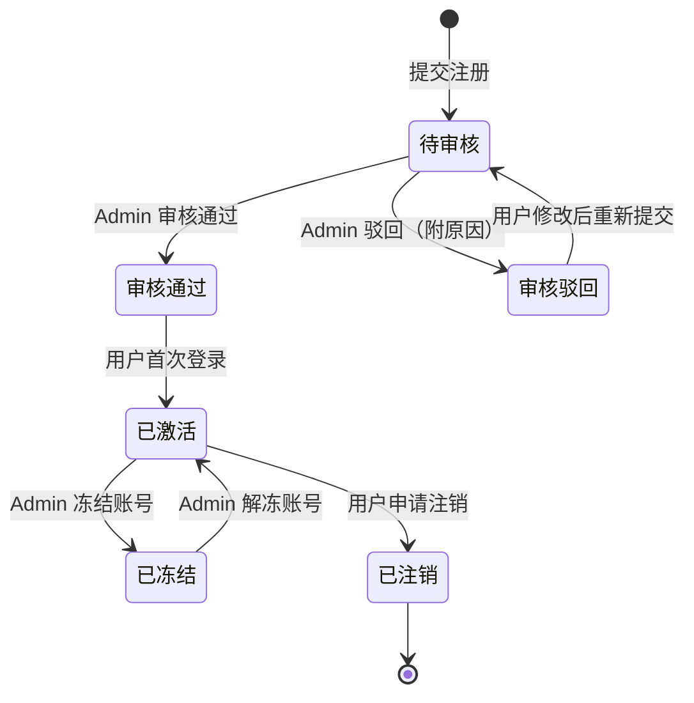

##### 5.1.2.3 密码重置页

| 字段名称 | 字段标识 | 类型 | 必填 | 限制 | 说明 |
| --------- | --------- | ------ | ------ | ------ | ------ |
| 手机号 | phone | string | 是 | 已注册的手机号 | — |
| 短信验证码 | sms_code | string | 是 | 6 位纯数字，有效期 5 分钟 | — |
| 新密码 | new_password | string | 是 | 8-20 位，须包含大小写字母和数字 | — |
| 确认新密码 | new_password_confirm | string | 是 | 与新密码一致 | — |

| 按钮 | 操作 |
| ------ | ------ |
| 获取验证码 | 向手机号发送短信验证码 |
| 确认重置 | 校验通过后重置密码，跳转至登录页 |
| 返回登录 | 跳转至登录页 |

---

#### 5.1.3 页脚信息

**页面说明**：位于所有页面底部的全局页脚，展示平台法律信息和联络渠道。

**布局组件**

| 区域 | 内容 | 说明 |
| ------ | ------ | ------ |
| 左侧 | 平台名称 + 版权声明 | 例："© 2026 中国广播电视社会组织联合会演员委员会" |
| 中部 | 备案信息 | ICP 备案号，点击可跳转至工信部查询页 |
| 右侧 | 联系方式 | 客服电话、官方邮箱、微信公众号二维码 |

---

#### 5.1.4 证书服务中心

**页面说明**：位于首页或导航栏的突出位置，提供演员资格证和专业技术资格证书的快速入口。

**页面布局**

| 区域 | 组件 | 说明 |
| ------ | ------ | ------ |
| 顶部标题 | "证书服务中心" | 醒目展示 |
| 服务卡片区 | 两张服务卡片 | 分别为"演员资格证"和"专业技术资格证书" |
| 证书查询区 | 搜索框 + 查询按钮 | 公开的证书真伪查询入口 |

**服务卡片**

| 卡片 | 入口按钮 | 跳转目标 |
| ------ | --------- | --------- |
| 演员资格证 | 立即申领 | /certificate/apply?type=actor_cert |
| 演员资格证 | 查看详情 | /certificate/intro?type=actor_cert |
| 专业技术资格证书 | 立即申领 | /certificate/apply?type=tech_cert |
| 专业技术资格证书 | 查看详情 | /certificate/intro?type=tech_cert |

**证书查询**

| 字段名称 | 字段标识 | 类型 | 必填 | 限制 | 说明 |
| --------- | --------- | ------ | ------ | ------ | ------ |
| 查询方式 | query_type | enum | 是 | 枚举：`cert_no`（证书编号）、`id_card`（身份证号）、`name`（姓名） | 下拉选择 |
| 查询关键词 | query_keyword | string | 是 | 根据查询方式校验格式 | — |

| 按钮 | 操作 |
| ------ | ------ |
| 查询 | 调用公开查询接口，展示证书基本信息或"未找到记录" |
| 重置 | 清空查询条件 |

---

### 5.2 首页门户

#### 5.2.1 智能工作台

**页面说明**：登录后的首页默认展示区域，根据用户角色聚合展示待办事项和效率看板，是用户的日常操作起点。

##### Actor 视角的工作台

**页面布局**

| 区域 | 组件 | 说明 |
| ------ | ------ | ------ |
| 欢迎区 | 用户头像 + 姓名 + 认证状态标签 | 展示当前登录身份 |
| 待办事项卡片 | 待办列表（最多展示 5 条） | 待缴费、待培训、待考核、证书即将到期等 |
| 快捷操作区 | 4 个快捷按钮 | 证书申领、在线培训、考核预约、个人档案 |
| 证书状态概览 | 证书卡片（最多 3 张） | 展示已持有证书的状态和有效期 |
| 通知横幅 | 最新 1 条重要通知 | 点击跳转至通知详情 |

**待办事项数据结构**

| 字段名称 | 字段标识 | 类型 | 说明 |
| --------- | --------- | ------ | ------ |
| 待办 ID | todo_id | string(36) | UUID |
| 待办类型 | todo_type | enum | 枚举：`payment`（缴费）、`training`（培训）、`exam`（考核）、`cert_renewal`（证书年审）、`review_result`（审核结果） |
| 待办标题 | title | string(100) | 简述待办内容 |
| 创建时间 | created_at | datetime | ISO 8601 |
| 截止时间 | deadline | datetime | 可为空 |
| 状态 | status | enum | 枚举：`pending`（待处理）、`done`（已完成）、`expired`（已过期） |
| 跳转链接 | action_url | string(500) | 点击待办项的跳转目标 |

**快捷操作按钮**

| 按钮 | 图标 | 跳转目标 | 权限 |
| ------ | ------ | --------- | ------ |
| 证书申领 | 📜 | /certificate/apply | Actor |
| 在线培训 | 📚 | /evaluation/training | Actor |
| 考核预约 | 📝 | /evaluation/exam | Actor |
| 个人档案 | 👤 | /profile/info | Actor |

##### Admin 视角的工作台

**页面布局**

| 区域 | 组件 | 说明 |
| ------ | ------ | ------ |
| 数据概览卡片 | 4 个统计卡片 | 本月新增注册、待审核证书、在审培训、本月收入 |
| 待办事项 | 待审批列表（最多 10 条） | 证书申请审批、认证审批、年审审批 |
| 效率看板 | 环形图 + 折线图 | 审批处理效率、月度趋势 |
| 快捷操作区 | 管理入口按钮组 | 证书管理台、培训管理台、认证管理台、人才档案 |

**数据概览卡片**

| 卡片 | 字段标识 | 数据说明 |
| ------ | --------- | --------- |
| 本月新增注册 | monthly_new_users | 当月新注册并审核通过的用户数 |
| 待审核证书 | pending_cert_count | 当前等待审核的证书申请数量 |
| 在审培训 | active_training_count | 当前进行中的培训批次数量 |
| 本月收入 | monthly_income | 当月培训费+考试费+证书费合计（元） |

**操作按钮**

| 按钮 | 跳转目标 | 权限 |
| ------ | --------- | ------ |
| 培训管理台 | /evaluation/training-manage | Admin |
| 考核管理台 | /evaluation/exam-manage | Admin |
| 认证管理台 | /certification/manage | Admin |
| 人才档案 | /talent-archive | Admin |
| 查看全部待办 | /workbench/todos | Admin |

##### Org 视角的工作台

**页面布局**

| 区域 | 组件 | 说明 |
| ------ | ------ | ------ |
| 机构信息卡片 | 机构名称 + 机构类型 + 资质状态 | 展示本机构基本信息 |
| 关联演员概览 | 本机构关联的演员数量 + 持证人数 | 统计数据（只读） |
| 通知横幅 | 最新 1 条系统通知 | — |

**操作按钮**

| 按钮 | 跳转目标 | 权限 |
| ------ | --------- | ------ |
| 查看机构信息 | /org-manage/my-org | Org |
| 查看关联演员 | /org-manage/my-org/actors | Org |

---

#### 5.2.2 品牌展示

**页面说明**：首页中部品牌展示区域，强化平台公信力。

**页面布局**

| 区域 | 组件 | 说明 |
| ------ | ------ | ------ |
| 单位资质区 | 资质证书图片轮播 | 展示委员会的主管部门批复、行业资质等 |
| 权威认证区 | 认证标识 + 文字说明 | 行业权威认证标识图 |
| 优秀人才案例区 | 人才卡片列表（最多展示 6 个） | 姓名、照片、证书等级、简介 |

**优秀人才案例卡片**

| 字段名称 | 字段标识 | 类型 | 限制 | 说明 |
| --------- | --------- | ------ | ------ | ------ |
| 姓名 | name | string(20) | — | — |
| 头像 | avatar_url | string(500) | JPG/PNG | — |
| 证书等级 | cert_level | string(20) | — | 如"一级演员" |
| 简介 | bio | string(200) | 最多 200 字 | — |
| 排序权重 | sort_order | int | 0-999 | 数值越大越靠前 |

**操作按钮（Admin 后台管理）**

| 按钮 | 操作 | 权限 |
| ------ | ------ | ------ |
| 编辑案例 | 修改人才案例信息 | Admin |
| 新增案例 | 添加优秀人才案例 | Admin |
| 删除案例 | 删除人才案例（二次确认） | Admin |
| 调整排序 | 拖拽或输入权重调整展示顺序 | Admin |

---

#### 5.2.3 党建专栏

**页面说明**：首页独立板块，展示党建相关信息。

**页面布局**

| 区域 | 组件 | 说明 |
| ------ | ------ | ------ |
| 专栏标题 | "党建专栏" + "查看更多"链接 | — |
| 文章列表 | 最新 3-5 篇党建文章卡片 | 标题 + 发布日期 + 摘要 |

**党建文章数据结构**

| 字段名称 | 字段标识 | 类型 | 必填 | 限制 | 说明 |
| --------- | --------- | ------ | ------ | ------ | ------ |
| 文章 ID | article_id | string(36) | 自动 | UUID | — |
| 标题 | title | string(100) | 是 | 最多 100 字 | — |
| 摘要 | summary | string(300) | 否 | 最多 300 字 | 列表页展示 |
| 正文 | content | text | 是 | 富文本，支持图文混排 | — |
| 封面图 | cover_url | string(500) | 否 | JPG/PNG，建议 16:9 比例 | — |
| 发布状态 | status | enum | 是 | 枚举：`draft`（草稿）、`published`（已发布）、`offline`（已下架） | — |
| 发布时间 | published_at | datetime | 否 | 发布时自动记录 | — |
| 创建人 | created_by | string(36) | 自动 | 关联管理员 ID | — |
| 置顶 | is_top | boolean | 是 | 默认 false | 置顶文章优先展示 |
| 排序权重 | sort_order | int | 是 | 默认 0 | — |

**操作按钮（前台）**

| 按钮 | 操作 | 权限 |
| ------ | ------ | ------ |
| 查看更多 | 跳转至党建专栏列表页 | 全部 |
| 文章标题/卡片 | 跳转至文章详情页 | 全部 |

**操作按钮（后台管理 - 详见后台管理模块）**

| 按钮 | 操作 | 权限 |
| ------ | ------ | ------ |
| 新建文章 | 打开富文本编辑器新建 | Admin |
| 编辑 | 修改已有文章 | Admin |
| 发布/下架 | 切换文章发布状态 | Admin |
| 删除 | 删除文章（二次确认） | Admin |
| 置顶/取消置顶 | 切换置顶状态 | Admin |

---

#### 5.2.4 通知公告

**页面说明**：首页通知公告区域 + 独立的通知公告列表页和详情页。

##### 首页通知区域

| 区域 | 组件 | 说明 |
| ------ | ------ | ------ |
| 标题栏 | "通知公告" + 分类 Tab + "查看更多" | — |
| 分类 Tab | 全部 / 考试安排 / 证书发放 / 政策公示 / 系统通知 | 切换展示不同分类 |
| 通知列表 | 最新 5-8 条通知（标题 + 日期 + 类型标签） | 点击跳转详情 |

##### 通知公告列表页（/notice/list）

**筛选区**

| 字段名称 | 字段标识 | 类型 | 说明 |
| --------- | --------- | ------ | ------ |
| 公告分类 | category | enum | 枚举：`exam_schedule`（考试安排）、`cert_issue`（证书发放）、`policy`（政策公示）、`system`（系统通知） |
| 关键词 | keyword | string(50) | 模糊搜索标题和摘要 |
| 发布日期范围 | date_range | date[] | 起止日期 |

| 按钮 | 操作 |
| ------ | ------ |
| 搜索 | 按条件筛选通知列表 |
| 重置 | 清空筛选条件 |

**列表项**

| 字段 | 说明 |
| ------ | ------ |
| 类型标签 | 彩色标签显示分类 |
| 标题 | 点击跳转详情页 |
| 发布日期 | — |
| 是否置顶 | 置顶标识 |

**通知公告数据结构**

| 字段名称 | 字段标识 | 类型 | 必填 | 限制 | 说明 |
| --------- | --------- | ------ | ------ | ------ | ------ |
| 公告 ID | notice_id | string(36) | 自动 | UUID | — |
| 标题 | title | string(100) | 是 | 最多 100 字 | — |
| 分类 | category | enum | 是 | 枚举：`exam_schedule`、`cert_issue`、`policy`、`system` | — |
| 摘要 | summary | string(300) | 否 | 最多 300 字 | — |
| 正文 | content | text | 是 | 富文本 | — |
| 附件 | attachments | file[] | 否 | 每个附件 ≤ 20MB，最多 5 个；支持 PDF/DOC/DOCX/XLS/XLSX | — |
| 发布状态 | status | enum | 是 | 枚举：`draft`、`published`、`offline` | — |
| 发布时间 | published_at | datetime | 否 | — | — |
| 置顶 | is_top | boolean | 是 | 默认 false | — |
| 创建人 | created_by | string(36) | 自动 | — | — |
| 创建时间 | created_at | datetime | 自动 | — | — |
| 更新时间 | updated_at | datetime | 自动 | — | — |

---

### 5.3 认证中心

> 📋 **字段定义参见**：认证中心的完整字段定义、状态流转、审核流程设计详见移动端 §4.3。PC 端表单字段与移动端完全一致，本节仅描述 PC 端特有的页面布局和交互差异。

#### 5.3.1 个人信息通报与核验

**页面说明**：这是面向 **Actor（演艺从业者）** 用户维护和提交个人详细职业信息的入口页面（包含真实姓名、艺名、联系方式、从业方向等必备字段）。该详尽信息在实名核验（身份证+人脸）的基础上共同构成演艺人员完整认证。信息经平台审核后成为人才档案的基础数据。**注意：User（普通用户）无需使用此页，仅需完成基础实名核验即可**。

##### 5.3.1.1 个人信息填报页（/certification/personal-info）

**页面布局**

| 区域 | 组件 | 说明 |
| ------ | ------ | ------ |
| 顶部提示 | 信息完整度进度条 + 提示文案 | 如"您的信息完整度为 65%，请补全以获得更好的服务" |
| 基本信息区 | 表单卡片 | 真实姓名、主要艺名/化名、性别、身高、体重、出生日期、民族、照片等 |
| 联系信息区 | 表单卡片 | 手机号、邮箱、通讯地址 |
| 从业信息区 | 表单卡片 | 从业年限、专业方向、演艺特长、所属团体、经纪公司等 |
| 教育背景区 | 动态表单（可增删行） | 学历、院校、专业、毕业时间 |
| 附件材料区 | 文件上传区 | 毕业证、从业证明、剧照/作品照片等 |

**基本信息字段**

| 字段名称 | 字段标识 | 类型 | 必填 | 限制 | 说明 |
| --------- | --------- | ------ | ------ | ------ | ------ |
| 真实姓名 | real_name | string(20) | 是 | 2-20 个中文字符，与实名验证一致 | 不可修改（来自认证流程） |
| 主要艺名 | stage_name | string(20) | 否 | 1-20 个字符 | 演员核心对外展示名称 |
| 曾用名 | former_name | string(20) | 否 | 2-20 个中文字符 | — |
| 性别 | gender | enum | 是 | 枚举：`male`（男）、`female`（女） | — |
| 出生日期 | birth_date | date | 是 | 不晚于当前日期，年龄须 ≥ 16 岁 | — |
| 民族 | ethnicity | enum | 是 | 56 个民族枚举值 | 下拉选择 |
| 身高 | height | int | 否 | 50-250 (cm) | 演艺人员身体规格描述 |
| 体重 | weight | int | 否 | 20-200 (kg) | 演艺人员身体规格描述 |
| 国籍 | nationality | string(20) | 是 | 默认"中国" | — |
| 身份证号 | id_card | string(18) | 是 | 与注册实名信息一致 | 不可修改，脱敏展示 |
| 个人照片 | photo_url | file | 是 | JPG/PNG，≤ 5MB，建议 2 寸证件照规格 | — |
| 个人简介 | bio | string(500) | 否 | 最多 500 字 | — |

**联系信息字段**

| 字段名称 | 字段标识 | 类型 | 必填 | 限制 | 说明 |
| --------- | --------- | ------ | ------ | ------ | ------ |
| 手机号 | phone | string(11) | 是 | 与注册手机号一致 | 不可直接修改，需通过账号管理更换 |
| 备用手机号 | phone_backup | string(11) | 否 | 手机号格式 | — |
| 电子邮箱 | email | string(100) | 否 | 邮箱格式 | — |
| 通讯地址 | address | string(200) | 否 | — | 含省/市/区/详细地址 |
| 邮政编码 | zip_code | string(6) | 否 | 6 位数字 | — |

**从业信息字段**

| 字段名称 | 字段标识 | 类型 | 必填 | 限制 | 说明 |
| --------- | --------- | ------ | ------ | ------ | ------ |
| 从业年限 | career_years | int | 是 | 0-99 | — |
| 从业起始年份 | career_start_year | int | 是 | 1950-当前年份 | — |
| 所属单位/团体 | organization | string(100) | 否 | — | 当前任职单位 |
| 单位性质 | org_type | enum | 否 | 枚举：`state_owned`（国有院团）、`private`（民营）、`freelance`（自由职业）、`other`（其他） | — |
| 专业方向 | speciality | enum[] | 是 | 多选：`film`（电影）、`tv`（电视剧）、`stage`（舞台剧）、`variety`（综艺）、`voice`（配音）等 | — |
| 演艺特长 | talents | string(100) | 否 | 比如武术、戏曲、舞蹈、体操等专门特长 | 补充展示能力 |
| 经纪公司 | agency | string(100) | 否 | — | — |
| 经纪人 | agent_name | string(20) | 否 | — | — |
| 经纪人联系方式 | agent_phone | string(11) | 否 | 手机号格式 | — |

**教育背景字段（数组，最多 5 条）**

| 字段名称 | 字段标识 | 类型 | 必填 | 限制 | 说明 |
| --------- | --------- | ------ | ------ | ------ | ------ |
| 学历 | degree | enum | 是 | 枚举：`junior_high`（初中）、`senior_high`（高中/中专）、`college`（大专）、`bachelor`（本科）、`master`（硕士）、`doctor`（博士） | — |
| 院校名称 | school_name | string(50) | 是 | — | — |
| 专业 | major | string(50) | 是 | — | — |
| 入学时间 | enroll_date | date | 是 | — | 精确到月 |
| 毕业时间 | graduate_date | date | 是 | 须晚于入学时间 | 精确到月 |
| 是否艺术类院校 | is_art_school | boolean | 是 | — | 影响表演能力认定 |

**附件材料字段**

| 字段名称 | 字段标识 | 类型 | 必填 | 限制 | 说明 |
| --------- | --------- | ------ | ------ | ------ | ------ |
| 毕业证书扫描件 | diploma_file | file | 条件必填 | JPG/PNG/PDF，≤ 10MB | 艺术类院校毕业生必须提供 |
| 从业证明材料 | career_proof_files | file[] | 条件必填 | 每个 ≤ 10MB，最多 5 个 | 非艺术类院校须提供（单位盖章证明） |
| 个人作品照片 | work_photos | file[] | 否 | JPG/PNG，每张 ≤ 5MB，最多 10 张 | 参演作品剧照等 |
| 获奖证书扫描件 | award_files | file[] | 否 | 每个 ≤ 10MB，最多 10 个 | — |
| 其他材料 | other_files | file[] | 否 | 每个 ≤ 10MB，最多 5 个 | 补充材料 |

**操作按钮**

| 按钮 | 操作 | 权限 | 说明 |
| ------ | ------ | ------ | ------ |
| 保存草稿 | 保存当前填写内容，不提交审核 | Actor | 可多次保存 |
| 提交审核 | 提交信息至管理员审核 | Actor | 必填项校验通过后才可提交 |
| 撤回 | 撤回已提交的审核（仅"待审核"状态可撤回） | Actor | — |
| 编辑 | 审核驳回后重新修改信息 | Actor | 驳回后可编辑并重新提交 |

**信息审核状态流转**


---

#### 5.3.2 认证管理台

**页面说明**：管理员用于处理用户认证申请的后台管理页面。支持查看认证队列、批量审批、查看统计数据。

##### 5.3.2.1 认证申请列表页（/certification/manage）

**页面布局**

| 区域 | 组件 | 说明 |
| ------ | ------ | ------ |
| 筛选区 | 多条件筛选表单 | 筛选认证申请 |
| 统计栏 | 4 个统计卡片 | 待审核数、今日已处理、本月通过率、平均处理时长 |
| 数据表格 | 分页表格 | 展示认证申请列表 |
| 批量操作栏 | 底部固定操作区 | 批量审批 |

**筛选条件**

| 字段名称 | 字段标识 | 类型 | 说明 |
| --------- | --------- | ------ | ------ |
| 审核状态 | status | enum | 枚举：`all`（全部）、`pending`（待审核）、`approved`（已通过）、`rejected`（已驳回） |
| 用户类型 | user_type | enum | 枚举：`all`（全部）、`actor`（演员） |
| 申请人姓名 | applicant_name | string | 模糊搜索 |
| 手机号 | phone | string | 精确搜索 |
| 身份证号 | id_card | string | 精确搜索（后 6 位模糊） |
| 申请时间范围 | apply_date_range | date[] | 起止日期 |

| 按钮 | 操作 |
| ------ | ------ |
| 搜索 | 按条件筛选 |
| 重置 | 清空筛选条件 |
| 导出 | 导出当前筛选结果为 Excel |

**数据表格列**

| 列名 | 字段标识 | 宽度 | 排序 | 说明 |
| ------ | --------- | ------ | ------ | ------ |
| 序号 | — | 60px | — | 自动编号 |
| 申请人姓名 | real_name | 100px | — | — |
| 用户类型 | user_type | 80px | — | 标签展示 |
| 手机号 | phone | 120px | — | 中间 4 位脱敏 |
| 身份证号 | id_card | 160px | — | 中间 8 位脱敏 |
| 申请时间 | apply_time | 160px | 支持 | — |
| 审核状态 | status | 100px | 支持 | 彩色标签 |
| 审核人 | reviewer_name | 100px | — | — |
| 审核时间 | review_time | 160px | 支持 | — |
| 操作 | — | 180px | — | 按钮组 |

**操作按钮（表格行级）**

| 按钮 | 操作 | 可见条件 | 权限 |
| ------ | ------ | --------- | ------ |
| 查看 | 打开申请详情弹窗/页面 | 始终可见 | Admin |
| 通过 | 审核通过该申请 | status = `pending` | Admin |
| 驳回 | 驳回该申请（需填写驳回原因） | status = `pending` | Admin |

**批量操作按钮（底部操作栏）**

| 按钮 | 操作 | 说明 |
| ------ | ------ | ------ |
| 全选/取消全选 | 勾选当前页所有记录 | — |
| 批量通过 | 将已勾选的待审核申请全部通过 | 二次确认弹窗 |
| 批量驳回 | 将已勾选的待审核申请全部驳回 | 需统一填写驳回原因 |

##### 5.3.2.2 认证申请详情页

**页面布局**

| 区域 | 组件 | 说明 |
| ------ | ------ | ------ |
| 申请人基本信息 | 只读展示 | 姓名、性别、身份证号（脱敏）、手机号、照片 |
| 实名认证材料 | 图片预览 | 身份证正反面、手持身份证照 |
| 从业信息 | 只读展示 | 从业年限、所属单位、专业方向等 |
| 教育背景 | 表格展示 | 学历列表 |
| 附件材料 | 文件列表 | 可预览/下载 |
| 审核操作区 | 表单 | 审核意见和操作按钮 |
| 审核历史 | 时间线 | 展示历次审核记录 |

**审核操作字段**

| 字段名称 | 字段标识 | 类型 | 必填 | 限制 | 说明 |
| --------- | --------- | ------ | ------ | ------ | ------ |
| 审核结论 | decision | enum | 是 | 枚举：`approved`（通过）、`rejected`（驳回） | — |
| 审核意见 | review_comment | string(500) | 驳回时必填 | 最多 500 字 | 通过时可选填 |
| 驳回原因分类 | reject_reason_type | enum | 驳回时必填 | 枚举：`material_incomplete`（材料不完整）、`material_invalid`（材料无效）、`info_mismatch`（信息不一致）、`other`（其他） | — |

| 按钮 | 操作 |
| ------ | ------ |
| 确认提交 | 提交审核结论 |
| 返回列表 | 返回认证管理列表页 |

---

#### 5.3.3 个人证书

**页面说明**：演员用户查看已获得证书、管理证书状态、在线缴费和接收年审提醒的页面。

##### 5.3.3.1 我的证书列表页（/certification/my-certs）

**页面布局**

| 区域 | 组件 | 说明 |
| ------ | ------ | ------ |
| 证书卡片区 | 卡片列表（2-3 列网格） | 每张卡片展示一个证书 |
| 空状态 | 引导区 | 无证书时展示"您还没有证书，立即申领"引导 |

**证书卡片组件**

| 元素 | 说明 |
| ------ | ------ |
| 证书类型图标 | 区分演员资格证 / 专业技术资格证书 |
| 证书编号 | — |
| 证书等级 | 仅演员证显示（一/二/三/四级）；专业技术资格证书不分级 |
| 发证日期 | — |
| 有效期至 | — |
| 状态标签 | 有效 / 即将到期 / 已过期 / 年审中 |
| 剩余天数提示 | 有效期剩余 ≤ 90 天时显示红色提醒 |

**卡片操作按钮**

| 按钮 | 操作 | 可见条件 |
| ------ | ------ | --------- |
| 查看详情 | 跳转至证书详情页 | 始终 |
| 在线缴费 | 跳转至缴费页面 | 有待缴费项时 |
| 申请年审 | 发起证书年审申请 | 距到期 ≤ 180 天 |
| 下载电子证书 | 下载证书 PDF | status = `valid` |

##### 5.3.3.2 证书详情页

**页面布局**

| 区域 | 组件 | 说明 |
| ------ | ------ | ------ |
| 证书预览区 | 电子证书展示（含防伪水印） | — |
| 基本信息区 | 字段列表 | 证书核心信息 |
| 年审记录 | 时间线 | 历次年审记录 |
| 缴费记录 | 表格 | 与该证书关联的缴费记录 |

**证书数据结构**

| 字段名称 | 字段标识 | 类型 | 必填 | 限制 | 说明 |
| --------- | --------- | ------ | ------ | ------ | ------ |
| 证书 ID | cert_id | string(36) | 自动 | UUID | — |
| 证书编号 | cert_no | string(30) | 自动 | 系统自动生成，规则：`AC-{年份}-{6位序号}` 或 `TC-{等级}-{年份}-{6位序号}` | — |
| 证书类型 | cert_type | enum | 是 | 枚举：`actor_cert`（演员资格证）、`tech_cert`（专业技术资格证书） | — |
| 证书等级 | cert_level | enum | 条件必填 | 枚举：`level_1`（一级）、`level_2`（二级）、`level_3`（三级）、`level_4`（四级），`tech_cert` 不适用 | 演员证分为一/二/三/四级，专业技术资格证书不分级 |
| 持证人 ID | holder_id | string(36) | 是 | 关联用户 ID | — |
| 持证人姓名 | holder_name | string(20) | 是 | — | — |
| 持证人身份证号 | holder_id_card | string(18) | 是 | — | 脱敏展示 |
| 发证机构 | issuing_org | string(100) | 是 | — | 如"中国广播电视社会组织联合会演员委员会" |
| 发证日期 | issue_date | date | 是 | — | — |
| 有效期至 | expiry_date | date | 是 | 发证日期 + 2 年 | — |
| 证书状态 | status | enum | 是 | 枚举：`valid`（有效）、`expiring_soon`（即将到期，≤90天）、`expired`（已过期）、`reviewing`（年审中）、`suspended`（暂停）、`revoked`（吊销） | — |
| 电子证书文件 | cert_file_url | string(500) | 否 | PDF 格式 | — |
| 二维码验证码 | qr_code | string(100) | 自动 | 用于证书真伪验证 | — |
| 创建时间 | created_at | datetime | 自动 | — | — |
| 更新时间 | updated_at | datetime | 自动 | — | — |

**证书状态生命周期**

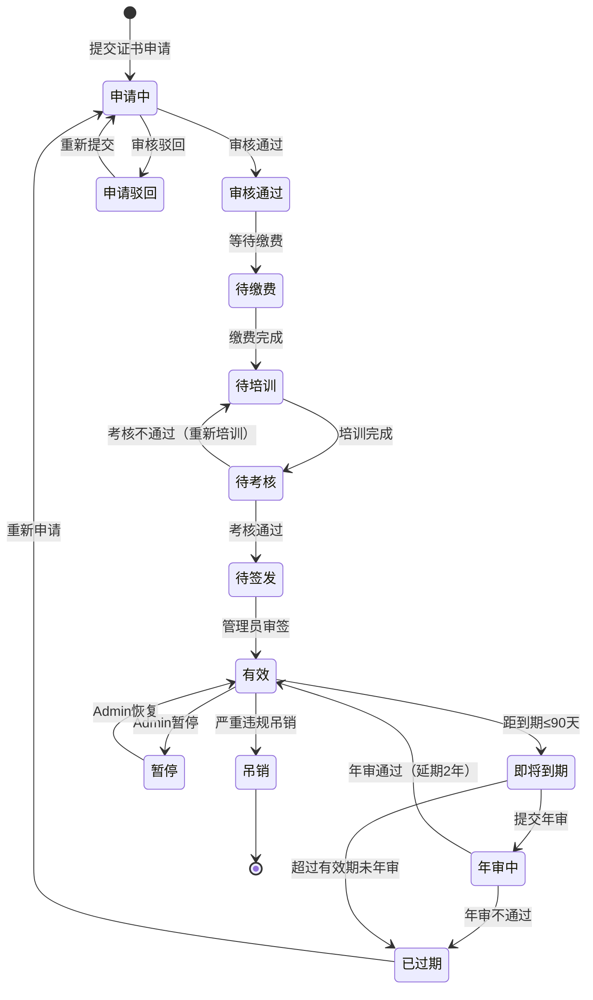

---

### 5.4 证书管理

> 📋 **字段定义参见**：证书申领、审批、年审等完整字段定义和状态流转详见移动端 §4.4。PC 端表单字段与移动端完全一致，本节仅描述 PC 端特有的页面布局和交互差异。

#### 5.4.1 证书申领

**页面说明**：演员用户在线申领演员资格证或专业技术资格证书的页面。采用分步向导式表单引导用户完成申领。

##### 5.4.1.1 证书类型选择页（/certificate/apply）

**页面布局**

| 区域 | 组件 | 说明 |
| ------ | ------ | ------ |
| 页面标题 | "证书申领" | — |
| 证书类型卡片 | 2 张选择卡片 | 演员资格证 / 专业技术资格证书 |
| 申领须知 | 折叠面板 | 各类型证书的申领条件说明 |

**演员资格证卡片信息**

| 元素 | 内容 |
| ------ | ------ |
| 标题 | 演员资格证 |
| 说明 | 对演员的"表演能力"和"艺术德行"两方面进行认证 |
| 费用 | 申领费 100 元（含培训费 1800 元、考试费 100 元需另缴） |
| 有效期 | 2 年，需定期审查 |
| 按钮 | 立即申领 → 跳转至申领表单，参数 `type=actor_cert` |

**专业技术资格证书卡片信息**

| 元素 | 内容 |
| ------ | ------ |
| 标题 | 专业技术资格证书 |
| 说明 | 凭有效演员证即可申领，申领后自动获得 |
| 前置条件 | 必须持有有效的演员资格证 |
| 按钮 | 立即申领 → 校验是否持有有效演员资格证，未持有则弹窗提示 |

##### 5.4.1.2 演员资格证申领表单（/certificate/apply/actor-cert）

**分步向导**：共 4 步

**Step 1：确认个人信息**

| 区域 | 组件 | 说明 |
| ------ | ------ | ------ |
| 信息展示区 | 只读表单 | 自动拉取认证中心已通过的个人信息 |
| 信息校验提示 | 提示条 | 若个人信息未通过审核，提示先完成认证 |

| 按钮 | 操作 |
| ------ | ------ |
| 信息无误，下一步 | 确认信息后进入 Step 2 |
| 修改个人信息 | 跳转至个人信息编辑页 |

**Step 2：选择表演能力认定方式**

| 字段名称 | 字段标识 | 类型 | 必填 | 限制 | 说明 |
| --------- | --------- | ------ | ------ | ------ | ------ |
| 认定方式 | ability_proof_type | enum | 是 | 枚举见下表 | 单选 |

| 认定方式 | 枚举值 | 条件 | 需上传材料 |
| --------- | -------- | ------ | ----------- |
| 艺术院校毕业 | `art_school` | 中等以上艺术学校（含综合性院校艺术专业）文艺表演类专业毕业 | 毕业证书扫描件 |
| 专业团体从业 | `professional_group` | 在专业艺术团体担任演员 3 年以上 | 单位书面证明（含参演作品）+ 盖章 |
| 协会技能考评 | `association_exam` | 不具备以上条件者，需通过表演协会组织的专业技能考评 | 无需上传，系统自动关联考评结果 |

**条件上传字段**

| 字段名称 | 字段标识 | 类型 | 必填 | 限制 | 可见条件 |
| --------- | --------- | ------ | ------ | ------ | --------- |
| 毕业证书 | diploma_file | file | 是 | JPG/PNG/PDF，≤ 10MB | ability_proof_type = `art_school` |
| 学位证书 | degree_file | file | 否 | JPG/PNG/PDF，≤ 10MB | ability_proof_type = `art_school` |
| 单位证明信 | org_proof_file | file | 是 | JPG/PNG/PDF，≤ 10MB，须有单位公章 | ability_proof_type = `professional_group` |
| 参演作品清单 | work_list_file | file | 是 | JPG/PNG/PDF，≤ 10MB | ability_proof_type = `professional_group` |
| 补充材料 | extra_files | file[] | 否 | 每个 ≤ 10MB，最多 3 个 | 始终可见 |

| 按钮 | 操作 |
| ------ | ------ |
| 上一步 | 返回 Step 1 |
| 下一步 | 校验材料上传完整性，进入 Step 3 |

**Step 3：费用确认与支付**

| 区域 | 组件 | 说明 |
| ------ | ------ | ------ |
| 费用明细 | 表格 | 展示各项费用 |
| 支付方式 | 单选按钮组 | 微信支付 / 支付宝 / 银行转账 |
| 发票信息 | 可选表单 | 填写开票信息 |

**费用明细**

| 费用项 | 字段标识 | 金额（元） | 说明 |
| -------- | --------- | ----------- | ------ |
| 艺德培训费 | training_fee | 1,800 | 在线培训课程 |
| 考试费 | exam_fee | 100 | 艺德考核 |
| 证书申领费 | cert_fee | 100 | 证书工本及验证费 |
| **合计** | **total_fee** | **2,000** | — |

**发票信息字段**

| 字段名称 | 字段标识 | 类型 | 必填 | 限制 | 说明 |
| --------- | --------- | ------ | ------ | ------ | ------ |
| 是否需要发票 | need_invoice | boolean | 是 | — | — |
| 发票类型 | invoice_type | enum | 条件必填 | 枚举：`personal`（个人）、`company`（企业） | need_invoice = true 时必填 |
| 发票抬头 | invoice_title | string(100) | 条件必填 | — | — |
| 纳税人识别号 | tax_no | string(20) | 条件必填 | invoice_type = `company` 时必填 | — |
| 接收邮箱 | invoice_email | string(100) | 条件必填 | 邮箱格式 | 电子发票接收邮箱 |

| 按钮 | 操作 |
| ------ | ------ |
| 上一步 | 返回 Step 2 |
| 确认支付 | 调用支付接口，跳转至支付页面 |

**Step 4：提交确认**

| 区域 | 组件 | 说明 |
| ------ | ------ | ------ |
| 申请摘要 | 只读信息卡 | 展示申请人、认定方式、费用等关键信息 |
| 承诺勾选 | 复选框 | "我已阅读并同意《演员证管理办法》" |
| 申请编号 | 自动生成 | 支付成功后生成申请编号 |

| 按钮 | 操作 |
| ------ | ------ |
| 提交申请 | 创建证书申请记录，进入审核流程 |
| 查看我的申请 | 跳转至申请进度查看页 |

##### 5.4.1.3 专业技术资格证书申领表单（/certificate/apply/tech-cert）

**前置校验**：用户必须持有状态为"有效"的演员资格证，否则弹窗提示并阻止继续。专业技术资格证书**不分等级**，无需选择等级。

**Step 1：确认前置条件**

| 字段名称 | 字段标识 | 类型 | 必填 | 限制 | 说明 |
| --------- | --------- | ------ | ------ | ------ | ------ |
| 持有演员证编号 | actor_cert_no | string | 自动 | 系统自动读取已持有的有效演员证 | 只读展示，不可修改 |

| 按钮 | 操作 |
| ------ | ------ |
| 下一步 | 系统校验演员证状态为"有效"后进入 Step 2，未持有或已失效则弹窗提示 |

**Step 2~4**：与演员资格证申领流程类似（确认信息 → 费用支付 → 提交确认），费用标准相同。

##### 5.4.1.4 申请进度查看页（/certificate/apply/progress）

**页面布局**

| 区域 | 组件 | 说明 |
| ------ | ------ | ------ |
| 进度步骤条 | Steps 组件 | 展示当前申请所处阶段 |
| 当前状态详情 | 信息卡 | 展示当前步骤的详细状态和待办提示 |
| 申请信息摘要 | 只读展示 | 申请编号、申请类型、申请时间等 |
| 操作区 | 按钮 | 根据当前状态展示可用操作 |

**进度步骤**

```text
提交申请 → 材料审核 → 缴费确认 → 艺德培训 → 考核评估 → 管理员审签 → 证书发放
```

**各步骤操作按钮**

| 步骤 | 按钮 | 操作 |
| ------ | ------ | ------ |
| 材料审核 | 查看审核意见 | 展示审核详情 |
| 材料审核（驳回） | 修改并重新提交 | 跳转至修改页 |
| 缴费确认 | 去缴费 | 跳转至支付页 |
| 艺德培训 | 开始学习 | 跳转至培训中心 |
| 考核评估 | 预约考试 | 跳转至考核中心 |
| 考核评估（不通过） | 重新报名 | 跳转至培训中心（每年限 2 次考试） |
| 证书发放 | 下载电子证书 | 下载 PDF |

---

#### 5.4.2 证书管理台

**页面说明**：管理员管理证书申请的后台页面。

##### 5.4.2.1 证书申请管理列表页（/certificate/manage）

**页面布局**

| 区域 | 组件 | 说明 |
| ------ | ------ | ------ |
| Tab 切换 | 待审核 / 审核中 / 已通过 / 已驳回 / 全部 | 按状态快速切换 |
| 筛选区 | 多条件筛选 | — |
| 统计栏 | 关键指标卡片 | 待审核数、本月申请数、通过率、平均处理时长 |
| 数据表格 | 分页表格 | 证书申请列表 |

**筛选条件**

| 字段名称 | 字段标识 | 类型 | 说明 |
| --------- | --------- | ------ | ------ |
| 证书类型 | cert_type | enum | 枚举：`all`、`actor_cert`、`tech_cert` |
| 证书等级 | cert_level | enum | 枚举：`all`、`level_1`~`level_4`（仅 actor_cert 时生效） |
| 申请人姓名 | applicant_name | string | 模糊搜索 |
| 申请编号 | apply_no | string | 精确搜索 |
| 申请时间范围 | apply_date_range | date[] | 起止日期 |
| 审核状态 | status | enum | 全部 / 待审核 / 审核中 / 已通过 / 已驳回 |

| 按钮 | 操作 |
| ------ | ------ |
| 搜索 | 执行筛选 |
| 重置 | 清空条件 |
| 导出 | 导出查询结果为 Excel |

**数据表格列**

| 列名 | 字段标识 | 宽度 | 排序 | 说明 |
| ------ | --------- | ------ | ------ | ------ |
| 序号 | — | 60px | — | — |
| 申请编号 | apply_no | 150px | — | 点击跳转详情 |
| 申请人姓名 | applicant_name | 100px | — | — |
| 证书类型 | cert_type | 120px | — | 标签展示 |
| 证书等级 | cert_level | 80px | — | 仅 tech_cert 显示 |
| 认定方式 | ability_proof_type | 120px | — | — |
| 申请时间 | apply_time | 160px | 支持 | — |
| 当前阶段 | current_stage | 120px | — | 标签（材料审核/培训中/考核中/待签发） |
| 审核状态 | status | 100px | 支持 | 彩色标签 |
| 操作 | — | 200px | — | 按钮组 |

**行级操作按钮**

| 按钮 | 操作 | 可见条件 | 权限 |
| ------ | ------ | --------- | ------ |
| 查看 | 打开申请详情 | 始终 | Admin |
| 审核 | 进入审核操作页 | status = `pending` | Admin |
| 签发 | 确认签发证书（盖章） | current_stage = `待签发` | Admin |
| 催办 | 发送提醒通知给申请人 | current_stage = `培训中` 或 `考核中` | Admin |

**证书申请详情页**

| 区域 | 组件 | 说明 |
| ------ | ------ | ------ |
| 申请概要 | 信息卡 | 申请编号、类型、等级、申请时间、当前阶段 |
| 申请人信息 | 只读展示 | 姓名、身份证号（脱敏）、联系方式 |
| 认定材料 | 文件列表 | 可预览/下载上传的证明材料 |
| 培训进度 | 进度卡 | 培训课程完成情况 |
| 考核成绩 | 成绩卡 | 考核分数和通过状态 |
| 缴费记录 | 表格 | 各项费用缴纳情况 |
| 审核记录 | 时间线 | 历次审核操作记录 |
| 操作区 | 按钮组 | 审核/签发操作 |

**审核操作字段**

| 字段名称 | 字段标识 | 类型 | 必填 | 限制 | 说明 |
| --------- | --------- | ------ | ------ | ------ | ------ |
| 审核结论 | decision | enum | 是 | 枚举：`approved`（通过）、`rejected`（驳回）、`need_supplement`（需补充材料） | — |
| 审核意见 | review_comment | string(500) | 驳回/补充时必填 | 最多 500 字 | — |
| 需补充项说明 | supplement_items | string(500) | 需补充时必填 | — | 详细说明需要补充的材料 |

| 按钮 | 操作 |
| ------ | ------ |
| 确认提交审核 | 提交审核结论，通知申请人 |
| 确认签发 | 生成证书编号，更新证书状态为"有效"，通知申请人（二次确认弹窗） |
| 返回列表 | 返回证书管理列表 |

**证书申请数据结构**

| 字段名称 | 字段标识 | 类型 | 必填 | 限制 | 说明 |
| --------- | --------- | ------ | ------ | ------ | ------ |
| 申请 ID | apply_id | string(36) | 自动 | UUID | — |
| 申请编号 | apply_no | string(20) | 自动 | 规则：`AP-{年份}{月份}-{5位序号}` | 唯一 |
| 申请人 ID | applicant_id | string(36) | 是 | 关联用户 ID | — |
| 证书类型 | cert_type | enum | 是 | `actor_cert` / `tech_cert` | — |
| 申请等级 | cert_level | enum | 条件必填 | `level_1` ~ `level_4` | 仅 `actor_cert`（演员证）时必填，专业技术资格证书不分级 |
| 认定方式 | ability_proof_type | enum | 是 | `art_school` / `professional_group` / `association_exam` | — |
| 申请状态 | status | enum | 是 | `draft`（草稿）、`pending`（待审核）、`reviewing`（审核中）、`approved`（已通过）、`rejected`（已驳回）、`supplement`（需补充材料） | — |
| 当前阶段 | current_stage | enum | 是 | `material_review`（材料审核）、`payment`（缴费）、`training`（培训）、`exam`（考核）、`org_review`（机构审核）、`issuing`（签发中）、`completed`（已完成） | — |
| 培训完成状态 | training_completed | boolean | 否 | — | 默认 false |
| 考核通过状态 | exam_passed | boolean | 否 | — | 默认 false |
| 考核分数 | exam_score | decimal(5,2) | 否 | 0-100 | — |
| 支付状态 | payment_status | enum | 是 | `unpaid`（未支付）、`paid`（已支付）、`refunded`（已退款） | — |
| 支付金额 | payment_amount | decimal(10,2) | 否 | — | 单位：元 |
| 支付时间 | payment_time | datetime | 否 | — | — |
| 支付流水号 | payment_transaction_no | string(50) | 否 | — | 第三方支付流水号 |
| 审核人 ID | reviewer_id | string(36) | 否 | — | — |
| 审核时间 | review_time | datetime | 否 | — | — |
| 审核意见 | review_comment | string(500) | 否 | — | — |
| 签发管理员 ID | issuing_admin_id | string(36) | 否 | — | — |
| 签发时间 | issue_time | datetime | 否 | — | — |
| 关联证书 ID | cert_id | string(36) | 否 | 签发后关联 | — |
| 创建时间 | created_at | datetime | 自动 | — | — |
| 更新时间 | updated_at | datetime | 自动 | — | — |

---

### 5.5 职业能力评价

> 📋 **字段定义参见**：培训课程、考核任务、题库管理等完整字段定义和状态流转详见移动端 §4.5。PC 端表单字段与移动端完全一致，本节仅描述 PC 端特有的页面布局和交互差异。

#### 5.5.1 培训中心

**页面说明**：面向演员用户的在线培训学习平台。支持课程报名、在线缴费、视频学习、进度跟踪、课后习题。系统自动关联证书申领所需的必修课程。

##### 5.5.1.1 培训课程列表页（/evaluation/training）

**页面布局**

| 区域 | 组件 | 说明 |
| ------ | ------ | ------ |
| Tab 分类 | 全部课程 / 必修课程 / 选修课程 / 我的课程 | 按类型切换 |
| 筛选区 | 课程分类筛选 + 关键词搜索 | — |
| 课程卡片列表 | 网格排列（3-4 列） | 每张卡片展示一个课程 |
| 分页 | 底部分页组件 | 每页 12 个 |

**筛选条件**

| 字段名称 | 字段标识 | 类型 | 说明 |
| --------- | --------- | ------ | ------ |
| 课程分类 | course_category | enum | 枚举：`all`（全部）、`ethics`（艺德修养）、`performance`（演技培训）、`law`（法律法规）、`psychology`（心理健康） |
| 课程状态 | course_status | enum | 枚举：`all`、`not_started`（未开始）、`in_progress`（学习中）、`completed`（已完成） |
| 关键词 | keyword | string(50) | 搜索课程名称和简介 |

| 按钮 | 操作 |
| ------ | ------ |
| 搜索 | 执行筛选 |
| 重置 | 清空条件 |

**课程卡片组件**

| 元素 | 说明 |
| ------ | ------ |
| 封面图 | 课程封面（16:9） |
| 课程名称 | — |
| 课程分类标签 | 彩色标签 |
| 是否必修 | 必修课程显示"必修"标识 |
| 总课时 | 如"共 12 课时" |
| 学习进度条 | 已报名课程显示进度百分比 |
| 价格 | 含在培训费中时显示"已包含" |

**卡片操作按钮**

| 按钮 | 操作 | 可见条件 |
| ------ | ------ | --------- |
| 查看详情 | 跳转至课程详情页 | 始终 |
| 立即报名 | 报名并缴费 | 未报名时 |
| 继续学习 | 跳转至上次学习的课时 | 学习中时 |
| 查看证书 | 课程完成后查看培训证书 | 已完成时 |

##### 5.5.1.2 课程详情页（/evaluation/training/:course_id）

**页面布局**

| 区域 | 组件 | 说明 |
| ------ | ------ | ------ |
| 课程头部 | 课程名称 + 简介 + 讲师 + 总课时 + 价格 | — |
| 课程大纲 | 可折叠列表 | 按章节展示课时列表，已学课时打勾 |
| 学习进度 | 环形进度 + 文字 | 已完成 X/Y 课时 |
| 课程评价 | 评分 + 评论区 | 已完成用户可评价 |
| 操作区 | 按钮 | — |

**课程大纲课时项**

| 元素 | 说明 |
| ------ | ------ |
| 课时序号 | — |
| 课时标题 | — |
| 课时类型图标 | 视频 📹 / 文档 📄 / 习题 📝 |
| 时长 | 视频课时显示时长 |
| 完成状态 | ✅ 已完成 / ⏸ 进行中 / 🔒 未解锁 |
| 播放按钮 | 点击进入课时学习页 |

**操作按钮**

| 按钮 | 操作 | 可见条件 |
| ------ | ------ | --------- |
| 立即报名 | 弹出支付确认 → 完成缴费 | 未报名 |
| 开始学习 | 进入第一个课时 | 已报名未开始 |
| 继续学习 | 进入上次位置的课时 | 学习中 |
| 申请考核 | 跳转至考核中心 | 所有必修课时完成 |

##### 5.5.1.3 课时学习页（/evaluation/training/:course_id/lesson/:lesson_id）

**页面布局**

| 区域 | 组件 | 说明 |
| ------ | ------ | ------ |
| 视频播放区 | 视频播放器 | 支持倍速（0.5x/1x/1.5x/2x）、全屏、拖拽进度 |
| 课时信息 | 课时标题 + 所属章节 + 时长 | — |
| 课件下载 | 附件列表 | 可下载课件 PDF |
| 课后习题区 | 习题表单 | 课时结束后弹出（如有） |
| 侧边栏 | 课程大纲（可折叠） | 快速切换课时 |

**视频播放规则**

| 规则 | 说明 |
| ------ | ------ |
| 观看时长记录 | 每 30 秒自动上报观看进度 |
| 完成条件 | 观看时长达到视频总时长的 80% 标记为已完成 |
| 防快进 | 首次观看不允许拖拽进度条超过已观看进度 |
| 断点续播 | 记录上次播放位置，重新进入自动续播 |

**课后习题字段**

| 字段名称 | 字段标识 | 类型 | 说明 |
| --------- | --------- | ------ | ------ |
| 题目 | question_text | string(500) | — |
| 题目类型 | question_type | enum | 枚举：`single`（单选）、`multiple`（多选）、`true_false`（判断） |
| 选项 | options | object[] | 每个选项含 `label`(string) 和 `value`(string) |
| 正确答案 | correct_answer | string[] | 正确选项的 value 数组 |
| 用户答案 | user_answer | string[] | 用户提交的答案 |
| 解析 | explanation | string(500) | 提交后展示 |

| 按钮 | 操作 |
| ------ | ------ |
| 提交答案 | 校验答案，展示对错和解析 |
| 下一课时 | 跳转至下一课时 |
| 返回课程 | 返回课程详情页 |

##### 5.5.1.4 培训数据与进度查看页（/evaluation/training/my-progress）

**页面布局**

| 区域 | 组件 | 说明 |
| ------ | ------ | ------ |
| 总体进度卡 | 环形图 | 已完成课程数/总课程数 |
| 必修完成状态 | 清单列表 | 每门必修课的完成状态与分数 |
| 学习时长统计 | 折线图 | 按周/月展示累计学习时长 |
| 课程列表 | 表格 | 已报名课程的详细进度 |

**课程进度表格列**

| 列名 | 字段标识 | 说明 |
| ------ | --------- | ------ |
| 课程名称 | course_name | — |
| 课程分类 | category | 标签 |
| 是否必修 | is_required | 是/否 |
| 总课时 | total_lessons | — |
| 已完成课时 | completed_lessons | — |
| 进度 | progress_percent | 进度条 |
| 习题正确率 | quiz_accuracy | 百分比 |
| 最后学习时间 | last_study_time | — |
| 操作 | — | "继续学习"按钮 |

**培训课程数据结构**

| 字段名称 | 字段标识 | 类型 | 必填 | 限制 | 说明 |
| --------- | --------- | ------ | ------ | ------ | ------ |
| 课程 ID | course_id | string(36) | 自动 | UUID | — |
| 课程名称 | course_name | string(100) | 是 | — | — |
| 课程分类 | category | enum | 是 | `ethics`/`performance`/`law`/`psychology` | — |
| 是否必修 | is_required | boolean | 是 | — | 关联证书类型 |
| 关联证书类型 | related_cert_type | enum[] | 否 | `actor_cert`/`tech_cert` | 该课程是哪类证书的必修 |
| 课程简介 | description | string(500) | 是 | — | — |
| 封面图 | cover_url | string(500) | 否 | — | — |
| 讲师姓名 | instructor_name | string(20) | 是 | — | — |
| 讲师简介 | instructor_bio | string(200) | 否 | — | — |
| 总课时数 | total_lessons | int | 是 | 1-100 | — |
| 总时长（分钟） | total_duration | int | 是 | — | — |
| 课程费用 | fee | decimal(10,2) | 是 | — | 0 表示免费 |
| 状态 | status | enum | 是 | `draft`/`published`/`offline` | — |
| 排序权重 | sort_order | int | 是 | 默认 0 | — |
| 创建时间 | created_at | datetime | 自动 | — | — |
| 更新时间 | updated_at | datetime | 自动 | — | — |

**课时数据结构**

| 字段名称 | 字段标识 | 类型 | 必填 | 限制 | 说明 |
| --------- | --------- | ------ | ------ | ------ | ------ |
| 课时 ID | lesson_id | string(36) | 自动 | UUID | — |
| 所属课程 ID | course_id | string(36) | 是 | — | — |
| 章节名称 | chapter_name | string(50) | 是 | — | — |
| 课时标题 | title | string(100) | 是 | — | — |
| 课时序号 | sequence | int | 是 | 1-100 | 同一课程内唯一 |
| 课时类型 | type | enum | 是 | `video`/`document`/`quiz` | — |
| 视频地址 | video_url | string(500) | 条件必填 | type = `video` 时必填 | — |
| 视频时长（秒） | video_duration | int | 条件必填 | — | — |
| 文档内容 | doc_content | text | 条件必填 | type = `document` 时必填 | 富文本 |
| 课件附件 | attachment_url | string(500) | 否 | PDF/PPT | — |
| 是否包含习题 | has_quiz | boolean | 是 | — | — |
| 习题数量 | quiz_count | int | 否 | — | — |

**学习记录数据结构**

| 字段名称 | 字段标识 | 类型 | 必填 | 限制 | 说明 |
| --------- | --------- | ------ | ------ | ------ | ------ |
| 记录 ID | record_id | string(36) | 自动 | UUID | — |
| 用户 ID | user_id | string(36) | 是 | — | — |
| 课程 ID | course_id | string(36) | 是 | — | — |
| 课时 ID | lesson_id | string(36) | 是 | — | — |
| 学习状态 | status | enum | 是 | `not_started`/`in_progress`/`completed` | — |
| 观看进度（秒） | watch_progress | int | 否 | — | 视频课时 |
| 完成时间 | completed_at | datetime | 否 | — | — |
| 习题得分 | quiz_score | decimal(5,2) | 否 | 0-100 | — |
| 总学习时长（秒） | study_duration | int | 是 | — | 累计学习时长 |
| 最后学习时间 | last_study_at | datetime | 是 | — | — |

---

#### 5.5.2 考核中心

**页面说明**：面向演员用户的考核评估页面。提供多元化考评体系（艺德考核、表演能力考核、心理测评等），支持线上考试和线下考核预约。

##### 5.5.2.1 考核列表页（/evaluation/exam）

**页面布局**

| 区域 | 组件 | 说明 |
| ------ | ------ | ------ |
| Tab 分类 | 全部 / 可参加的考核 / 我的考核记录 | — |
| 通知横幅 | 最近一次考核安排通知 | — |
| 考核卡片列表 | 列表排列 | 展示可参加和已参加的考核 |

**考核卡片组件**

| 元素 | 说明 |
| ------ | ------ |
| 考核名称 | — |
| 考核类型标签 | 艺德考核 / 表演能力考核 / 心理测评 |
| 考核方式 | 线上（在线答题）/ 线下（现场考核） |
| 考核时间 | 开始~结束时间窗口 |
| 时长限制 | 如"90 分钟" |
| 合格标准 | 如"≥ 60 分" |
| 费用 | — |
| 我的状态 | 未报名 / 已报名 / 已完成 / 已过期 |

**卡片操作按钮**

| 按钮 | 操作 | 可见条件 |
| ------ | ------ | --------- |
| 报名 | 报名参加考核（线上即刻报名，线下需预约时间） | 未报名且在报名时间窗口内 |
| 开始考试 | 进入在线答题页面 | 已报名 + 线上考核 + 在考试时间窗口内 |
| 查看成绩 | 展示考核分数和明细 | 已完成 |
| 查看详情 | 查看考核信息和安排 | 始终 |
| 预约时间 | 选择线下考核的时间段 | 线下考核 + 已报名未预约 |

##### 5.5.2.2 线上考试页面（/evaluation/exam/:exam_id/take）

**页面布局**

| 区域 | 组件 | 说明 |
| ------ | ------ | ------ |
| 顶部信息栏 | 考试名称 + 倒计时 + 题目进度 | 固定在顶部 |
| 答题区 | 题目展示 + 选项选择 | 单题展示模式或整卷展示模式 |
| 答题卡侧边栏 | 题号网格 | 已答/未答/标记状态，点击快速跳转 |
| 底部操作栏 | 上一题/下一题/标记/交卷 | — |

**考试规则**

| 规则 | 说明 |
| ------ | ------ |
| 防切屏 | 切换浏览器 Tab 超过 3 次强制交卷 |
| 倒计时 | 到时自动交卷 |
| 断线续考 | 网络断开后 5 分钟内可重新进入继续答题 |
| 答题保存 | 每次切题自动保存当前答案 |
| 成绩有效期 | 考核成绩半年内有效 |
| 考试次数限制 | 每年仅允许参加 2 次同类考试 |

**操作按钮**

| 按钮 | 操作 |
| ------ | ------ |
| 上一题 | 切换到上一题 |
| 下一题 | 切换到下一题 |
| 标记本题 | 标记为待检查 |
| 交卷 | 二次确认弹窗 → 提交答卷 → 显示得分（自动评分）或"等待批阅"（主观题） |

##### 5.5.2.3 考核成绩查看页（/evaluation/exam/:exam_id/result）

**页面布局**

| 区域 | 组件 | 说明 |
| ------ | ------ | ------ |
| 成绩概要卡 | 总分 + 通过/未通过标签 + 排名百分位 | — |
| 各维度得分 | 雷达图或柱状图 | 按考核维度细分展示 |
| 题目回顾 | 折叠列表 | 每题的答题情况和正确答案（自动评分题目） |
| 操作区 | 按钮 | — |

| 按钮 | 操作 | 可见条件 |
| ------ | ------ | --------- |
| 重新报名 | 报名下一次考核 | 未通过 + 当年考试次数 < 2 |
| 下载成绩单 | 下载 PDF 成绩单 | 已通过 |
| 返回考核列表 | 返回列表页 | 始终 |

---

#### 5.5.3 培训管理台

**页面说明**：管理员配置和管理培训课程、题库、学习进度的后台页面。

##### 5.5.3.1 课程管理列表页（/evaluation/training-manage）

**页面布局**

| 区域 | 组件 | 说明 |
| ------ | ------ | ------ |
| 统计卡片 | 3 个卡片 | 已发布课程数、本月活跃学员数、平均完成率 |
| 筛选区 | 多条件筛选 | — |
| 数据表格 | 分页表格 | 课程列表 |

**筛选条件**

| 字段名称 | 字段标识 | 类型 | 说明 |
| --------- | --------- | ------ | ------ |
| 课程分类 | category | enum | 全部 / 艺德修养 / 演技培训 / 法律法规 / 心理健康 |
| 课程状态 | status | enum | 全部 / 草稿 / 已发布 / 已下架 |
| 是否必修 | is_required | enum | 全部 / 必修 / 选修 |
| 关键词 | keyword | string | 搜索课程名称 |

| 按钮 | 操作 | 权限 |
| ------ | ------ | ------ |
| 搜索 | 执行筛选 | Admin |
| 重置 | 清空条件 | Admin |
| 新建课程 | 跳转至课程编辑页 | Admin |

**数据表格列**

| 列名 | 字段标识 | 宽度 | 排序 | 说明 |
| ------ | --------- | ------ | ------ | ------ |
| 序号 | — | 60px | — | — |
| 课程名称 | course_name | 200px | — | 点击跳转编辑 |
| 分类 | category | 100px | — | 标签 |
| 是否必修 | is_required | 80px | — | — |
| 总课时 | total_lessons | 80px | 支持 | — |
| 已报名人数 | enrolled_count | 100px | 支持 | — |
| 完成率 | completion_rate | 100px | 支持 | 百分比 |
| 状态 | status | 80px | 支持 | 彩色标签 |
| 创建时间 | created_at | 160px | 支持 | — |
| 操作 | — | 200px | — | 按钮组 |

**行级操作按钮**

| 按钮 | 操作 | 可见条件 | 权限 |
| ------ | ------ | --------- | ------ |
| 编辑 | 进入课程编辑页 | 始终 | Admin |
| 发布 | 发布课程 | status = `draft` | Admin |
| 下架 | 下架课程 | status = `published` | Admin |
| 查看学员 | 查看报名学员列表和进度 | 始终 | Admin |
| 删除 | 删除课程（二次确认） | 已报名人数=0 | Admin |

##### 5.5.3.2 课程编辑页（/evaluation/training-manage/edit/:course_id）

**页面布局**

| 区域 | 组件 | 说明 |
| ------ | ------ | ------ |
| 基本信息表单 | 表单 | 课程名、分类、讲师、价格等 |
| 课程大纲编辑 | 可拖拽排序列表 | 章节和课时管理 |
| 课时编辑区 | 内联编辑 | 上传视频/文档、配置习题 |

**基本信息字段**：参见培训课程数据结构（4.5.1.4）

**课时编辑操作**

| 按钮 | 操作 |
| ------ | ------ |
| 添加章节 | 新增一个章节分组 |
| 添加课时 | 在选中章节下添加课时 |
| 上传视频 | 上传课时视频，支持 MP4/MOV，≤ 2GB |
| 上传文档 | 上传课时文档 |
| 配置习题 | 弹窗编辑课后习题 |
| 拖拽排序 | 拖拽调整课时和章节顺序 |
| 删除课时 | 删除课时（二次确认） |
| 保存 | 保存全部修改 |
| 预览 | 以学员视角预览课程 |

##### 5.5.3.3 学员进度管理页（/evaluation/training-manage/:course_id/students）

**数据表格列**

| 列名 | 字段标识 | 宽度 | 说明 |
| ------ | --------- | ------ | ------ |
| 序号 | — | 60px | — |
| 学员姓名 | student_name | 100px | — |
| 手机号 | phone | 120px | 脱敏 |
| 报名时间 | enroll_time | 160px | — |
| 已完成课时 | completed_lessons | 100px | — |
| 学习进度 | progress | 120px | 进度条 |
| 总学习时长 | total_study_time | 100px | 格式化为 X 小时 X 分 |
| 习题平均分 | avg_quiz_score | 100px | — |
| 最后学习时间 | last_study_at | 160px | — |
| 操作 | — | 120px | — |

| 按钮 | 操作 |
| ------ | ------ |
| 发送提醒 | 向该学员发送学习提醒通知 |
| 查看详情 | 查看该学员每课时的学习记录 |
| 导出 | 导出全部学员进度为 Excel |

##### 5.5.3.4 培训数据分析看板（/evaluation/training-manage/analytics）

**看板组件**

| 组件 | 数据 | 图表类型 |
| ------ | ------ | --------- |
| 课程完成率趋势 | 按月统计各课程完成率 | 折线图 |
| 学员活跃度 | 按日/周/月统计活跃学员数 | 柱状图 |
| 课程热度排行 | 按报名人数排序的 Top 10 课程 | 水平柱状图 |
| 习题正确率分布 | 各课程习题平均正确率 | 雷达图 |
| 总体完成指标 | 已报名/进行中/已完成人数 | 环形图 |

---

#### 5.5.4 考核管理台

**页面说明**：管理员创建、配置和管理考核任务的后台页面。支持题库管理、试卷生成、自动/手动阅卷、成绩统计。

##### 5.5.4.1 考核任务管理列表页（/evaluation/exam-manage）

**页面布局**

| 区域 | 组件 | 说明 |
| ------ | ------ | ------ |
| 统计卡片 | 4 个卡片 | 进行中考核、本月考核人次、平均通过率、待批阅试卷数 |
| 筛选区 | 多条件筛选 | — |
| 数据表格 | 分页表格 | 考核任务列表 |

**筛选条件**

| 字段名称 | 字段标识 | 类型 | 说明 |
| --------- | --------- | ------ | ------ |
| 考核类型 | exam_type | enum | 全部 / 艺德考核 / 表演能力考核 / 心理测评 |
| 考核方式 | exam_mode | enum | 全部 / 线上 / 线下 |
| 状态 | status | enum | 全部 / 草稿 / 报名中 / 进行中 / 已结束 |
| 关键词 | keyword | string | 搜索考核名称 |
| 时间范围 | date_range | date[] | 起止日期 |

| 按钮 | 操作 | 权限 |
| ------ | ------ | ------ |
| 搜索 | 执行筛选 | Admin |
| 重置 | 清空条件 | Admin |
| 新建考核 | 创建新的考核任务 | Admin |

**数据表格列**

| 列名 | 字段标识 | 宽度 | 排序 | 说明 |
| ------ | --------- | ------ | ------ | ------ |
| 序号 | — | 60px | — | — |
| 考核名称 | exam_name | 200px | — | 点击跳转详情 |
| 考核类型 | exam_type | 120px | — | 标签 |
| 考核方式 | exam_mode | 80px | — | — |
| 报名时间窗口 | register_period | 200px | — | 起止时间 |
| 考核时间窗口 | exam_period | 200px | 支持 | 起止时间 |
| 报名人数 | register_count | 80px | 支持 | — |
| 通过率 | pass_rate | 80px | 支持 | 百分比 |
| 状态 | status | 100px | 支持 | 彩色标签 |
| 操作 | — | 200px | — | 按钮组 |

**行级操作按钮**

| 按钮 | 操作 | 可见条件 | 权限 |
| ------ | ------ | --------- | ------ |
| 编辑 | 编辑考核配置 | status = `draft` | Admin |
| 发布 | 发布考核（开放报名） | status = `draft` | Admin |
| 查看成绩 | 查看所有考生成绩 | status = `已结束` | Admin |
| 批阅 | 进入批阅页面 | 有待批阅试卷 | Admin |
| 数据分析 | 查看考核分析看板 | status = `已结束` | Admin |
| 结束 | 手动结束考核 | status = `进行中` | Admin |
| 删除 | 删除考核（二次确认） | status = `draft` 且报名人数=0 | Admin |

##### 5.5.4.2 考核任务编辑页（/evaluation/exam-manage/edit/:exam_id）

**基本信息字段**

| 字段名称 | 字段标识 | 类型 | 必填 | 限制 | 说明 |
| --------- | --------- | ------ | ------ | ------ | ------ |
| 考核名称 | exam_name | string(100) | 是 | — | — |
| 考核类型 | exam_type | enum | 是 | `ethics`(艺德)/`performance`(表演能力)/`psychology`(心理测评) | — |
| 考核方式 | exam_mode | enum | 是 | `online`(线上)/`offline`(线下) | — |
| 关联证书类型 | related_cert_type | enum | 否 | `actor_cert`/`tech_cert` | 该考核与哪类证书关联 |
| 报名开始时间 | register_start | datetime | 是 | — | — |
| 报名截止时间 | register_end | datetime | 是 | 须晚于报名开始 | — |
| 考核开始时间 | exam_start | datetime | 是 | 须晚于报名截止 | — |
| 考核结束时间 | exam_end | datetime | 是 | 须晚于考核开始 | — |
| 考试时长（分钟） | duration_minutes | int | 是 | 30-300 | 线上考核的答题时长 |
| 合格分数线 | pass_score | decimal(5,2) | 是 | 0-100，默认 60 | — |
| 总分 | total_score | decimal(5,2) | 是 | 默认 100 | — |
| 报名费 | register_fee | decimal(10,2) | 是 | — | 0 表示免费 |
| 最大报名人数 | max_registrations | int | 否 | — | 0 表示不限 |
| 考核说明 | description | text | 否 | 富文本 | — |
| 考核须知 | notice | text | 否 | — | 展示给考生的注意事项 |

**试卷配置区**

| 字段名称 | 字段标识 | 类型 | 必填 | 说明 |
| --------- | --------- | ------ | ------ | ------ |
| 组卷方式 | paper_mode | enum | 是 | `manual`（手动选题）/ `random`（随机抽题） |
| 手动选题 | selected_questions | string[] | 条件必填 | 从题库中选择具体题目 |
| 随机抽题规则 | random_rules | object[] | 条件必填 | 按分类/难度配置抽题数量 |

**随机抽题规则字段**

| 字段名称 | 字段标识 | 类型 | 说明 |
| --------- | --------- | ------ | ------ |
| 题目分类 | question_category | enum | 题库中的分类 |
| 题目类型 | question_type | enum | 单选/多选/判断/简答 |
| 难度 | difficulty | enum | `easy`/`medium`/`hard` |
| 抽取数量 | count | int | — |
| 每题分值 | score_per_question | decimal | — |

| 按钮 | 操作 |
| ------ | ------ |
| 保存草稿 | 保存考核配置 |
| 预览试卷 | 以考生视角预览 |
| 发布 | 发布考核并开放报名 |

##### 5.5.4.3 题库管理页（/evaluation/exam-manage/question-bank）

**页面布局**

| 区域 | 组件 | 说明 |
| ------ | ------ | ------ |
| 筛选区 | 分类/类型/难度/关键词筛选 | — |
| 数据表格 | 分页表格 | 题目列表 |

**筛选条件**

| 字段名称 | 字段标识 | 类型 | 说明 |
| --------- | --------- | ------ | ------ |
| 题目分类 | category | enum | 艺德知识/法律法规/表演理论/心理健康/其他 |
| 题目类型 | type | enum | 全部/单选/多选/判断/简答 |
| 难度 | difficulty | enum | 全部/简单/中等/困难 |
| 关键词 | keyword | string | 搜索题干内容 |

| 按钮 | 操作 | 权限 |
| ------ | ------ | ------ |
| 搜索 | 执行筛选 | Admin |
| 重置 | 清空 | Admin |
| 新建题目 | 打开题目编辑弹窗 | Admin |
| 批量导入 | 上传 Excel 批量导入题目 | Admin |
| 导出 | 导出题库为 Excel | Admin |

**题目数据结构**

| 字段名称 | 字段标识 | 类型 | 必填 | 限制 | 说明 |
| --------- | --------- | ------ | ------ | ------ | ------ |
| 题目 ID | question_id | string(36) | 自动 | UUID | — |
| 题干 | content | text | 是 | 支持富文本（含图片） | — |
| 题目分类 | category | enum | 是 | `ethics_knowledge`/`law`/`performance_theory`/`psychology`/`other` | — |
| 题目类型 | type | enum | 是 | `single`(单选)/`multiple`(多选)/`true_false`(判断)/`short_answer`(简答) | — |
| 难度 | difficulty | enum | 是 | `easy`/`medium`/`hard` | — |
| 选项 | options | json | 条件必填 | 选择题必填，数组格式 `[{label,value,is_correct}]` | — |
| 正确答案 | correct_answer | text | 是 | — | 选择题为正确选项值，简答题为参考答案 |
| 答案解析 | explanation | text | 否 | — | — |
| 建议分值 | suggested_score | decimal(5,2) | 是 | 默认 2 | — |
| 使用次数 | usage_count | int | 自动 | — | 被引用到试卷的次数 |
| 正确率 | accuracy_rate | decimal(5,2) | 自动 | — | 历史答题正确率 |
| 状态 | status | enum | 是 | `active`/`disabled` | — |
| 创建人 | created_by | string(36) | 自动 | — | — |
| 创建时间 | created_at | datetime | 自动 | — | — |
| 更新时间 | updated_at | datetime | 自动 | — | — |

**新建/编辑题目弹窗操作**

| 按钮 | 操作 |
| ------ | ------ |
| 添加选项 | 增加一个选项（最多 8 个） |
| 删除选项 | 删除指定选项 |
| 设为正确答案 | 标记选项为正确答案 |
| 保存 | 保存题目 |
| 取消 | 关闭弹窗 |

##### 5.5.4.4 批阅页面（/evaluation/exam-manage/:exam_id/review）

**页面布局**

| 区域 | 组件 | 说明 |
| ------ | ------ | ------ |
| 待批阅列表 | 左侧考生列表 | 展示待批阅考生，点击切换 |
| 答卷展示区 | 中部 | 展示考生每题的答案 |
| 评分区 | 右侧 | 每题打分和评语 |

**评分操作字段**

| 字段名称 | 字段标识 | 类型 | 必填 | 限制 | 说明 |
| --------- | --------- | ------ | ------ | ------ | ------ |
| 题目得分 | score | decimal(5,2) | 是 | 0 ~ 该题满分 | — |
| 评语 | comment | string(200) | 否 | — | 每题可选评语 |

| 按钮 | 操作 |
| ------ | ------ |
| 保存评分 | 保存当前考生的评分 |
| 提交并下一位 | 提交评分，切换到下一位考生 |
| 批量自动评分 | 对客观题（单选/多选/判断）自动评分 |

##### 5.5.4.5 考核数据分析看板（/evaluation/exam-manage/:exam_id/analytics）

**看板组件**

| 组件 | 数据 | 图表类型 |
| ------ | ------ | --------- |
| 考核概览 | 报名人数/实际参考/通过人数/通过率 | 指标卡片 |
| 分数分布 | 各分数段人数分布 | 柱状图 |
| 题目正确率 | 每题的正确率排名 | 水平柱状图 |
| 难度分析 | 各难度级别的平均得分 | 分组柱状图 |
| 成绩排行 | Top 10 和 Bottom 10 考生 | 表格 |

**考核任务数据结构**

| 字段名称 | 字段标识 | 类型 | 必填 | 限制 | 说明 |
| --------- | --------- | ------ | ------ | ------ | ------ |
| 考核 ID | exam_id | string(36) | 自动 | UUID | — |
| 考核名称 | exam_name | string(100) | 是 | — | — |
| 考核类型 | exam_type | enum | 是 | `ethics`/`performance`/`psychology` | — |
| 考核方式 | exam_mode | enum | 是 | `online`/`offline` | — |
| 关联证书类型 | related_cert_type | enum | 否 | — | — |
| 报名时间窗口 | register_start / register_end | datetime | 是 | — | — |
| 考核时间窗口 | exam_start / exam_end | datetime | 是 | — | — |
| 考试时长 | duration_minutes | int | 是 | — | — |
| 合格分数线 | pass_score | decimal(5,2) | 是 | — | — |
| 总分 | total_score | decimal(5,2) | 是 | — | — |
| 报名费 | register_fee | decimal(10,2) | 是 | — | — |
| 组卷方式 | paper_mode | enum | 是 | `manual`/`random` | — |
| 状态 | status | enum | 是 | `draft`/`registering`/`in_progress`/`ended` | — |
| 报名人数 | register_count | int | 自动 | — | — |
| 实际参考人数 | actual_count | int | 自动 | — | — |
| 通过人数 | pass_count | int | 自动 | — | — |
| 创建时间 | created_at | datetime | 自动 | — | — |

**考生答卷数据结构**

| 字段名称 | 字段标识 | 类型 | 必填 | 限制 | 说明 |
| --------- | --------- | ------ | ------ | ------ | ------ |
| 答卷 ID | answer_sheet_id | string(36) | 自动 | UUID | — |
| 考核 ID | exam_id | string(36) | 是 | — | — |
| 考生 ID | student_id | string(36) | 是 | — | — |
| 开始答题时间 | start_time | datetime | 自动 | — | — |
| 交卷时间 | submit_time | datetime | 否 | — | — |
| 答题状态 | status | enum | 是 | `in_progress`/`submitted`/`reviewing`/`scored` | — |
| 总得分 | total_score | decimal(5,2) | 否 | — | 批阅完成后 |
| 是否通过 | is_passed | boolean | 否 | — | — |
| 客观题得分 | objective_score | decimal(5,2) | 否 | — | 自动评分 |
| 主观题得分 | subjective_score | decimal(5,2) | 否 | — | 手动评分 |
| 切屏次数 | tab_switch_count | int | 自动 | — | 防作弊记录 |
| 批阅人 ID | reviewer_id | string(36) | 否 | — | — |
| 批阅时间 | review_time | datetime | 否 | — | — |

---

### 5.6 人才数字档案

> 📋 **字段定义参见**：人才档案的完整字段定义和数据结构详见移动端 §4.8。PC 端与移动端完全一致，本节仅描述 PC 端特有的导出和大屏展示功能。

#### 5.6.1 基础信息管理

**页面说明**：管理员查看和管理平台所有注册人员基本信息的后台页面。

##### 5.6.1.1 人员信息列表页（/talent-archive/basic）

**页面布局**

| 区域 | 组件 | 说明 |
| ------ | ------ | ------ |
| 统计卡片 | 3 个卡片 | 总注册人数、本月新增、已认证人数 |
| 筛选区 | 多条件筛选 | — |
| 数据表格 | 分页表格 | 人员基本信息列表 |

**筛选条件**

| 字段名称 | 字段标识 | 类型 | 说明 |
| --------- | --------- | ------ | ------ |
| 姓名 | name | string | 模糊搜索 |
| 手机号 | phone | string | 精确搜索 |
| 身份证号 | id_card | string | 后 6 位模糊搜索 |
| 认证状态 | auth_status | enum | 全部/待审核/已认证/已驳回/已冻结 |
| 用户类型 | user_type | enum | 全部/演员 |
| 注册时间范围 | register_date_range | date[] | 起止日期 |
| 专业方向 | speciality | enum | 电影/电视剧/舞台剧/综艺/配音/其他 |

| 按钮 | 操作 | 权限 |
| ------ | ------ | ------ |
| 搜索 | 执行筛选 | Admin |
| 重置 | 清空条件 | Admin |
| 导出 | 导出查询结果为 Excel | Admin |

**数据表格列**

| 列名 | 字段标识 | 宽度 | 排序 | 说明 |
| ------ | --------- | ------ | ------ | ------ |
| 序号 | — | 60px | — | — |
| 头像 | photo_url | 60px | — | 缩略图 |
| 姓名 | real_name | 100px | — | 点击跳转档案详情 |
| 性别 | gender | 60px | — | — |
| 手机号 | phone | 120px | — | 中间 4 位脱敏 |
| 身份证号 | id_card | 160px | — | 中间 8 位脱敏 |
| 用户类型 | user_type | 80px | — | 标签 |
| 认证状态 | auth_status | 100px | 支持 | 彩色标签 |
| 持有证书 | cert_count | 80px | 支持 | 数字 |
| 注册时间 | register_time | 160px | 支持 | — |
| 操作 | — | 180px | — | 按钮组 |

**行级操作按钮**

| 按钮 | 操作 | 可见条件 | 权限 |
| ------ | ------ | --------- | ------ |
| 查看档案 | 跳转至全景数字档案页 | 始终 | Admin |
| 编辑 | 编辑人员基本信息 | 始终 | Admin |
| 冻结 | 冻结该账号 | auth_status = `已认证` | Admin |
| 解冻 | 解冻该账号 | auth_status = `已冻结` | Admin |

---

#### 5.6.2 资格证书管理

**页面说明**：管理员查看所有注册人员证书持有情况的汇总页面。

##### 5.6.2.1 证书汇总列表页（/talent-archive/certificates）

**页面布局**

| 区域 | 组件 | 说明 |
| ------ | ------ | ------ |
| 统计卡片 | 4 个卡片 | 有效演员证数量、有效专业资格证数量、即将到期数量、已过期数量 |
| 筛选区 | 多条件筛选 | — |
| 数据表格 | 分页表格 | 证书列表 |

**筛选条件**

| 字段名称 | 字段标识 | 类型 | 说明 |
| --------- | --------- | ------ | ------ |
| 持证人姓名 | holder_name | string | 模糊搜索 |
| 证书类型 | cert_type | enum | 全部/演员资格证/专业技术资格证书 |
| 证书等级 | cert_level | enum | 全部/一级/二级/三级/四级 |
| 证书状态 | status | enum | 全部/有效/即将到期/已过期/年审中/暂停/吊销 |
| 发证日期范围 | issue_date_range | date[] | — |
| 到期日期范围 | expiry_date_range | date[] | — |

| 按钮 | 操作 | 权限 |
| ------ | ------ | ------ |
| 搜索 | 执行筛选 | Admin |
| 重置 | 清空条件 | Admin |
| 导出 | 导出证书数据为 Excel | Admin |

**数据表格列**

| 列名 | 字段标识 | 宽度 | 排序 | 说明 |
| ------ | --------- | ------ | ------ | ------ |
| 序号 | — | 60px | — | — |
| 证书编号 | cert_no | 150px | — | — |
| 持证人 | holder_name | 100px | — | 点击跳转档案 |
| 证书类型 | cert_type | 120px | — | 标签 |
| 证书等级 | cert_level | 80px | — | — |
| 发证日期 | issue_date | 120px | 支持 | — |
| 有效期至 | expiry_date | 120px | 支持 | — |
| 剩余天数 | remaining_days | 80px | 支持 | ≤90 天标红 |
| 状态 | status | 100px | 支持 | 彩色标签 |
| 操作 | — | 150px | — | 按钮组 |

**行级操作按钮**

| 按钮 | 操作 | 权限 |
| ------ | ------ | ------ |
| 查看详情 | 查看证书详情 | Admin |
| 暂停 | 暂停证书有效性 | Admin |
| 恢复 | 恢复已暂停的证书 | Admin |
| 吊销 | 吊销证书（需填写原因，二次确认） | Admin |

---

#### 5.6.3 全景数字档案

**页面说明**：整合单个人才的全维度信息，形成包含基本信息、证书、培训、考核、荣誉、红黑榜、心理健康等数据的360度全景画像。

##### 5.6.3.1 人才全景档案页（/talent-archive/panorama/:user_id）

**页面布局**

| 区域 | 组件 | 说明 |
| ------ | ------ | ------ |
| 顶部概要 | 头像 + 姓名 + 认证标识 + 档案健康度评分 | — |
| Tab 导航 | 基本信息 / 证书记录 / 培训记录 / 考核记录 / 荣誉记录 / 红黑榜 / 心理健康 | 切换不同维度 |
| 档案健康度 | 雷达图 | 多维度评分可视化 |
| 优化建议 | 提示卡片 | 根据档案完整度给出优化建议 |

**档案健康度评分维度**

| 维度 | 字段标识 | 计算规则 | 满分 |
| ------ | --------- | --------- | ------ |
| 信息完整度 | info_score | 已填字段/总字段 × 100 | 100 |
| 证书状态 | cert_score | 持有有效证书数量 × 权重 | 100 |
| 培训完成度 | training_score | 必修课完成率 × 100 | 100 |
| 考核成绩 | exam_score | 最近一次考核标准化得分 | 100 |
| 荣誉积累 | honor_score | 荣誉数量 × 权重 | 100 |
| 合规状态 | compliance_score | 无黑榜记录=100，有黑榜=0 | 100 |

**Tab 1：基本信息**  
展示与 4.3.1 个人信息填报页相同的字段，此处为只读模式。

**Tab 2：证书记录**  
表格展示该人才持有的所有证书，字段参见 4.3.3.2 证书数据结构。

**Tab 3：培训记录**

| 列名 | 说明 |
| ------ | ------ |
| 课程名称 | — |
| 课程分类 | 标签 |
| 报名时间 | — |
| 完成状态 | 进行中/已完成/未开始 |
| 学习进度 | 进度条 |
| 完成时间 | — |
| 习题平均分 | — |

**Tab 4：考核记录**

| 列名 | 说明 |
| ------ | ------ |
| 考核名称 | — |
| 考核类型 | 标签 |
| 考核时间 | — |
| 得分 | — |
| 是否通过 | ✅ / ❌ |
| 成绩有效期至 | — |

**Tab 5：荣誉记录**

| 列名 | 说明 |
| ------ | ------ |
| 荣誉名称 | — |
| 荣誉类型 | 头衔/称号/奖项/公益 |
| 颁发机构 | — |
| 获得时间 | — |
| 证明材料 | 可预览/下载 |
| 审核状态 | 待审核/已通过/已驳回 |

**Tab 6：红黑榜记录**

| 列名 | 说明 |
| ------ | ------ |
| 榜单类型 | 红榜/黑榜 |
| 事由 | — |
| 记录时间 | — |
| 有效期至 | 黑榜记录有有效期 |
| 影响 | 对证书/培训/考核的影响说明 |
| 操作人 | — |

**Tab 7：心理健康记录**

| 列名 | 说明 |
| ------ | ------ |
| 测评名称 | — |
| 测评时间 | — |
| 综合评分 | 数值 |
| 评估等级 | 优秀/良好/一般/需关注 |
| 建议 | 简要建议文本 |
| 详细报告 | 可下载 PDF |

**操作按钮**

| 按钮 | 操作 | 权限 |
| ------ | ------ | ------ |
| 导出档案 | 导出完整档案为 PDF | Admin |
| 打印档案 | 打印档案页面 | Admin |
| 编辑信息 | 进入编辑模式修改信息 | Admin |
| 添加荣誉 | 为该人才添加荣誉记录 | Admin |
| 添加红/黑榜记录 | 新增红黑榜记录 | Admin |

---

#### 5.6.4 工作台

**页面说明**：管理员处理各类上报和审核事项的工作台页面。

##### 5.6.4.1 审核工作台页面（/talent-archive/workbench）

**页面布局**

| 区域 | 组件 | 说明 |
| ------ | ------ | ------ |
| Tab 分类 | 待审核 / 已处理 / 全部 | — |
| 事项类型筛选 | 下拉框 | 证书验证/荣誉审核/申诉处理/信息变更 |
| 事项列表 | 分页表格 | — |

**事项类型枚举**

| 事项类型 | 枚举值 | 说明 |
| --------- | -------- | ------ |
| 证书验证 | `cert_verify` | 验证外部提交的证书真伪 |
| 荣誉审核 | `honor_review` | 审核用户上报的荣誉记录 |
| 申诉处理 | `appeal` | 处理用户提交的申诉 |
| 信息变更 | `info_change` | 审核用户的信息变更请求 |

**数据表格列**

| 列名 | 字段标识 | 宽度 | 说明 |
| ------ | --------- | ------ | ------ |
| 序号 | — | 60px | — |
| 事项类型 | item_type | 100px | 标签 |
| 标题 | title | 200px | — |
| 提交人 | submitter_name | 100px | — |
| 提交时间 | submit_time | 160px | — |
| 优先级 | priority | 80px | 高/中/低 |
| 状态 | status | 100px | 待审核/处理中/已完成/已驳回 |
| 操作 | — | 150px | — |

**行级操作按钮**

| 按钮 | 操作 | 可见条件 | 权限 |
| ------ | ------ | --------- | ------ |
| 处理 | 进入审核处理页面 | status = `待审核` | Admin |
| 查看 | 查看事项详情 | 始终 | Admin |

**审核处理字段**

| 字段名称 | 字段标识 | 类型 | 必填 | 限制 | 说明 |
| --------- | --------- | ------ | ------ | ------ | ------ |
| 处理结论 | decision | enum | 是 | `approved`/`rejected`/`pending` | — |
| 处理意见 | comment | string(500) | 驳回时必填 | — | — |
| 附件 | attachment | file[] | 否 | 每个 ≤ 10MB，最多 3 个 | 支撑材料 |

| 按钮 | 操作 |
| ------ | ------ |
| 提交 | 提交处理结论 |
| 返回 | 返回工作台列表 |

---

### 5.7 财务管理

> 📋 **字段定义参见**：财务管理的完整字段定义和数据结构详见移动端 §4.9。PC 端新增对账报表导出和发票管理等专属功能。

#### 5.7.1 收支概览

**页面说明**：管理员查看和管理平台全部资金流水的后台页面，包括证书费、培训费、考试费等各类收入。

##### 5.7.1.1 财务概览仪表盘（/finance/overview）

**页面布局**

| 区域 | 组件 | 说明 |
| ------ | ------ | ------ |
| 周期选择器 | 日/周/月/季度/年度切换 | 默认月度 |
| 收入指标卡片 | 4 个卡片 | 本期总收入、环比增长率、订单总数、退款金额 |
| 收入趋势图 | 折线图 | 按日/周/月展示收入趋势 |
| 收入构成 | 饼图 | 按费用类型展示收入占比 |
| 最近交易列表 | 表格 | 最近 10 笔交易 |

**收入指标卡片**

| 卡片 | 字段标识 | 说明 |
| ------ | --------- | ------ |
| 本期总收入 | period_income | 选定周期内的收入合计 |
| 环比增长 | income_growth_rate | 与上一周期对比的增长率百分比 |
| 订单总数 | order_count | 选定周期内的支付订单数 |
| 退款金额 | refund_amount | 选定周期内的退款合计 |

##### 5.7.1.2 交易流水列表页（/finance/transactions）

**筛选条件**

| 字段名称 | 字段标识 | 类型 | 说明 |
| --------- | --------- | ------ | ------ |
| 费用类型 | fee_type | enum | 全部/培训费/考试费/证书申领费/验证费/年审费 |
| 支付状态 | payment_status | enum | 全部/已支付/已退款/支付中/支付失败 |
| 支付方式 | payment_method | enum | 全部/微信支付/支付宝/银行转账 |
| 用户姓名 | user_name | string | 模糊搜索 |
| 订单编号 | order_no | string | 精确搜索 |
| 交易时间范围 | transaction_date_range | date[] | 起止日期 |
| 金额范围 | amount_range | decimal[] | 最小/最大金额 |

| 按钮 | 操作 | 权限 |
| ------ | ------ | ------ |
| 搜索 | 执行筛选 | Admin |
| 重置 | 清空条件 | Admin |
| 导出 | 导出流水为 Excel | Admin |
| 导出对账单 | 按月导出对账报表 | Admin |

**数据表格列**

| 列名 | 字段标识 | 宽度 | 排序 | 说明 |
| ------ | --------- | ------ | ------ | ------ |
| 序号 | — | 60px | — | — |
| 订单编号 | order_no | 180px | — | — |
| 用户姓名 | user_name | 100px | — | — |
| 费用类型 | fee_type | 100px | — | 标签 |
| 金额（元） | amount | 100px | 支持 | — |
| 支付方式 | payment_method | 100px | — | — |
| 支付状态 | payment_status | 100px | 支持 | 彩色标签 |
| 支付时间 | payment_time | 160px | 支持 | — |
| 流水号 | transaction_no | 200px | — | 第三方支付流水号 |
| 操作 | — | 120px | — | — |

**行级操作按钮**

| 按钮 | 操作 | 可见条件 | 权限 |
| ------ | ------ | --------- | ------ |
| 查看 | 查看交易详情 | 始终 | Admin |
| 退款 | 发起退款操作 | payment_status = `已支付` | Admin |

**交易数据结构**

| 字段名称 | 字段标识 | 类型 | 必填 | 限制 | 说明 |
| --------- | --------- | ------ | ------ | ------ | ------ |
| 订单 ID | order_id | string(36) | 自动 | UUID | — |
| 订单编号 | order_no | string(30) | 自动 | 规则：`ORD-{年月日}-{6位序号}` | 唯一 |
| 用户 ID | user_id | string(36) | 是 | — | — |
| 用户姓名 | user_name | string(20) | 是 | — | 冗余存储 |
| 费用类型 | fee_type | enum | 是 | `training_fee`(培训费)/`exam_fee`(考试费)/`cert_fee`(证书申领费)/`verify_fee`(验证费)/`renewal_fee`(年审费) | — |
| 关联业务 ID | related_biz_id | string(36) | 否 | — | 关联的申请ID/课程ID/考核ID |
| 关联业务类型 | related_biz_type | enum | 否 | `cert_apply`/`course`/`exam`/`renewal` | — |
| 金额 | amount | decimal(10,2) | 是 | > 0 | 单位：元 |
| 支付方式 | payment_method | enum | 是 | `wechat`/`alipay`/`bank_transfer` | — |
| 支付状态 | payment_status | enum | 是 | `pending`/`paid`/`refunded`/`failed` | — |
| 第三方流水号 | transaction_no | string(64) | 否 | — | 支付平台返回 |
| 支付时间 | payment_time | datetime | 否 | — | — |
| 退款金额 | refund_amount | decimal(10,2) | 否 | — | — |
| 退款时间 | refund_time | datetime | 否 | — | — |
| 退款原因 | refund_reason | string(200) | 否 | — | — |
| 发票状态 | invoice_status | enum | 是 | `none`(无需)/`pending`(待开)/`issued`(已开) | — |
| 发票 ID | invoice_id | string(36) | 否 | — | 关联发票 |
| 备注 | remark | string(200) | 否 | — | — |
| 创建时间 | created_at | datetime | 自动 | — | — |
| 更新时间 | updated_at | datetime | 自动 | — | — |

##### 5.7.1.3 退款操作弹窗

| 字段名称 | 字段标识 | 类型 | 必填 | 限制 | 说明 |
| --------- | --------- | ------ | ------ | ------ | ------ |
| 退款金额 | refund_amount | decimal(10,2) | 是 | 不超过原订单金额 | 支持部分退款 |
| 退款原因 | refund_reason | string(200) | 是 | — | — |
| 退款方式 | refund_method | enum | 是 | `original`(原路退回)/`manual`(线下退款) | 默认原路退回 |

| 按钮 | 操作 |
| ------ | ------ |
| 确认退款 | 提交退款申请（二次确认弹窗） |
| 取消 | 关闭弹窗 |

---

### 5.8 个人中心

> 📋 **字段定义参见**：个人中心的完整字段定义详见移动端 §4.6。PC 端与移动端保持一致。

#### 5.8.1 个人信息

**页面说明**：演员用户查看和管理个人综合信息的页面。

##### 5.8.1.1 个人信息主页（/profile/info）

**页面布局**

| 区域 | 组件 | 说明 |
| ------ | ------ | ------ |
| 个人概要卡 | 头像 + 姓名 + 认证标识 + 会员等级 | — |
| 统计面板 | 4 个小卡片 | 持有证书数、在学课程数、荣誉数量、待办事项 |
| 基本信息区 | 只读展示 | 与 4.3.1 相同字段 |
| 联系信息区 | 只读展示 | — |
| 从业信息区 | 只读展示 | — |
| 教育背景区 | 表格展示 | — |

**操作按钮**

| 按钮 | 操作 | 权限 |
| ------ | ------ | ------ |
| 编辑信息 | 跳转至 /certification/personal-info 编辑模式 | Actor |
| 修改头像 | 弹窗上传新头像（裁切） | Actor |

---

#### 5.8.2 证书资产库

**页面说明**：演员用户管理所有证书资源的统一入口，不限平台获得的证书。支持上传外部证书、审查资料更新、快捷验证。

##### 5.8.2.1 证书资产库页面（/profile/certificates）

**页面布局**

| 区域 | 组件 | 说明 |
| ------ | ------ | ------ |
| Tab 分类 | 平台证书 / 外部证书 / 全部 | — |
| 证书卡片列表 | 网格排列 | 每张卡片展示一个证书 |
| 添加入口 | 浮动按钮 | 添加外部证书 |

**平台证书卡片**：参见 4.3.3.1 证书卡片组件

**外部证书卡片**

| 元素 | 说明 |
| ------ | ------ |
| 证书名称 | — |
| 发证机构 | — |
| 发证日期 | — |
| 证书图片 | 缩略图 |
| 来源标识 | "外部导入" 标签 |
| 审核状态 | 待审核/已通过/已驳回 |

**操作按钮**

| 按钮 | 操作 | 可见条件 |
| ------ | ------ | --------- |
| 添加外部证书 | 弹窗表单上传外部证书 | 始终 |
| 查看详情 | 查看证书详情 | 始终 |
| 下载 | 下载电子证书 | 平台证书 + status = valid |
| 编辑 | 修改外部证书信息 | 外部证书 |
| 删除 | 删除外部证书（二次确认） | 外部证书 |
| 快捷验证 | 展示证书验证二维码 | 平台证书 + status = valid |

**添加外部证书表单**

| 字段名称 | 字段标识 | 类型 | 必填 | 限制 | 说明 |
| --------- | --------- | ------ | ------ | ------ | ------ |
| 证书名称 | cert_name | string(100) | 是 | — | — |
| 发证机构 | issuing_org | string(100) | 是 | — | — |
| 证书类别 | cert_category | string(50) | 是 | — | 如"普通话等级证书"、"职业资格证"等 |
| 发证日期 | issue_date | date | 是 | 不晚于当前日期 | — |
| 有效期至 | expiry_date | date | 否 | — | 无有效期可留空 |
| 证书编号 | cert_no | string(50) | 否 | — | — |
| 证书扫描件 | cert_image | file | 是 | JPG/PNG/PDF，≤ 10MB | — |
| 补充说明 | remark | string(200) | 否 | — | — |

| 按钮 | 操作 |
| ------ | ------ |
| 提交 | 提交外部证书，进入审核队列 |
| 取消 | 关闭弹窗 |

---

#### 5.8.3 荣誉管理

**页面说明**：演员用户维护个人头衔、称号、奖项等荣誉记录的页面。

##### 5.8.3.1 荣誉列表页（/profile/honors）

**页面布局**

| 区域 | 组件 | 说明 |
| ------ | ------ | ------ |
| 荣誉统计 | 总荣誉数 + 各类型数量 | — |
| 荣誉卡片列表 | 时间线排列 | 按获得时间倒序 |
| 添加入口 | 按钮 | 添加新荣誉 |

**荣誉数据结构**

| 字段名称 | 字段标识 | 类型 | 必填 | 限制 | 说明 |
| --------- | --------- | ------ | ------ | ------ | ------ |
| 荣誉 ID | honor_id | string(36) | 自动 | UUID | — |
| 用户 ID | user_id | string(36) | 是 | — | — |
| 荣誉名称 | honor_name | string(100) | 是 | — | — |
| 荣誉类型 | honor_type | enum | 是 | `title`(头衔)/`award`(奖项)/`certificate`(称号)/`charity`(公益) | — |
| 颁发机构 | issuing_org | string(100) | 是 | — | — |
| 获得时间 | award_date | date | 是 | 不晚于当前日期 | — |
| 描述 | description | string(500) | 否 | — | — |
| 证明材料 | proof_files | file[] | 否 | 每个 ≤ 10MB，最多 5 个 | — |
| 审核状态 | status | enum | 是 | `pending`/`approved`/`rejected` | — |
| 审核意见 | review_comment | string(200) | 否 | — | — |
| 是否公开 | is_public | boolean | 是 | 默认 true | 是否在档案中公开展示 |
| 创建时间 | created_at | datetime | 自动 | — | — |

**操作按钮**

| 按钮 | 操作 | 可见条件 | 权限 |
| ------ | ------ | --------- | ------ |
| 添加荣誉 | 弹窗表单新增荣誉 | 始终 | Actor |
| 编辑 | 修改荣誉信息 | status ≠ `approved` | Actor |
| 删除 | 删除荣誉（二次确认） | 始终 | Actor |
| 查看审核意见 | 展示驳回原因 | status = `rejected` | Actor |

---

#### 5.8.4 账号/密码管理

**页面说明**：用户管理登录账号信息和安全设置的页面。

##### 5.8.4.1 账号管理页面（/profile/account）

**页面布局**

| 区域 | 组件 | 说明 |
| ------ | ------ | ------ |
| 手机号管理 | 当前手机号（脱敏）+ 更换按钮 | — |
| 密码管理 | 密码状态 + 修改密码按钮 | — |
| 登录记录 | 最近 10 次登录记录 | 时间 + 设备 + IP 地址 |

**更换手机号流程**

| 步骤 | 字段/操作 |
| ------ | --------- |
| 1. 验证原手机号 | 发送验证码至原手机号 → 输入验证码确认身份 |
| 2. 绑定新手机号 | 输入新手机号 → 发送验证码 → 输入验证码确认 |

**更换手机号字段**

| 字段名称 | 字段标识 | 类型 | 必填 | 限制 | 说明 |
| --------- | --------- | ------ | ------ | ------ | ------ |
| 原手机验证码 | old_phone_code | string(6) | 是 | 6 位数字 | — |
| 新手机号 | new_phone | string(11) | 是 | 手机号格式，不可与已注册号码重复 | — |
| 新手机验证码 | new_phone_code | string(6) | 是 | 6 位数字 | — |

**修改密码字段**

| 字段名称 | 字段标识 | 类型 | 必填 | 限制 | 说明 |
| --------- | --------- | ------ | ------ | ------ | ------ |
| 当前密码 | old_password | string | 是 | — | — |
| 新密码 | new_password | string | 是 | 8-20 位，须包含大小写字母和数字 | — |
| 确认新密码 | confirm_password | string | 是 | 与新密码一致 | — |

| 按钮 | 操作 |
| ------ | ------ |
| 更换手机号 | 打开更换手机号弹窗 |
| 修改密码 | 打开修改密码弹窗 |
| 确认修改 | 提交修改（各弹窗内） |
| 取消 | 关闭弹窗 |

---

### 5.9 后台管理

> 📋 **字段定义参见**：后台管理各模块的完整字段定义详见移动端 §4.12。PC 端新增菜单树拖拽排序、操作审计日志导出等专属功能。

#### 5.9.1 权限管理

**页面说明**：管理员统一配置系统用户角色、数据权限和操作权限的页面。

##### 5.9.1.1 角色管理页（/admin/roles）

**页面布局**

| 区域 | 组件 | 说明 |
| ------ | ------ | ------ |
| 角色列表 | 表格 | 展示系统所有角色 |
| 新建角色按钮 | 顶部按钮 | — |

**数据表格列**

| 列名 | 字段标识 | 宽度 | 说明 |
| ------ | --------- | ------ | ------ |
| 序号 | — | 60px | — |
| 角色名称 | role_name | 150px | — |
| 角色编码 | role_code | 120px | 唯一标识 |
| 描述 | description | 200px | — |
| 关联用户数 | user_count | 100px | — |
| 状态 | status | 80px | 启用/禁用 |
| 创建时间 | created_at | 160px | — |
| 操作 | — | 200px | — |

**角色数据结构**

| 字段名称 | 字段标识 | 类型 | 必填 | 限制 | 说明 |
| --------- | --------- | ------ | ------ | ------ | ------ |
| 角色 ID | role_id | string(36) | 自动 | UUID | — |
| 角色名称 | role_name | string(50) | 是 | 不可重复 | 如"超级管理员"、"证书审核员" |
| 角色编码 | role_code | string(30) | 是 | 英文+下划线，不可重复 | 如 `super_admin`、`cert_reviewer` |
| 描述 | description | string(200) | 否 | — | — |
| 权限列表 | permissions | string[] | 是 | — | 关联的权限标识数组 |
| 数据范围 | data_scope | enum | 是 | `all`(全部)/`dept`(本部门)/`self`(仅自己) | — |
| 状态 | status | enum | 是 | `active`/`disabled` | — |
| 是否系统角色 | is_system | boolean | 是 | — | 系统预设角色不可删除 |
| 创建时间 | created_at | datetime | 自动 | — | — |

**预设系统角色**

| 角色名称 | 角色编码 | 说明 |
| --------- | --------- | ------ |
| 超级管理员 | super_admin | 拥有全部权限，不可删除/修改 |
| 证书审核员 | cert_reviewer | 证书申请审核权限 |
| 培训管理员 | training_admin | 培训课程和学员管理权限 |
| 考核管理员 | exam_admin | 考核任务和批阅权限 |
| 财务管理员 | finance_admin | 财务数据查看和退款权限 |
| 内容管理员 | content_admin | 通知公告/党建专栏等内容管理权限 |

**行级操作按钮**

| 按钮 | 操作 | 可见条件 | 权限 |
| ------ | ------ | --------- | ------ |
| 编辑 | 编辑角色信息和权限 | is_system = false | Admin |
| 配置权限 | 弹窗勾选权限树 | 始终 | Admin |
| 禁用/启用 | 切换角色状态 | is_system = false | Admin |
| 删除 | 删除角色（二次确认） | is_system = false 且 user_count = 0 | Admin |
| 新建角色 | 创建新角色 | — | Admin |

**权限树结构（部分示例）**

```text
├── 认证中心
│   ├── 查看认证申请
│   ├── 审核认证申请
│   └── 导出认证数据
├── 证书管理
│   ├── 查看证书申请
│   ├── 审核证书申请
│   ├── 签发证书
│   └── 吊销证书
├── 培训管理
│   ├── 管理课程
│   ├── 查看学员进度
│   └── 发送学习提醒
├── 考核管理
│   ├── 管理考核任务
│   ├── 管理题库
│   ├── 批阅试卷
│   └── 查看考核数据
├── 人才档案
│   ├── 查看人员信息
│   ├── 编辑人员信息
│   ├── 查看全景档案
│   └── 冻结/解冻账号
├── 财务管理
│   ├── 查看交易流水
│   ├── 执行退款
│   └── 导出财务数据
├── 系统管理
│   ├── 角色管理
│   ├── 菜单管理
│   ├── 通知公告管理
│   ├── 数据安全审计
│   └── 消息中心配置
├── 红黑榜
│   ├── 查看红黑榜
│   ├── 新增红黑榜记录
│   └── 编辑/删除红黑榜
└── 心理健康
    ├── 管理测评任务
    ├── 查看测评报告
    └── 导出测评数据
```

##### 5.9.1.2 用户角色分配页（/admin/user-roles）

**筛选条件**

| 字段名称 | 字段标识 | 类型 | 说明 |
| --------- | --------- | ------ | ------ |
| 用户姓名 | name | string | 模糊搜索 |
| 角色 | role_id | enum | 下拉选择角色 |

**数据表格列**

| 列名 | 字段标识 | 宽度 | 说明 |
| ------ | --------- | ------ | ------ |
| 序号 | — | 60px | — |
| 用户姓名 | real_name | 100px | — |
| 手机号 | phone | 120px | 脱敏 |
| 当前角色 | roles | 200px | 多标签展示 |
| 操作 | — | 120px | — |

| 按钮 | 操作 |
| ------ | ------ |
| 分配角色 | 弹窗勾选角色（多选） |

---

#### 5.9.2 菜单管理

**页面说明**：管理员自定义前端导航菜单结构的页面。

##### 5.9.2.1 菜单管理页面（/admin/menus）

**页面布局**

| 区域 | 组件 | 说明 |
| ------ | ------ | ------ |
| 菜单树 | 树形结构（可拖拽） | 展示全部菜单层级 |
| 菜单编辑区 | 右侧表单 | 选中菜单项后编辑 |

**菜单数据结构**

| 字段名称 | 字段标识 | 类型 | 必填 | 限制 | 说明 |
| --------- | --------- | ------ | ------ | ------ | ------ |
| 菜单 ID | menu_id | string(36) | 自动 | UUID | — |
| 父级菜单 ID | parent_id | string(36) | 否 | — | 顶级菜单为空 |
| 菜单名称 | menu_name | string(50) | 是 | — | — |
| 路由路径 | path | string(200) | 是 | — | — |
| 图标 | icon | string(50) | 否 | — | 图标标识 |
| 排序 | sort_order | int | 是 | 0-999 | — |
| 是否可见 | is_visible | boolean | 是 | 默认 true | — |
| 关联权限 | permission_code | string(50) | 否 | — | 关联权限标识 |
| 状态 | status | enum | 是 | `active`/`disabled` | — |

| 按钮 | 操作 |
| ------ | ------ |
| 新增菜单 | 添加顶级或子级菜单 |
| 编辑 | 修改菜单信息 |
| 删除 | 删除菜单（无子级时可删） |
| 拖拽排序 | 拖拽调整顺序和层级 |
| 保存排序 | 保存拖拽排序结果 |

---

#### 5.9.3 通知公告管理

**页面说明**：管理员编辑、发布和管理通知公告的后台页面。

##### 5.9.3.1 通知公告管理列表页（/admin/notices）

**页面布局**

| 区域 | 组件 | 说明 |
| ------ | ------ | ------ |
| 筛选区 | 分类/状态/关键词筛选 | — |
| 数据表格 | 分页表格 | 公告列表 |

**筛选条件**

| 字段名称 | 字段标识 | 类型 | 说明 |
| --------- | --------- | ------ | ------ |
| 分类 | category | enum | 全部/考试安排/证书发放/政策公示/系统通知 |
| 状态 | status | enum | 全部/草稿/已发布/已下架 |
| 关键词 | keyword | string | 搜索标题 |

**数据表格列**

| 列名 | 字段标识 | 宽度 | 排序 | 说明 |
| ------ | --------- | ------ | ------ | ------ |
| 序号 | — | 60px | — | — |
| 标题 | title | 250px | — | — |
| 分类 | category | 100px | — | 标签 |
| 状态 | status | 80px | 支持 | — |
| 是否置顶 | is_top | 80px | — | — |
| 发布时间 | published_at | 160px | 支持 | — |
| 创建人 | created_by_name | 100px | — | — |
| 操作 | — | 250px | — | — |

**行级操作按钮**

| 按钮 | 操作 | 可见条件 |
| ------ | ------ | --------- |
| 编辑 | 进入编辑页面 | 始终 |
| 发布 | 发布公告 | status = `draft` |
| 下架 | 下架公告 | status = `published` |
| 置顶/取消置顶 | 切换置顶 | status = `published` |
| 删除 | 删除（二次确认） | status = `draft` |
| 新建公告 | 跳转至新建编辑页 | — |

**通知公告编辑页**

| 字段 | 说明 |
| ------ | ------ |
| 表单字段 | 参见 4.2.4 通知公告数据结构 |
| 富文本编辑器 | 正文编辑，支持图文混排、表格、视频嵌入 |
| 附件上传区 | 支持拖拽上传 |

| 按钮 | 操作 |
| ------ | ------ |
| 保存草稿 | 保存不发布 |
| 发布 | 保存并立即发布 |
| 预览 | 预览公告效果 |
| 取消 | 放弃编辑 |

---

#### 5.9.4 数据安全

**页面说明**：记录系统关键操作行为，提供审计日志查询功能。

##### 5.9.4.1 操作审计日志页（/admin/audit-log）

**页面布局**

| 区域 | 组件 | 说明 |
| ------ | ------ | ------ |
| 筛选区 | 多条件筛选 | — |
| 数据表格 | 分页表格 | 审计日志列表 |

**筛选条件**

| 字段名称 | 字段标识 | 类型 | 说明 |
| --------- | --------- | ------ | ------ |
| 操作人 | operator_name | string | 模糊搜索 |
| 操作类型 | action_type | enum | 全部/登录/数据导出/权限变更/账号操作/证书操作/财务操作 |
| 操作时间范围 | action_date_range | date[] | — |
| IP 地址 | ip_address | string | 精确搜索 |

| 按钮 | 操作 |
| ------ | ------ |
| 搜索 | 执行筛选 |
| 重置 | 清空条件 |
| 导出 | 导出审计日志 |

**数据表格列**

| 列名 | 字段标识 | 宽度 | 排序 | 说明 |
| ------ | --------- | ------ | ------ | ------ |
| 序号 | — | 60px | — | — |
| 操作人 | operator_name | 100px | — | — |
| 操作人角色 | operator_role | 100px | — | — |
| 操作类型 | action_type | 120px | — | 标签 |
| 操作描述 | action_desc | 300px | — | 详细描述 |
| 操作对象 | target | 150px | — | 如"证书 AC-2026-000001" |
| IP 地址 | ip_address | 120px | — | — |
| 设备信息 | device_info | 150px | — | 浏览器+操作系统 |
| 操作时间 | action_time | 160px | 支持 | — |
| 操作结果 | result | 80px | — | 成功/失败 |

**审计日志数据结构**

| 字段名称 | 字段标识 | 类型 | 必填 | 限制 | 说明 |
| --------- | --------- | ------ | ------ | ------ | ------ |
| 日志 ID | log_id | string(36) | 自动 | UUID | — |
| 操作人 ID | operator_id | string(36) | 是 | — | — |
| 操作人姓名 | operator_name | string(20) | 是 | — | — |
| 操作类型 | action_type | enum | 是 | `login`/`data_export`/`permission_change`/`account_action`/`cert_action`/`finance_action` | — |
| 操作描述 | action_desc | string(500) | 是 | — | — |
| 操作对象类型 | target_type | string(50) | 否 | — | 如 `user`/`certificate`/`role` |
| 操作对象 ID | target_id | string(36) | 否 | — | — |
| 请求参数 | request_params | json | 否 | — | 脱敏后的请求参数 |
| IP 地址 | ip_address | string(45) | 是 | — | 支持 IPv6 |
| 设备信息 | device_info | string(200) | 否 | — | User-Agent |
| 操作结果 | result | enum | 是 | `success`/`failure` | — |
| 失败原因 | failure_reason | string(200) | 否 | — | — |
| 操作时间 | action_time | datetime | 自动 | — | — |

**需审计的关键操作**

| 操作 | 说明 |
| ------ | ------ |
| 用户登录/登出 | 记录登录时间、设备、IP |
| 数据导出 | 任何导出 Excel/PDF 操作 |
| 权限变更 | 角色分配、权限修改 |
| 账号冻结/解冻/注销 | — |
| 证书签发/暂停/吊销 | — |
| 退款操作 | — |
| 红黑榜操作 | 新增/编辑/删除 |

---

#### 5.9.5 消息中心

**页面说明**：管理员配置和管理系统消息推送的页面。

##### 5.9.5.1 消息模板管理页（/admin/message-templates）

**页面布局**

| 区域 | 组件 | 说明 |
| ------ | ------ | ------ |
| 模板列表 | 分页表格 | 系统消息模板列表 |

**消息模板数据结构**

| 字段名称 | 字段标识 | 类型 | 必填 | 限制 | 说明 |
| --------- | --------- | ------ | ------ | ------ | ------ |
| 模板 ID | template_id | string(36) | 自动 | UUID | — |
| 模板名称 | template_name | string(100) | 是 | — | 如"证书审核通过通知" |
| 模板编码 | template_code | string(50) | 是 | 唯一 | 如 `cert_approved` |
| 消息类型 | msg_type | enum | 是 | `system`(系统)/`reminder`(提醒)/`alert`(警告) | — |
| 推送渠道 | channels | enum[] | 是 | `in_app`(站内)/`sms`(短信)/`email`(邮件)/`wechat`(微信) | 多选 |
| 标题模板 | title_template | string(200) | 是 | 支持变量占位符 `{{var}}` | — |
| 内容模板 | content_template | text | 是 | 支持变量占位符 | — |
| 变量说明 | variables | json | 否 | — | 记录可用变量及说明 |
| 状态 | status | enum | 是 | `active`/`disabled` | — |

**预设消息模板**

| 模板名称 | 编码 | 触发场景 |
| --------- | ------ | --------- |
| 认证审核通过 | auth_approved | 用户认证审核通过时 |
| 认证审核驳回 | auth_rejected | 用户认证审核驳回时 |
| 证书审核通过 | cert_approved | 证书申请审核通过时 |
| 证书签发通知 | cert_issued | 证书签发完成时 |
| 证书即将到期 | cert_expiring | 证书到期前 90/60/30 天 |
| 培训提醒 | training_reminder | 已报名课程未开始学习提醒 |
| 考核报名通知 | exam_register_open | 新考核开放报名时 |
| 考核成绩通知 | exam_result | 考核成绩出来时 |
| 缴费提醒 | payment_reminder | 待缴费提醒 |
| 年审提醒 | renewal_reminder | 年审到期提醒 |

**行级操作按钮**

| 按钮 | 操作 |
| ------ | ------ |
| 编辑 | 编辑模板内容 |
| 启用/禁用 | 切换模板状态 |
| 测试发送 | 向指定手机号/邮箱发送测试消息 |

##### 5.9.5.2 消息发送记录页（/admin/message-logs）

**数据表格列**

| 列名 | 字段标识 | 宽度 | 说明 |
| ------ | --------- | ------ | ------ |
| 序号 | — | 60px | — |
| 消息标题 | title | 200px | — |
| 接收人 | receiver_name | 100px | — |
| 推送渠道 | channel | 80px | 标签 |
| 发送状态 | send_status | 80px | 成功/失败/待发送 |
| 发送时间 | send_time | 160px | — |
| 是否已读 | is_read | 80px | 站内消息 |

---

#### 5.9.6 红黑榜管理

**页面说明**：管理员维护演员红黑榜记录的后台页面。红榜记录正面表现（公益演出、见义勇为等），黑榜记录负面行为（违规违纪等）。

##### 5.9.6.1 红黑榜列表页（/admin/honor-board）

**页面布局**

| 区域 | 组件 | 说明 |
| ------ | ------ | ------ |
| Tab 分类 | 红榜 / 黑榜 / 全部 | — |
| 统计卡片 | 2 个卡片 | 红榜总数、黑榜总数 |
| 筛选区 | 多条件筛选 | — |
| 数据表格 | 分页表格 | 红黑榜记录列表 |

**筛选条件**

| 字段名称 | 字段标识 | 类型 | 说明 |
| --------- | --------- | ------ | ------ |
| 榜单类型 | board_type | enum | 全部/红榜/黑榜 |
| 人员姓名 | person_name | string | 模糊搜索 |
| 事由分类 | reason_category | enum | 见下表 |
| 记录状态 | status | enum | 全部/有效/已过期/已撤销 |
| 记录时间范围 | record_date_range | date[] | — |

**事由分类枚举**

| 榜单 | 事由分类 | 枚举值 |
| ------ | --------- | -------- |
| 红榜 | 公益演出 | `charity_performance` |
| 红榜 | 捐赠行为 | `donation` |
| 红榜 | 见义勇为 | `bravery` |
| 红榜 | 行业贡献 | `industry_contribution` |
| 红榜 | 其他正面 | `other_positive` |
| 黑榜 | 违法行为 | `illegal` |
| 黑榜 | 违规违纪 | `violation` |
| 黑榜 | 失信行为 | `dishonesty` |
| 黑榜 | 不良记录 | `misconduct` |
| 黑榜 | 其他负面 | `other_negative` |

**数据表格列**

| 列名 | 字段标识 | 宽度 | 排序 | 说明 |
| ------ | --------- | ------ | ------ | ------ |
| 序号 | — | 60px | — | — |
| 榜单类型 | board_type | 80px | — | 红色/黑色标签 |
| 人员姓名 | person_name | 100px | — | 点击跳转档案 |
| 事由分类 | reason_category | 120px | — | — |
| 事由详情 | reason_detail | 250px | — | 截断展示 |
| 记录时间 | record_date | 120px | 支持 | — |
| 有效期至 | expiry_date | 120px | 支持 | — |
| 影响措施 | impact_measures | 150px | — | — |
| 状态 | status | 80px | — | 有效/已过期/已撤销 |
| 操作人 | operator_name | 100px | — | — |
| 操作 | — | 200px | — | — |

**行级操作按钮**

| 按钮 | 操作 | 可见条件 | 权限 |
| ------ | ------ | --------- | ------ |
| 查看 | 查看记录详情 | 始终 | Admin |
| 编辑 | 修改记录信息 | status = `有效` | Admin |
| 撤销 | 撤销记录（需填写原因） | status = `有效` | Admin |
| 删除 | 删除记录（二次确认） | status = `已撤销` | Admin |
| 新增记录 | 跳转至新增表单 | — | Admin |

**红黑榜数据结构**

| 字段名称 | 字段标识 | 类型 | 必填 | 限制 | 说明 |
| --------- | --------- | ------ | ------ | ------ | ------ |
| 记录 ID | record_id | string(36) | 自动 | UUID | — |
| 人员 ID | person_id | string(36) | 是 | 关联用户 ID | — |
| 人员姓名 | person_name | string(20) | 是 | — | 冗余存储 |
| 榜单类型 | board_type | enum | 是 | `red`(红榜)/`black`(黑榜) | — |
| 事由分类 | reason_category | enum | 是 | 参见事由分类枚举 | — |
| 事由详情 | reason_detail | text | 是 | — | 详细描述 |
| 证据材料 | evidence_files | file[] | 否 | 每个 ≤ 10MB，最多 10 个 | — |
| 记录时间 | record_date | date | 是 | — | — |
| 有效期至 | expiry_date | date | 条件必填 | 黑榜必填 | 黑榜记录有有效期 |
| 影响措施 | impact_measures | string(500) | 条件必填 | 黑榜必填 | 如"暂停证书"、"禁止参加考核" |
| 关联证书操作 | cert_action | enum | 否 | `none`(无)/`suspend`(暂停)/`revoke`(吊销) | 黑榜时是否联动处理证书 |
| 状态 | status | enum | 是 | `active`(有效)/`expired`(已过期)/`revoked`(已撤销) | — |
| 撤销原因 | revoke_reason | string(200) | 否 | — | — |
| 操作人 ID | operator_id | string(36) | 是 | — | — |
| 操作人姓名 | operator_name | string(20) | 是 | — | — |
| 创建时间 | created_at | datetime | 自动 | — | — |
| 更新时间 | updated_at | datetime | 自动 | — | — |

**黑榜影响规则**

| 影响 | 说明 |
| ------ | ------ |
| 证书暂停 | 黑榜期间证书自动暂停，黑榜过期后自动恢复 |
| 禁止考核 | 黑榜期间不允许报名参加考核 |
| 档案标注 | 全景档案中永久显示黑榜记录 |
| 年审影响 | 黑榜期间不可通过年审 |

---

#### 5.9.7 心理健康测评

**页面说明**：管理员创建和管理心理健康测评任务的后台页面。支持配置测评问卷、查看测评报告、导出数据。

##### 5.9.7.1 测评任务管理页（/admin/psychology）

**页面布局**

| 区域 | 组件 | 说明 |
| ------ | ------ | ------ |
| 统计卡片 | 3 个卡片 | 进行中测评数、本月参评人数、需关注人数 |
| 数据表格 | 分页表格 | 测评任务列表 |

**数据表格列**

| 列名 | 字段标识 | 宽度 | 排序 | 说明 |
| ------ | --------- | ------ | ------ | ------ |
| 序号 | — | 60px | — | — |
| 测评名称 | assessment_name | 200px | — | — |
| 量表类型 | scale_type | 120px | — | 标签 |
| 开放时间 | open_period | 200px | — | 起止时间 |
| 参评人数 | participant_count | 80px | 支持 | — |
| 需关注人数 | concern_count | 100px | 支持 | 需关注等级的人数 |
| 状态 | status | 80px | — | — |
| 操作 | — | 200px | — | — |

**行级操作按钮**

| 按钮 | 操作 | 可见条件 | 权限 |
| ------ | ------ | --------- | ------ |
| 编辑 | 编辑测评配置 | status = `draft` | Admin |
| 发布 | 发布测评 | status = `draft` | Admin |
| 查看报告 | 查看汇总报告和个人报告 | 有参评数据 | Admin |
| 导出数据 | 导出测评数据为 Excel | 有参评数据 | Admin |
| 结束 | 手动结束测评 | status = `进行中` | Admin |
| 新建测评 | 创建新测评任务 | — | Admin |

##### 5.9.7.2 测评任务编辑页

**测评任务字段**

| 字段名称 | 字段标识 | 类型 | 必填 | 限制 | 说明 |
| --------- | --------- | ------ | ------ | ------ | ------ |
| 测评名称 | assessment_name | string(100) | 是 | — | — |
| 量表类型 | scale_type | enum | 是 | `scl90`(SCL-90)/`sds`(SDS抑郁)/`sas`(SAS焦虑)/`custom`(自定义) | — |
| 测评说明 | description | text | 否 | — | — |
| 开放开始时间 | open_start | datetime | 是 | — | — |
| 开放结束时间 | open_end | datetime | 是 | — | — |
| 是否匿名 | is_anonymous | boolean | 是 | 默认 false | — |
| 目标人群 | target_group | enum | 是 | `all`(全部演员)/`cert_holder`(持证人员)/`specific`(指定人员) | — |
| 指定人员列表 | target_users | string[] | 条件必填 | target_group = `specific` 时必填 | 用户 ID 数组 |

**测评问卷题目字段**（自定义量表时）

| 字段名称 | 字段标识 | 类型 | 必填 | 说明 |
| --------- | --------- | ------ | ------ | ------ |
| 题目 | question | string(500) | 是 | — |
| 选项 | options | object[] | 是 | 每个含 `label`(string) 和 `score`(int) |
| 维度 | dimension | string(50) | 否 | 如"情绪"、"压力"、"人际" |

##### 5.9.7.3 测评报告页

**汇总报告**

| 组件 | 数据 | 图表类型 |
| ------ | ------ | --------- |
| 整体评估等级分布 | 优秀/良好/一般/需关注人数 | 饼图 |
| 各维度平均分 | 情绪/压力/人际/自信等维度 | 雷达图 |
| 需关注人员列表 | 评估等级="需关注"的人员 | 表格（姓名/评分/主要维度） |

**个人报告**

| 区域 | 内容 |
| ------ | ------ |
| 综合评分 | 数值 + 等级标签 |
| 各维度得分 | 雷达图 |
| 建议文本 | 根据评分自动生成 |
| 详细答题记录 | 每题的选择和得分 |

**测评数据结构**

| 字段名称 | 字段标识 | 类型 | 必填 | 限制 | 说明 |
| --------- | --------- | ------ | ------ | ------ | ------ |
| 测评 ID | assessment_id | string(36) | 自动 | UUID | — |
| 测评名称 | assessment_name | string(100) | 是 | — | — |
| 量表类型 | scale_type | enum | 是 | — | — |
| 状态 | status | enum | 是 | `draft`/`active`/`ended` | — |
| 创建时间 | created_at | datetime | 自动 | — | — |

**测评结果数据结构**

| 字段名称 | 字段标识 | 类型 | 必填 | 限制 | 说明 |
| --------- | --------- | ------ | ------ | ------ | ------ |
| 结果 ID | result_id | string(36) | 自动 | UUID | — |
| 测评 ID | assessment_id | string(36) | 是 | — | — |
| 用户 ID | user_id | string(36) | 是 | — | — |
| 总得分 | total_score | decimal(5,2) | 是 | — | — |
| 评估等级 | level | enum | 是 | `excellent`(优秀)/`good`(良好)/`normal`(一般)/`concern`(需关注) | — |
| 各维度得分 | dimension_scores | json | 否 | — | `{dimension: score}` |
| 答题记录 | answers | json | 是 | — | 每题的选择 |
| 建议 | suggestion | text | 是 | — | 自动/手动生成 |
| 提交时间 | submitted_at | datetime | 自动 | — | — |

---

---

## 6. 核心业务流程

### 6.1 用户注册与认证流程

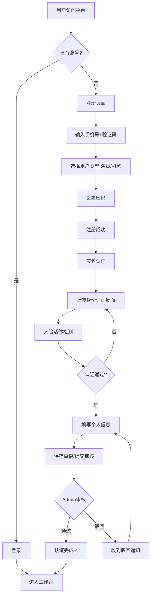

### 6.2 演员资格证申领全流程

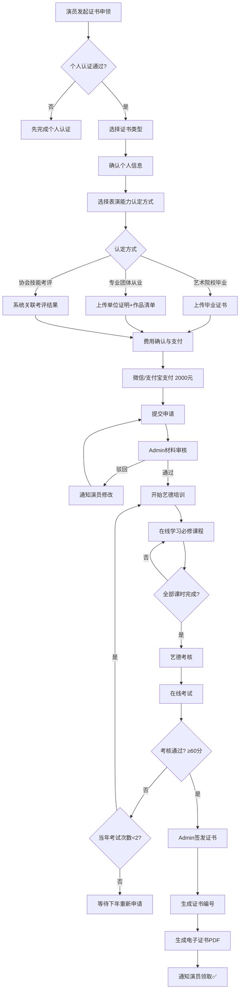

### 6.3 证书年审流程

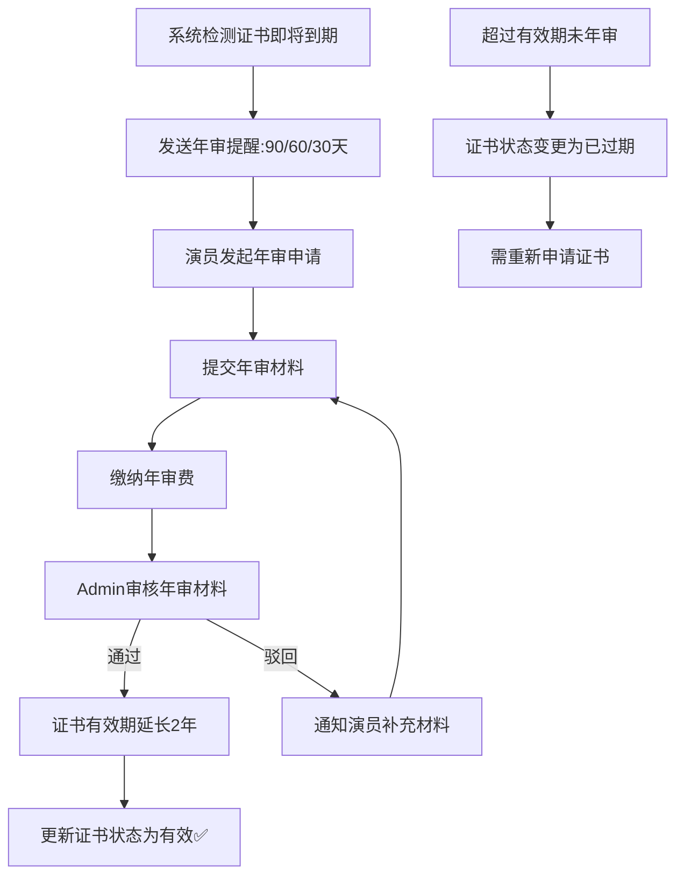

### 6.4 培训学习流程

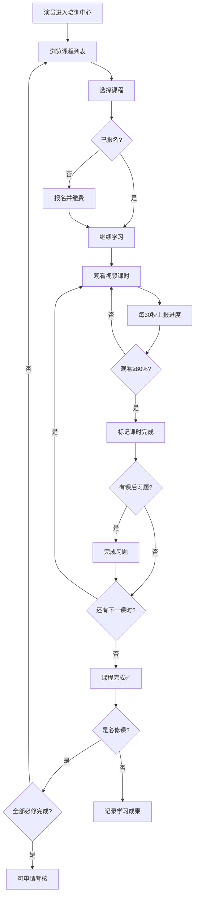

### 6.5 在线考试流程

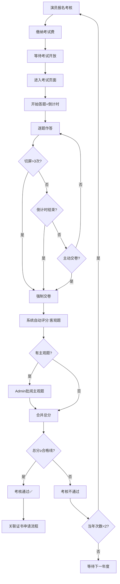

### 6.6 红黑榜影响流程

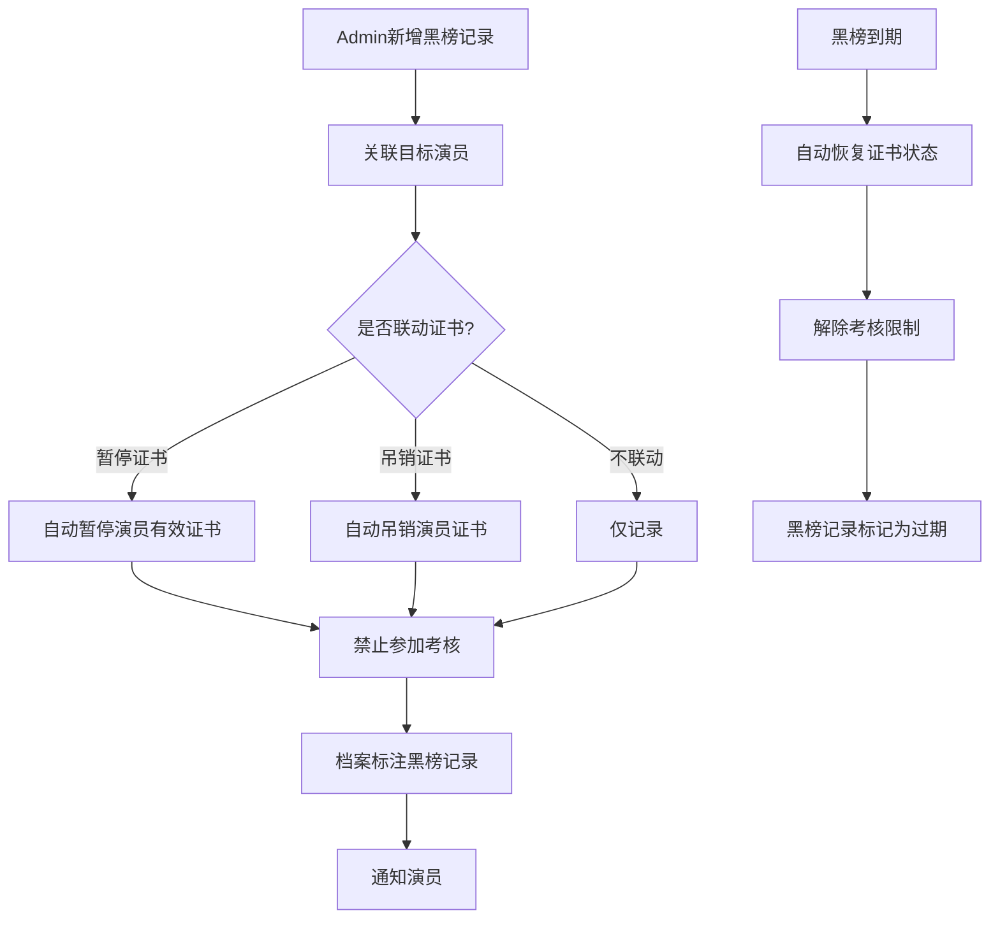

---

## 7. 业务领域模型

### 7.1 核心实体关系图

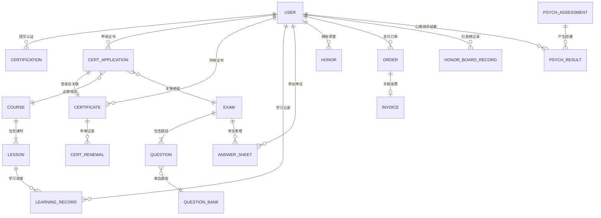

### 7.2 核心实体清单

| 实体 | 标识 | 说明 | 详细定义位置 |
| ------ | ------ | ------ | ------------ |
| 用户 | USER | 演员/管理员/机构账号 | §4.1.2 |
| 认证申请 | CERTIFICATION | 个人信息审核记录 | §4.3.1 |
| 证书申请 | CERT_APPLICATION | 证书申领申请 | §4.4.2 |
| 证书 | CERTIFICATE | 颁发的证书 | §4.3.3.2 |
| 课程 | COURSE | 培训课程 | §4.5.1.4 |
| 课时 | LESSON | 课程下的课时 | §4.5.1.4 |
| 学习记录 | LEARNING_RECORD | 用户学习进度 | §4.5.1.4 |
| 考核任务 | EXAM | 考核/考试 | §4.5.4.5 |
| 题目 | QUESTION | 题库中的题目 | §4.5.4.3 |
| 答卷 | ANSWER_SHEET | 考生答卷 | §4.5.4.5 |
| 荣誉 | HONOR | 演员荣誉记录 | §4.8.3 |
| 订单 | ORDER | 支付交易 | §4.7.1.2 |
| 红黑榜记录 | HONOR_BOARD_RECORD | 红黑榜 | §4.9.6 |
| 心理测评 | PSYCH_ASSESSMENT | 测评任务 | §4.9.7 |
| 测评结果 | PSYCH_RESULT | 个人测评结果 | §4.9.7 |
| 角色 | ROLE | 系统角色 | §4.9.1 |
| 菜单 | MENU | 导航菜单 | §4.9.2 |
| 审计日志 | AUDIT_LOG | 操作日志 | §4.9.4 |
| 消息模板 | MSG_TEMPLATE | 消息通知模板 | §4.9.5 |

---

## 8. 非功能需求

### 8.1 性能需求

| 指标 | 要求 |
| ------ | ------ |
| 页面首屏加载 | PC 端 ≤ 3 秒，小程序端 ≤ 2 秒 |
| API 响应时间 | 普通查询 ≤ 500ms，复杂查询 ≤ 2 秒 |
| 并发用户数 | 支持 500 并发用户（初期规模） |
| 视频流播放 | 支持 720p 流畅播放，缓冲时间 ≤ 3 秒 |
| 文件上传 | 10MB 文件上传 ≤ 10 秒（4G 网络） |
| 在线考试 | 支持 200 人同时在线考试 |
| 数据库查询 | 单表 100 万级数据量下查询 ≤ 1 秒 |

### 8.2 安全需求

| 要求 | 说明 |
| ------ | ------ |
| 数据传输加密 | 全站 HTTPS，TLS 1.2+ |
| 密码存储 | Bcrypt 加盐哈希，禁止明文存储 |
| 敏感数据脱敏 | 身份证号、手机号展示时中间部分脱敏 |
| SQL 注入防护 | 使用参数化查询，禁止拼接 SQL |
| XSS 防护 | 所有用户输入进行 HTML 转义 |
| CSRF 防护 | 使用 Token 机制防止跨站请求伪造 |
| 接口鉴权 | JWT Token + RBAC 权限模型 |
| 文件上传安全 | 文件类型白名单 + 文件内容检测 + 独立存储域名 |
| 操作审计 | 关键操作记录审计日志（参见 §4.9.4） |
| 登录安全 | 密码错误 5 次锁定 30 分钟，异地登录短信提醒 |
| 数据备份 | 数据库每日全量备份 + 实时增量备份，保留 30 天 |
| 证书防伪 | 电子证书含数字水印 + 验证二维码 |

### 8.3 可用性需求

| 要求 | 说明 |
| ------ | ------ |
| 系统可用率 | ≥ 99.5%（月度） |
| 计划维护 | 提前 48 小时通知，维护窗口 ≤ 4 小时 |
| 故障恢复 | RTO（恢复时间目标）≤ 4 小时 |
| 数据完整性 | RPO（恢复点目标）≤ 1 小时 |
| 降级策略 | 核心业务（登录/证书查看）在部分服务异常时可降级运行 |

### 8.4 兼容性需求

| 终端 | 兼容要求 |
| ------ | --------- |
| PC 端浏览器 | Chrome 90+、Firefox 90+、Edge 90+、Safari 14+ |
| PC 端分辨率 | 最低 1280×720，推荐 1920×1080 |
| 小程序基础库 | ≥ 2.20.0 |
| 移动设备 | iOS 12+、Android 7.0+ |
| 微信版本 | ≥ 8.0 |

### 8.5 可扩展性需求

| 要求 | 说明 |
| ------ | ------ |
| 模块化架构 | 前后端分离，模块间通过 API 解耦 |
| 用户规模 | 初期支撑 1 万注册用户，可扩展至 10 万 |
| 存储扩展 | 文件存储使用对象存储（OSS），支持弹性扩容 |
| 证书类型扩展 | 预留新证书类型的配置能力 |
| 第三方集成 | 预留与外部系统（OA/审批）的 API 对接能力 |

---

## 9. 验收清单

### 9.1 功能验收

| 序号 | 验收项 | 验收标准 | 优先级 |
| ------ | -------- | --------- | -------- |
| 1 | 用户注册与登录 | 手机号注册/登录/找回密码全流程通畅 | P0 |
| 2 | 实名认证 | 身份证 OCR + 人脸核身通过率 ≥ 95% | P0 |
| 3 | 个人信息填报 | PC + 小程序均可填报并同步 | P0 |
| 4 | 认证审核 | Admin 可批量/单条审核，通知到位 | P0 |
| 5 | 演员资格证申领 | 4步向导完整走通，支付成功 | P0 |
| 6 | 专业技术资格证书申领 | 等级校验正确，前置条件检查通过 | P0 |
| 7 | 证书签发 | Admin 签发后生成编号和电子证书 | P0 |
| 8 | 证书验证 | 扫码/输入编号验证结果正确 | P0 |
| 9 | 在线培训 | 视频播放流畅，进度记录准确 | P0 |
| 10 | 在线考试 | 计时/防切屏/自动交卷/评分准确 | P0 |
| 11 | 证书年审 | 到期提醒 + 年审流程通畅 | P1 |
| 12 | 财务管理 | 收入统计/交易流水/退款操作正确 | P1 |
| 13 | 人才全景档案 | 7 个维度数据正确展示 | P1 |
| 15 | 红黑榜管理 | 黑榜联动证书暂停/考核限制正确 | P1 |
| 16 | 心理健康测评 | 测评答题 + 报告生成 + 数据导出 | P2 |
| 17 | 权限管理 | RBAC 权限控制生效，菜单按角色显示 | P0 |
| 18 | 消息推送 | 站内 + 短信 + 微信订阅消息到达 | P1 |
| 19 | 审计日志 | 关键操作均被记录 | P1 |
| 20 | 数据导出 | Excel 导出格式正确，大数据量不超时 | P1 |

### 9.2 非功能验收

| 序号 | 验收项 | 验收标准 |
| ------ | -------- | --------- |
| 1 | 页面加载 | PC ≤ 3s，小程序 ≤ 2s |
| 2 | API 响应 | 普通查询 ≤ 500ms |
| 3 | 并发测试 | 500 并发无报错 |
| 4 | 安全测试 | 通过 OWASP Top 10 扫描 |
| 5 | 兼容性测试 | 覆盖主流浏览器和微信版本 |
| 6 | 数据备份恢复 | 执行一次完整备份恢复演练 |

### 9.3 全局界面的视觉与交互规范

| 序号 | 约定项 | 规范细则 |
| ------ | -------- | --------- |
| 1 | 全局主题主色调 | 移动端各全量页面须应用中性灰、天空蓝或平台赤红色作为主调，严谨并**禁止大面积使用刺眼突兀的深紫色 (`indigo` / `purple`) 等配色**，以求风格端庄连贯。 |
| 2 | 返回与底部菜单 | 所有二级下钻列表页（含 Admin 审核台）必须包含顶栏左侧的“返回”按钮并联动公共底部栏区域。 |
| 3 | 移动端边缘限制约束 | 吸附底部的操作菜单及弹窗底栏（如 `fixed bottom-0`元素），需强制配置 `left-1/2 -translate-x-1/2 w-full max-w-[430px]`，杜绝 PC 预览时出现的全屏伸展变形。 |

---

## 10. 发布计划

### 10.1 总体计划

| 阶段 | 周期 | 里程碑 |
| ------ | ------ | -------- |
| 需求评审 | 第 1-2 周 | 需求规格说明书终版确认 |
| 系统设计 | 第 3-4 周 | 技术方案评审、数据库设计、API 设计 |
| 一期开发 | 第 5-12 周 | 核心功能（认证+证书+培训+考核） |
| 一期联调测试 | 第 13-14 周 | 集成测试、性能测试、安全测试 |
| 一期 UAT | 第 15 周 | 用户验收测试 |
| 一期上线 | 第 16 周 | 正式发布 V1.0 |
| 二期开发 | 第 17-22 周 | 增强功能（红黑榜+心理测评+数据分析+行业机构） |
| 二期上线 | 第 24 周 | 正式发布 V2.0 |

### 10.2 一期功能范围（V1.0）

| 优先级 | 模块 | 功能 |
| -------- | ------ | ------ |
| P0 | 全局导航 | 登录/注册/导航菜单/证书验证 |
| P0 | 首页门户 | 工作台/通知公告 |
| P0 | 认证中心 | 个人信息填报/认证审核 |
| P0 | 证书管理 | 证书申领/证书管理台/证书签发 |
| P0 | 职业能力评价 | 培训中心/考核中心 |
| P0 | 个人中心 | 个人信息/证书资产库/账号管理 |
| P0 | 后台管理 | 权限管理/消息中心 |
| P0 | 小程序端 | 认证/证书/培训/考核/个人中心 |

### 10.3 二期功能范围（V2.0）

| 优先级 | 模块 | 功能 |
| -------- | ------ | ------ |
| P1 | 人才数字档案 | 全景档案/基础信息管理/资格证书管理/工作台 |
| P1 | 财务管理 | 收支概览/交易流水/退款 |
| P1 | 后台管理 | 菜单管理/数据安全/通知公告管理 |
| P1 | 首页门户 | 品牌展示/党建专栏 |
| P2 | 后台管理 | 红黑榜管理/心理健康测评 |
| P1 | 个人中心 | 荣誉管理 |

### 10.4 风险与对策

| 风险 | 级别 | 对策 |
| ------ | ------ | ------ |
| 实名认证第三方服务不稳定 | 高 | 对接多家身份验证服务商做主备切换 |
| 在线考试高并发 | 中 | 使用消息队列削峰 + 独立考试服务模块 |
| 微信小程序审核周期 | 中 | 预留 7-10 天审核缓冲期 |
| 视频存储成本 | 中 | 使用 CDN + 分层存储策略 |
| 支付对账差异 | 低 | 每日自动对账 + 人工复核 |

**— 文档结束 —**

*本文档版本：V1.1*  
*最后更新：2026-04-01*  
*编写：中国广播电视社会组织联合会演员委员会*
